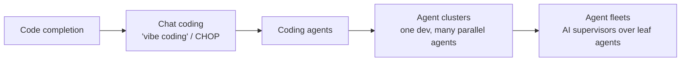

# Revenge of the Junior Developer

Steve Yegge's (Sourcegraph — a coding-tools vendor, so read the optimism with
that in mind) counter-take to his own earlier "Death of the Junior Developer."
The thesis: there will be plenty of software jobs — just not the kind where you
write code by hand "like some sort of barbarian" — and **juniors are better
positioned for that world than seniors.**

## The six waves

Yegge frames AI coding as overlapping waves, each eclipsing the last:

- **Vibe coding** (Karpathy's name for chat-based coding) is going viral in
  Silicon Valley while ~80% of the industry hasn't heard the term.
- **Agentic coding** — the subject of the post — will "rocket by" chat coding.
  Chat becomes a fallback of last resort.
- **Agent clusters / fleets**: a single IC developer runs manager-agents that
  each supervise groups of coding agents — the "FY26 org chart" where every
  human is effectively a second-level line manager of AI. This is
  [from coder to orchestrator](from-coder-to-orchestrator.md) taken to its
  extreme.

## Why juniors win

The observed pattern: **juniors adopt AI far faster than seniors.** They're in
school or freshly out, they treat AI engineering as core job training, they use
chat, assistants, and agents without ego. "Junior devs are vibing. They get it."

Seniors, by contrast, often resist — some out of busyness, but many because
*really* learning something new feels like starting over, and starting over
feels threatening. Yegge recounts a senior sending around slide decks arguing
the team should abandon AI entirely. The industry now has "the widest
distribution of understanding in tech history."

## The takeaway (and the caveat)

> The new job of "software engineer" will involve little direct coding, and a
> *lot* of agent babysitting. The sooner you get on board, the easier your life
> will be.

The optimism is real but vendor-flavored, and it sits in direct tension with the
missing-rung worry: juniors who only orchestrate never build the judgment that
supervising agents requires (see [ironies of automation](ironies-of-automation.md),
[AI won't kill junior devs](ai-wont-kill-junior-devs.md), and
[learning the craft](learning-the-craft.md)). Yegge's bet is that adaptability
beats accumulated craft; the counter-bet is that the craft is what makes the
supervision trustworthy. Both can be true depending on how deliberately teams
teach.

## Related

- [From Coder to Orchestrator](from-coder-to-orchestrator.md) — the role the
  waves converge on.
- [Vibe Coding](vibe-coding.md) — the chat-coding wave named here.
- [AI Won't Kill Junior Devs](ai-wont-kill-junior-devs.md) — the more cautious
  companion view.

## References
- [Revenge of the junior developer — Steve Yegge, Sourcegraph](https://sourcegraph.com/blog/revenge-of-the-junior-developer)
