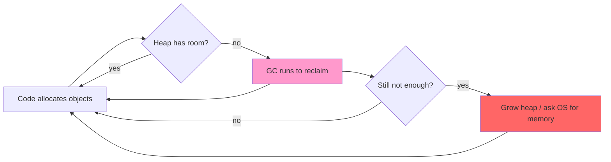

# Ruby Performance Optimization

Alexander Dymo's *Ruby Performance Optimization: Why Ruby Is Slow, and How to
Fix It* (Pragmatic Bookshelf, 2015). The book's argument is that most Ruby
"slowness" is not a language problem you have to live with — it is a memory
problem in the code you wrote, and it is fixable without caching, scaling, or a
rewrite. It reframes optimization as a disciplined, measurement-driven craft
rather than a bag of speed tricks.

## The core thesis: memory, not CPU, is the bottleneck

The common belief is that Ruby is slow at the CPU level. Dymo's point is the
opposite: post-1.9 Ruby is roughly on par with other dynamic languages for raw
execution. What actually makes real Ruby programs drag is **memory pressure**.
Ruby allocates objects generously, and every allocation eventually has to be
reclaimed by the garbage collector. When a program allocates more than fits in
the current heap, the GC runs; when the heap has to grow, the OS gets involved.
The time your code spends in GC and in memory management dwarfs the time it
spends doing the work you care about.

The practical consequence: **the way to make Ruby fast is to make it allocate
less.** Cut allocations and you cut GC runs, and the CPU time follows. This is
why two functionally identical snippets can differ by an order of magnitude —
one churns through throwaway objects, the other reuses them. It connects
directly to the idea in [Rethinking Performance](rethinking-performance.md)
that the interesting cost is often not the one you assumed, and to the
design-level discipline of [Practical Object-Oriented Design in
Ruby](practical-object-oriented-design-in-ruby.md): clean object design and
lean allocation are not in tension, but you have to know which allocations your
"nice" code is quietly generating.

## Measure before you optimize

The book is emphatic that you never optimize on a hunch — you profile, find the
real hot spot, change it, and re-measure. Guessing wastes effort on code that
was never the problem and risks making things worse.

- **Profiling** identifies *where* time and memory go. The book centers on
  `ruby-prof`, using its printers to render flat and call-graph views, and
  feeding its output into KCachegrind/QCachegrind for visual call graphs. A
  companion memory profile (via `ruby-prof`, and directly via `GC#stat` and
  `GC::Profiler`) shows *where the allocations happen*, which is usually the
  more important question.
- **Benchmarking correctly** measures *how much* a change helped. This is
  harder than it looks, and most of the measurement chapter is about the
  pitfalls:
  - **External factors** — background processes, CPU frequency scaling, a busy
    machine — add noise. Isolate the benchmark so it measures your code, not the
    weather on the box.
  - **Unpredictable internals** — GC firing mid-measurement is the big one. A
    run that happens to trigger a collection looks slow for reasons unrelated to
    the code under test. Control for GC so runs are comparable.
  - **Single runs lie.** One number is not a measurement. Take many samples and
    analyze them statistically (compare distributions, not lone timings) so you
    can tell a real improvement from noise.

The workflow the book teaches: profile to find the fruit, pick the
low-hanging pieces first, optimize *without breaking behavior*, then step back
and confirm the win held up — a loop, not a one-shot.

## Reduce memory and allocations

Since allocations drive GC and GC drives slowness, the highest-leverage fixes
are allocation cuts:

- **Save memory in the hot path.** Avoid creating objects you immediately throw
  away. Reuse buffers and mutate in place where it is safe rather than producing
  a new object each iteration.
- **Optimize iterators.** Chained enumerable methods each tend to materialize an
  intermediate array; over a large collection that is a flood of short-lived
  objects. Collapse the chain, iterate once, or stream instead of building
  intermediates.
- **Write less Ruby.** The fastest object is the one you never allocate. Doing
  less work — fewer intermediate structures, fewer conversions — is itself the
  optimization.
- **Rails-specific wins** come from the same principle: make ActiveRecord
  allocate fewer objects (avoid loading whole rows/records you don't need,
  watch N+1 materialization) and make ActionView render with less overhead.

## Tune the garbage collector

Once the code allocates as little as it reasonably can, the GC itself can be
tuned. The book explains how Ruby uses memory (the heap of "slots," how objects
map onto it), what triggers a collection, and why the **generational** collector
in 2.1 and the **incremental** collector in 2.2 are so much faster — they avoid
scanning the whole heap on every run. On top of that you can adjust GC
environment settings (heap growth factors, slot counts, malloc limits) so the
collector runs less often or grows the heap more sensibly for your workload.
GC tuning is a multiplier on good code, not a substitute for it — tuning a
program that allocates recklessly only delays the pain.

## Performance testing in the app and CI

Optimization that isn't defended regresses. The book treats performance as
something you **test**, not just fix once:

- **Benchmark** critical paths repeatably.
- **Assert performance** — write tests that fail when a path gets slower or
  allocates more than an agreed budget, so a regression breaks the build the
  same way a logic bug would.
- **Report** slowdowns and improvements over time so trends are visible.
- **Test Rails application performance** end to end, not just isolated methods.

## Think outside the box

For cases where code-level tuning isn't enough, the book offers operational
tactics: **cycle long-running instances** before they bloat, **fork to run heavy
jobs** so their memory is reclaimed when the child exits, do **out-of-band GC**
(collect between requests instead of during them), **tune the database**, and —
only after the rest — **buy enough production resources**. Notably, throwing
hardware at it comes last, which mirrors the whole book's stance: understand and
fix the cost first, scale second.

## References

- [Ruby Performance Optimization — Pragmatic Bookshelf](https://pragprog.com/titles/adrpo/ruby-performance-optimization/)
