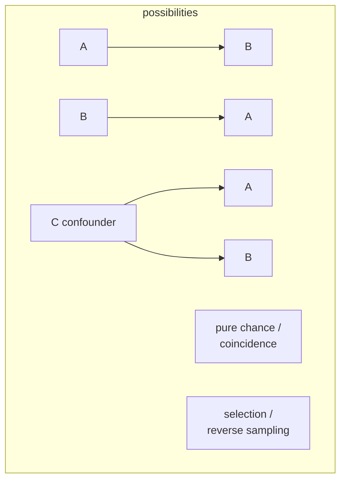

# Correlation and Causation

*"Correlation does not imply causation"* is the most repeated slogan in science — and the most
frequently violated in practice. A **correlation** is a statistical association: two things tend to
vary together. **Causation** is a productive relationship: changing one *makes* the other change.
The gap between them is where a great deal of bad science, bad journalism, and bad policy lives.

## Why association isn't cause

If A and B are correlated, several distinct situations are possible, and the data alone cannot tell
them apart:

- **A causes B** — the hoped-for interpretation.
- **B causes A** — reverse causation (do the fit exercise, or do exercisers stay fit?).
- **A third factor C causes both** — a [confounder](experiments-and-controls.md). Ice-cream sales and
  drownings correlate because *summer heat* drives both.
- **Coincidence** — with enough variables, some will correlate by chance alone (spurious
  correlation).
- **Selection bias** — the association is an artifact of how the sample was gathered.

## Establishing causation

Because correlation is ambiguous, science uses stronger tools to earn a causal claim:

- **The randomized controlled trial** — [randomization](experiments-and-controls.md) breaks the link
  between the treatment and any confounder, so a difference in outcome must be caused by the
  treatment. This is the cleanest route and the reason the RCT is the gold standard.
- **Controlling for confounders** — when you cannot randomize, statistically adjust for known
  confounders. Weaker, because *unknown* confounders remain uncontrolled.
- **Bradford Hill considerations** — in fields like epidemiology, causation is argued from a
  convergence of signs: a strong and consistent association, a dose–response relationship, the cause
  preceding the effect (**temporality**), a plausible mechanism, and coherence with other evidence.
  The case that smoking causes cancer was built this way, without ever randomizing humans to smoke.

## Temporality and mechanism

Two ideas do real work in separating cause from mere correlation. **Temporality**: a cause must
precede its effect — an association where the "effect" often comes first is suspect. **Mechanism**: a
credible causal story specifies *how* A produces B, connecting the statistical pattern to the
[theories](models-and-theories-in-science.md) of the relevant science. A correlation with a known
mechanism and correct temporality is far more convincing than a bare number.

## Why it matters

Almost every practical question — does this drug work, does this policy help, is this exposure
harmful — is a causal question answered with correlational data. Knowing the difference, and demanding
the design (a control, randomization, ruling out confounders) that licenses a causal leap, is the
central skill of evidence-based reasoning and the antidote to being fooled by a striking chart. It
connects directly to [experiments and controls](experiments-and-controls.md) and to
[statistics](../statistics/index.md).

## References

- [The Demon-Haunted World](sagan-demon-haunted-world.md) — on confusing correlation with cause as a
  classic reasoning error.
