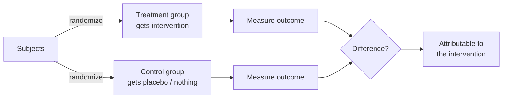

# Experiments and Controls

An **experiment** is a deliberate intervention on the world, designed so that the effect of one
factor can be isolated from everything else. Its power over passive observation is that it lets
science move from "these things go together" to "this *causes* that" (see
[correlation and causation](correlation-and-causation.md)). The whole art of experimental design is
the art of **control**: arranging conditions so that rival explanations for a result are ruled out
in advance.

## The anatomy of variables

- **Independent variable** — the factor the experimenter deliberately changes (the drug dose).
- **Dependent variable** — the outcome measured to see if it responds (blood pressure).
- **Control variables** — everything else, held constant so it can't muddy the comparison (age,
  diet, time of day).
- **Confounding variable** — a lurking factor that varies *with* the independent variable and offers
  an alternative cause of the effect. Confounders are the enemy; controlling them is the point.

## The control group

The core device is comparison against a **control group** that is treated identically *except* for
the independent variable. If a treated group improves and an untreated control group does not — and
the two groups were otherwise alike — the improvement can be attributed to the treatment. Without a
control, you cannot tell the treatment's effect from what would have happened anyway (natural
recovery, seasonal change, the passage of time).

## Randomization, blinding, and the placebo

Three refinements turn a comparison into a trustworthy one:

- **Randomization** — assigning subjects to groups by chance. This is the single most powerful move:
  it distributes *all* confounders, known and unknown, evenly across groups on average, so the groups
  differ systematically only in the treatment. It is what makes the **randomized controlled trial
  (RCT)** the gold standard for causal claims.
- **The placebo** — an inert stand-in given to the control group so that the mere *expectation* of
  treatment (the placebo effect) is present in both groups and thus cancels out.
- **Blinding** — keeping subjects unaware of their group (**single-blind**), and ideally keeping the
  experimenters unaware too (**double-blind**), so that neither wishful reporting nor unconscious
  bias in measurement can favor the treatment.

## Natural and quasi-experiments

Much science cannot randomize — you cannot assign people to smoke, or assign a planet an orbit.
Astronomy, epidemiology, and economics rely on **observational studies**, **natural experiments**
(where nature or policy supplies a quasi-random split), and statistical control of confounders. These
support causal claims more weakly than an RCT, which is exactly why the link from
[correlation to causation](correlation-and-causation.md) must be argued so carefully there.

## Why it matters

The control group and randomization are among the most consequential inventions in the history of
knowledge: they are how we separate real effects from wishful thinking, regression to the mean, and
coincidence. A result without a proper control is not evidence of causation, however large or
striking — a lesson relearned every time an uncontrolled study is later overturned by an RCT.

## References

- [The Demon-Haunted World](sagan-demon-haunted-world.md) — Sagan's "baloney-detection kit" on
  controls and the necessity of testing against alternatives.
