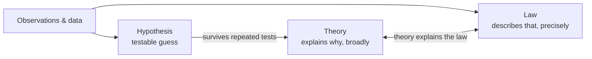

# Hypothesis, Theory, and Law

Three words — *hypothesis*, *theory*, *law* — name different kinds of scientific claim, and
confusing them is the source of one of the most common public misunderstandings of science ("it's
*just* a theory"). They are not rungs where a claim graduates from one to the next by accumulating
proof; they are **different things doing different jobs**.

## The three, distinguished

- **Hypothesis** — a specific, testable, tentative proposed explanation for a limited phenomenon.
  It is the unit the [scientific method](the-scientific-method.md) actually tests. "This drug lowers
  blood pressure" is a hypothesis. Its defining virtue is
  [falsifiability](falsifiability-and-demarcation.md): it must forbid some observations.
- **Theory** — a broad, well-substantiated explanation of a wide range of phenomena, integrating
  many confirmed hypotheses, facts, and laws into a coherent framework with strong explanatory and
  predictive power. Evolution, plate tectonics, general relativity, germ theory, and quantum theory
  are *theories*. In science, "theory" is the **highest status an explanation can hold**, the
  opposite of the everyday sense of "a hunch."
- **Law** — a concise statement, often mathematical, describing *that* a regularity holds, usually
  without explaining *why*. Newton's law of gravitation says how masses attract; it does not say
  what gravity *is*. Laws describe; theories explain.

A crucial correction to the common picture: a hypothesis does **not** "grow up" into a law and then
a theory. Laws and theories coexist and answer different questions — *what regularity?* versus *what
mechanism?* A law can be explained by a theory (kinetic theory explains the gas laws), and both can
stand for centuries.

## "Only a theory"

Because "theory" in daily speech means a guess, people wrongly infer that a scientific theory is
unproven or optional. The reverse is true: calling something a *scientific theory* signals it has
survived extensive testing and unifies large bodies of evidence. The tentativeness that remains is
science's general refusal to claim absolute certainty — not weakness specific to that theory. A
theory can be refined or, rarely, overturned in a [scientific
revolution](paradigms-and-scientific-revolutions.md), but it is the sturdiest product science makes.

## The null hypothesis

In statistical practice, hypotheses are tested in pairs. The **null hypothesis** (H₀) states there
is no effect or no difference; the **alternative hypothesis** (H₁) states there is. Data are used to
compute how probable such data would be *if the null were true* — a **p-value**. A small p-value
means the data would be surprising under the null, licensing its rejection. This never *proves* H₁;
it only makes H₀ implausible. Misreading p-values (as the probability the hypothesis is true, or as
a measure of effect size) is a leading source of scientific error — see
[uncertainty, error, and reproducibility](uncertainty-error-and-reproducibility.md) and the deeper
treatment in [statistics](../statistics/index.md).

## Why it matters

Getting these categories straight is what lets you read a scientific claim correctly: whether it is
a narrow testable conjecture, a precise description of a regularity, or a mature framework that
organizes a whole domain. It also inoculates against the rhetorical trick of dismissing robust
science as "merely theoretical."

## References

- [The Structure of Scientific Revolutions](kuhn-structure-of-scientific-revolutions.md) — how
  theories, not isolated hypotheses, are what actually rise and fall in science.
