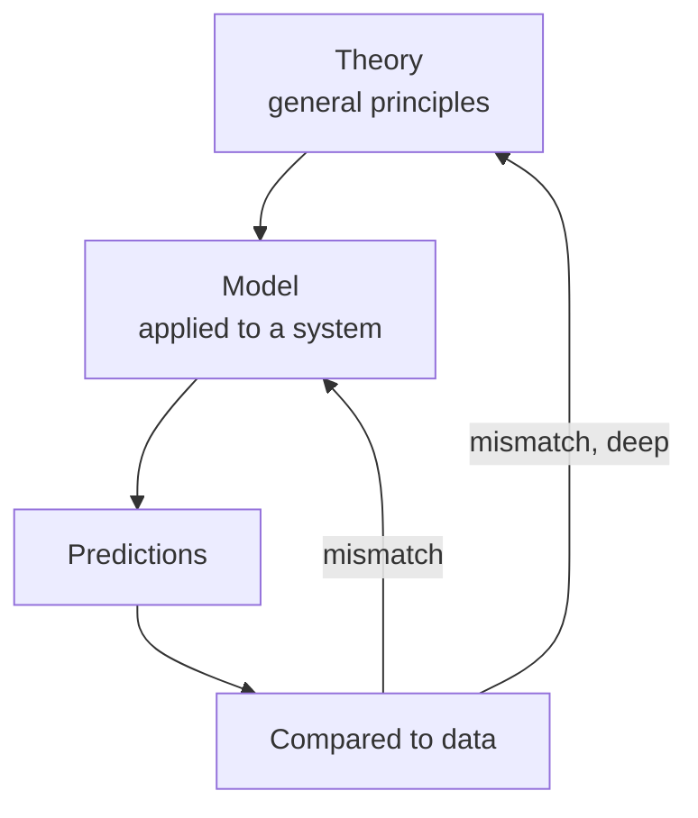

# Models and Theories in Science

Science rarely engages the world in all its messy fullness. Instead it builds **models** —
simplified, deliberately incomplete representations that keep the features relevant to a question
and discard the rest. A **theory** is the broader framework of principles from which models are
built and by which they are justified. Understanding that science trades in models, not perfect
mirrors, dissolves a lot of confusion about what a scientific claim is and isn't.

## What a model is

A model can be physical (a scale model, an animal "model organism"), mathematical (an equation), or
computational (a simulation). What they share is **idealization**: assuming away complications to
make a problem tractable. Physics assumes frictionless planes and point masses; economics assumes
rational agents; climate science runs simplified atmospheres. These assumptions are known to be
false in detail — that is the point. A model is a tool for a purpose, judged not by whether it is
*true* but by whether it is *useful and accurate enough* for the question at hand.

> "All models are wrong, but some are useful." — George Box

## The map and the territory

A model relates to reality as a map relates to territory. A map useful for driving omits soil
chemistry and every blade of grass; a map as detailed as the territory would be useless. The **map is
not the territory** — confusing the model for reality is a category error (reification). Yet a good
map is indispensable precisely *because* it leaves things out. Scientific progress often means
swapping a coarser map for a finer one, not replacing a "false" map with a "true" one. This is the
same map–territory idea that runs through [systems thinking](../systems-thinking/index.md).

## Levels of model and the theory that grounds them

A [theory](hypothesis-theory-and-law.md) supplies the principles; a model applies them to a specific
system to generate [predictions](the-scientific-method.md); predictions meet data; mismatch drives
revision of the model, or, if deep and persistent, of the theory itself (a possible
[paradigm shift](paradigms-and-scientific-revolutions.md)). Newtonian mechanics remains an excellent
*model* for everyday speeds even though relativity superseded it as the deeper *theory* — a reminder
that superseded science is often still-useful science within its domain.

## Simulation: the third pillar

Computational modelling has become a mode of inquiry alongside theory and experiment. When systems
are too complex for closed-form solution or too large, slow, or dangerous to experiment on —
galaxies, climates, pandemics, economies — scientists **simulate** them, running the model forward to
see what it implies. Simulations extend science's reach but inherit every assumption baked into the
model, so their outputs are only as trustworthy as their inputs and validation against real data.

## Why it matters

Grasping that science produces models, not photographs of reality, corrects two opposite errors: the
naïve realism that treats every current model as final truth, and the lazy skepticism that says
"models are just assumptions, so they prove nothing." Models are provisional, purpose-built, and
testable — and that is exactly what makes them powerful.

## References

- [The Structure of Scientific Revolutions](kuhn-structure-of-scientific-revolutions.md) — on how the
  frameworks behind models are held, defended, and occasionally overturned.
