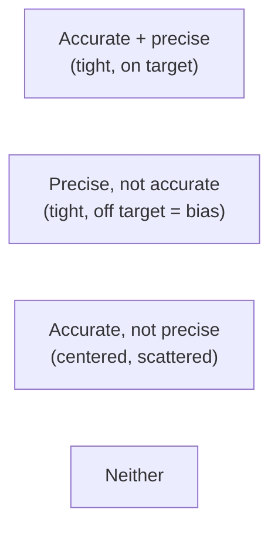

# Observation and Measurement

If [empiricism](empiricism-and-scientific-evidence.md) is the commitment to evidence, **measurement**
is how that commitment is made quantitative. To measure is to assign a number and a **unit** to a
property of the world by comparison with a standard. Turning vague observation ("it's hot," "that's
heavy") into numbers with stated uncertainty is what lets science compare results, test predictions
precisely, and accumulate.

## Units and the SI

A bare number is meaningless; "5" is not a measurement, "5 metres" is. Science standardizes on the
**International System of Units (SI)**, built on seven base units — metre (length), kilogram (mass),
second (time), ampere (electric current), kelvin (temperature), mole (amount of substance), candela
(luminous intensity) — from which all others are derived. Since 2019 these are defined in terms of
fixed fundamental constants (e.g. the second via the caesium atom's radiation, the metre via the
speed of light), so the standards are reproducible in any lab rather than tied to a physical
artifact. **Dimensional analysis** — checking that the units on both sides of an equation match — is
a fast, powerful sanity check on any physical calculation.

## Accuracy versus precision

Two distinct virtues of a measurement, often confused:

- **Accuracy** — how close a measurement is to the true value. Poor accuracy signals **systematic
  error** (bias): a miscalibrated scale reading 2 g high every time.
- **Precision** — how close repeated measurements are to *each other*, regardless of the truth. Poor
  precision signals **random error** (scatter): readings bouncing around.

The distinction matters because the two problems have different fixes: bias is reduced by
**calibration** and better [experimental design](experiments-and-controls.md); scatter is reduced by
**averaging many measurements**. See [uncertainty and error](uncertainty-error-and-reproducibility.md).

## Significant figures and reporting uncertainty

A measurement should communicate how well it is known. **Significant figures** encode this: writing
"2.5 kg" claims less precision than "2.500 kg." More formally, results are reported with an explicit
**uncertainty** (e.g. 2.50 ± 0.03 kg) and often an error bar on a graph. Carrying more digits than
the measurement justifies is false precision; a conclusion is only as sharp as its least certain
input.

## Operationalization: measuring the abstract

Many things science cares about — intelligence, inflation, biodiversity, pain — are not directly
readable off an instrument. **Operationalization** is defining such a construct in terms of a
concrete, repeatable measurement procedure (intelligence *as* an IQ-test score; temperature *as* the
height of a mercury column). This makes the abstract testable, but introduces a permanent question:
does the operational measure actually capture the concept (**validity**), and does it do so
consistently (**reliability**)? Much dispute in the [social sciences](../statistics/index.md) is
really dispute about operationalization.

## Why it matters

Measurement is the interface between theory and world. Its quality bounds everything downstream: no
statistical wizardry rescues a biased instrument or an invalid operational definition ("garbage in,
garbage out"). Understanding accuracy, precision, units, and uncertainty is the difference between a
number that means something and a number that only looks authoritative.

## References

- [The Demon-Haunted World](sagan-demon-haunted-world.md) — on quantification and stated uncertainty
  as marks of honest inquiry.
