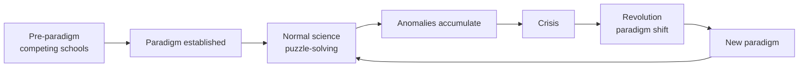

# Paradigms and Scientific Revolutions

The picture of science as a steady, cumulative march toward truth was overturned by Thomas Kuhn's
*The Structure of Scientific Revolutions* (1962). Kuhn argued that science actually alternates
between long periods of stable, incremental work and rare, wrenching upheavals in which the whole
framework changes. His vocabulary — **paradigm**, **normal science**, **anomaly**, **paradigm
shift** — has become the standard way to describe how science *really* develops.

## Paradigms and normal science

A **paradigm** is the entire constellation of shared assumptions, exemplary problems, methods, and
standards that defines a scientific community at a given time — the framework within which its
members agree on what counts as a good question, a valid method, and an acceptable answer.

Most scientific work is **normal science**: puzzle-solving *within* the reigning paradigm. Scientists
don't spend their days trying to overthrow the framework; they extend it, refine its measurements,
and clean up the puzzles it poses, taking the paradigm's core for granted. Normal science is
enormously productive precisely because it doesn't re-litigate fundamentals every day.

## Anomalies and crisis

Normal science inevitably turns up **anomalies** — results that resist explanation within the
paradigm. A few anomalies are tolerated, set aside as puzzles to be solved later. But as anomalies
accumulate and stubbornly resist, the field can enter a **crisis**: confidence in the paradigm
erodes, and scientists begin entertaining alternative frameworks.

## Revolutions and paradigm shifts

A **scientific revolution** is the replacement of one paradigm by another — Ptolemaic by Copernican
astronomy, Newtonian by relativistic and quantum physics. Kuhn's most provocative claims concern what
this replacement is like:

- **It is not purely cumulative.** A new paradigm doesn't just add to the old; it reorganizes the
  field, redefining which problems and even which *facts* matter. Some old questions are abandoned
  rather than answered.
- **Incommensurability.** Rival paradigms can be hard to compare directly because they use concepts
  differently and disagree on standards — "mass" means something different for Newton and Einstein.
  There is no wholly neutral vantage point from which to judge between them.
- **It resembles a gestalt switch.** Scientists come to *see* the same data differently, and the
  transition has a social and generational character (old guards rarely convert; the field turns over
  as they retire).

## Criticism and balance

Kuhn was read by some as making science irrational or merely fashion-driven — if paradigm choice
isn't settled by neutral evidence, is it just sociology? Kuhn resisted that reading, and most
philosophers now hold a middle position: paradigm shifts are driven by real explanatory and
predictive superiority ([consilience, scope, fruitfulness](scientific-reasoning.md)), even if they
are not the clean, purely logical falsifications that [Popper](falsifiability-and-demarcation.md)
described. Normal science and revolution are two modes, and both are rational.

## Why it matters

Kuhn corrects the naïve textbook story of linear progress and explains why deep change is rare,
resisted, and disruptive rather than smooth. It also tempers overconfidence: today's paradigm is
the best framework we have, not the final word — a stance of provisional commitment that is science's
signature. It connects to [the sociology of science](../sociology/index.md) and to how
[theories](models-and-theories-in-science.md) rise and fall.

## References

- [The Structure of Scientific Revolutions](kuhn-structure-of-scientific-revolutions.md) — Kuhn's
  original account of paradigms, normal science, and revolutions.
