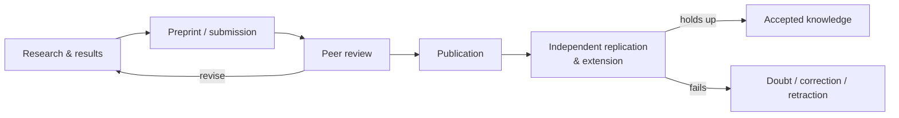

# The Scientific Community and Peer Review

Science is not a solitary activity but a **social institution**. Its reliability comes less from the
brilliance or honesty of any individual than from a *system* of mutual criticism: results are
published, scrutinized by other experts, and — crucially — checked by independent replication. This
collective machinery is what turns one researcher's claim into shared knowledge, and it is the deeper
meaning of science's "self-correction."

## How a finding becomes knowledge

- **Publication** makes a result public, detailed enough that others can evaluate and repeat it. "If
  it isn't published, it isn't science" overstates, but communication to the community is essential —
  private results can't be checked.
- **Peer review** — before publication, independent experts assess the work's methods, analysis, and
  conclusions, recommending rejection, revision, or acceptance. It is a **filter, not a guarantee**:
  reviewers catch many flaws but cannot rerun the experiment, and fraud or subtle error slips
  through. Peer review screens; replication verifies.
- **Replication and extension** — other labs repeat and build on the work. Findings that repeatedly
  hold up become trusted; those that don't are quietly abandoned or formally
  [corrected](uncertainty-error-and-reproducibility.md).

## Norms of the community

The sociologist Robert Merton described science's ethos as a set of shared norms (sometimes
abbreviated **CUDOS**):

- **Communalism** — findings are shared property, not private secrets.
- **Universalism** — claims are judged by evidence and logic, not by the identity, nationality, or
  status of who makes them.
- **Disinterestedness** — researchers are expected to pursue truth, not personal gain, with the
  community's scrutiny guarding against self-deception.
- **Organized skepticism** — nothing is exempt from critical examination; claims must earn assent.

These are ideals, imperfectly realized, but they describe the standards the community holds itself to
and appeals to when something goes wrong.

## Where the system strains

The social machinery has well-known failure modes, most visible in the [replication
crisis](uncertainty-error-and-reproducibility.md):

- **Publication bias** — positive, novel results are favored; negative and replication results are
  under-published, distorting the literature.
- **Perverse incentives** — "publish or perish" rewards volume and splashy claims over rigor,
  encouraging p-hacking and salami-slicing.
- **Peer review's limits** — slow, uneven, unpaid, and poor at detecting fraud.

The **open-science** movement is the community's self-correction of its own process: pre-registration,
open data and code, registered reports (peer-reviewed *before* results are known), preprints, and
credit for replication work. It relates to the broader [sociology of
knowledge](../sociology/index.md).

## Why it matters

Understanding science as a self-correcting community, rather than a collection of infallible experts,
gets the epistemics right: trust flows from the *process* — scrutiny, replication, openness — not
from authority. It clarifies why a single un-replicated study (even peer-reviewed) is weak, why
scientific consensus carries real weight, and why reforming incentives matters as much as any
individual experiment.

## References

- [The Structure of Scientific Revolutions](kuhn-structure-of-scientific-revolutions.md) — on the
  scientific community as the unit that holds and changes paradigms.
- [The Demon-Haunted World](sagan-demon-haunted-world.md) — on organized skepticism as the heart of
  the scientific attitude.
