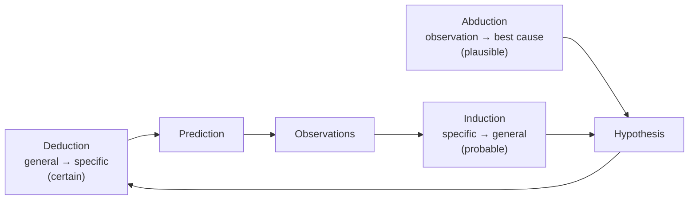

# Scientific Reasoning

Evidence never interprets itself; getting from observations to conclusions takes **inference**.
Science uses three basic patterns of reasoning — deduction, induction, and abduction — usually
woven together, plus guiding principles like parsimony for choosing among competing explanations.
Knowing which kind of inference is in play tells you how strong a conclusion really is.

## The three inferences

- **Deduction** — from general premises to a guaranteed conclusion. If the premises are true and the
  logic valid, the conclusion *must* be true. This is the reasoning of [mathematics and
  logic](../logic/index.md) and of deriving [predictions](the-scientific-method.md) from a theory
  ("if this theory holds, this experiment must show X"). Deduction is certain but adds no new empirical
  content — it unpacks what the premises already contain.
- **Induction** — from specific observations to a general conclusion. Every observed electron has
  charge −e, so *all* electrons probably do. Induction is how science generalizes from data, but it
  is **never certain**: the next observation could break the pattern. This is the **problem of
  induction** (Hume) — no finite run of confirmations proves a universal law, which is part of what
  motivated [Popper's shift to falsification](falsifiability-and-demarcation.md).
- **Abduction** — inference to the best explanation. Given a surprising observation, reason *backward*
  to the hypothesis that would best account for it. A doctor reasons from symptoms to the most likely
  disease; a physicist infers an unseen particle from its tracks. Most scientific *discovery* is
  abductive — it generates the hypotheses that deduction and induction then test.

The scientific cycle runs on all three: **abduct** a hypothesis to explain a puzzle, **deduce** its
testable consequences, then **induce** from the accumulated tests whether to trust it.

## Choosing among explanations

Usually several hypotheses fit the data, so science needs principles for preferring one:

- **Occam's razor (parsimony)** — prefer the explanation with the fewest assumptions or entities.
  Not a claim that reality *is* simple, but a methodological bet: simpler theories are easier to test,
  harder to fudge, and historically more fruitful. The razor breaks ties; it never overrides
  evidence.
- **Explanatory scope and power** — favor the hypothesis that explains *more* of the observations,
  and explains them in more detail.
- **Consilience** — favor the hypothesis that coheres with independently established knowledge from
  other fields; an explanation that would require overturning well-tested physics pays a steep price.
- **Fruitfulness** — favor the hypothesis that makes new, checkable predictions rather than only
  accommodating what's already known.

## Cognitive traps reasoning must guard against

Human reasoning is systematically biased, and much of scientific method exists to counter it:
**confirmation bias** (seeking evidence that fits, ignoring what doesn't), **apophenia** (seeing
patterns in noise), **anecdotal reasoning** (over-weighting vivid single cases), and **motivated
reasoning**. [Controls](experiments-and-controls.md), [blinding](experiments-and-controls.md),
[pre-registration](uncertainty-error-and-reproducibility.md), and [peer
review](scientific-community-and-peer-review.md) are institutional fixes for these individual flaws.
See also [cognition and biases](../psychology/index.md).

## Why it matters

Labeling the inference is the fastest way to gauge a claim's strength: a deductive conclusion is as
solid as its premises, an inductive one is always open to revision, and an abductive one is only as
good as the alternatives that were considered and ruled out. Scientific reasoning is simply ordinary
reasoning made careful, explicit, and checkable.

## References

- [Novum Organum](bacon-novum-organum.md) — Bacon's program of disciplined induction from
  observation.
- [The Logic of Scientific Discovery](popper-logic-of-scientific-discovery.md) — Popper on the
  problem of induction and the turn to refutation.
