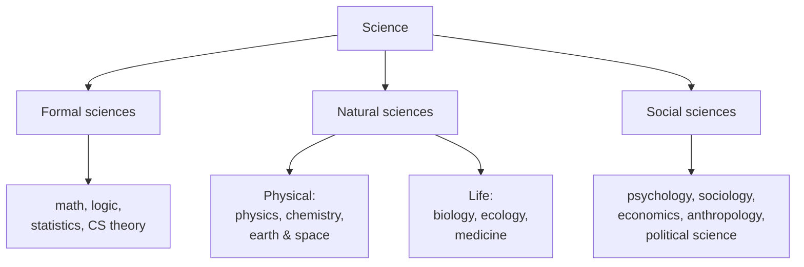

# The Branches of Science

Science is conventionally divided into branches by *what* they study, but the divisions are
practical conveniences, not natural walls — the interesting action is often at the borders
(biochemistry, astrophysics, cognitive science, econophysics). This note maps the standard
territory and then examines the deeper question the map raises: how the sciences relate to one
another, through **reductionism** and **emergence**.

## The standard map

- **Formal sciences** — [mathematics](../math/index.md), [logic](../logic/index.md),
  [statistics](../statistics/index.md), theoretical CS. Study abstract structures; validated by
  **proof**, not experiment. They are the *language and tools* of the others, not empirical sciences
  themselves.
- **Natural sciences** — the empirical study of nature, usually split into the **physical sciences**
  ([physics](../physics/index.md), [chemistry](../chemistry/index.md), earth and space science) and
  the **life sciences** ([biology](../biology/index.md), ecology, medicine,
  [neuroscience](../neuroscience/index.md)).
- **Social sciences** — the empirical study of humans and societies
  ([psychology](../psychology/index.md), [sociology](../sociology/index.md),
  [economics](../economics/index.md), [anthropology](../anthropology/index.md),
  [political science](../political-science/index.md)). They apply scientific method to subjects that
  resist isolation and control, leaning hard on [statistics](../statistics/index.md) and
  [careful design](experiments-and-controls.md).

A common further cut distinguishes **basic science** (pursuing understanding for its own sake) from
**applied science** and [engineering](../engineering/index.md) (using knowledge to solve problems) —
though the two feed each other constantly.

## Reductionism versus emergence

The branches raise a foundational question: is the division merely practical, or do the higher-level
sciences study something genuinely *not* captured by the lower?

- **Reductionism** holds that higher-level phenomena are, in principle, explainable by lower-level
  ones: chemistry reduces to physics, biology to chemistry, minds to neurons. On this view the
  sciences form a hierarchy, each grounded in the one below, and the ultimate explanation is
  physical. Reductionism has been extraordinarily successful — much of modern science is the
  discovery that some phenomenon *is* really some simpler mechanism.
- **Emergence** holds that higher levels have properties and laws that are real and not usefully — or
  even not at all — reducible to the parts. Temperature, natural selection, market prices, and
  consciousness are patterns that exist at their own level; "a water molecule isn't wet." Even if
  everything is *made of* physics, the higher sciences capture regularities that a purely
  lower-level description would miss or drown in detail. This is the domain of [systems
  thinking](../systems-thinking/index.md) and complexity.

Most working scientists are pragmatic: reductionist *methods* (break it down to understand mechanism)
coexist with acceptance that emergent levels have their own valid, autonomous sciences. The debate is
less "which is right" than "at what level is this phenomenon best explained."

## Why it matters

Knowing the map prevents category errors — expecting a social science to look like physics, or
dismissing a field for not being "hard." And the reductionism/emergence question is not idle: it
shapes whether we think a phenomenon (a disease, a recession, a mind) is best attacked by drilling
down to parts or by studying the system at its own level. Both strategies are scientific; choosing
well is part of the craft.

## References

- [The Structure of Scientific Revolutions](kuhn-structure-of-scientific-revolutions.md) — on how
  distinct scientific communities and their paradigms individuate the branches.
