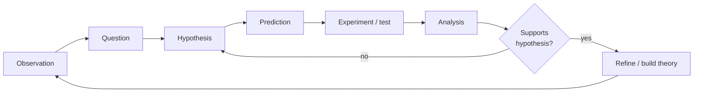

# The Scientific Method

The scientific method is the iterative procedure by which science turns curiosity about the world
into warranted knowledge. Textbooks often present it as a fixed sequence of steps, but that tidy
recipe is a simplification. In practice the "method" is a **loop** — a disciplined cycle of
proposing explanations and testing them against evidence — that scientists run many times, in any
order, often circling back when results surprise them.

## The canonical loop

- **Observation** — notice a phenomenon or a pattern in existing data.
- **Question** — frame a specific, answerable question about it.
- **Hypothesis** — propose a testable, tentative explanation. A good hypothesis is
  [falsifiable](falsifiability-and-demarcation.md): it forbids some possible observations.
- **Prediction** — deduce what *should* be observed if the hypothesis is true (and, crucially,
  what should *not*).
- **Experiment or test** — gather new evidence, ideally under [controlled
  conditions](experiments-and-controls.md), to check the prediction.
- **Analysis** — compare results to the prediction, using [statistics](hypothesis-theory-and-law.md)
  to judge whether the difference is real or noise.
- **Revise or build** — reject or refine the hypothesis, or, if it survives repeated tests,
  fold it into a broader [theory](models-and-theories-in-science.md). Then iterate.

## Why the "recipe" view misleads

Real inquiry rarely marches through these steps once. Discoveries come from accident, analogy, and
inspired guessing as much as from orderly deduction; hypotheses are often invented *after* an
unexpected result, then tested on fresh data. The method's real content is not the sequence but two
commitments:

- **Test against evidence that could prove you wrong.** A hypothesis earns credibility only by
  surviving genuine attempts to refute it — which is why the *prediction* step must risk something.
- **Control the alternatives.** Any result has rival explanations; good method systematically rules
  them out (see [experiments and controls](experiments-and-controls.md) and
  [correlation vs causation](correlation-and-causation.md)).

## A worked shape: the null hypothesis

In much of science, and nearly all of the [social sciences](../statistics/index.md), the test is
framed against a **null hypothesis** — the default claim that there is *no* effect. The researcher
gathers data and asks how surprising it would be under the null. Only if the data are surprising
enough (unlikely to be mere chance) is the null rejected in favor of a real effect. This machinery
is developed in [hypothesis, theory, and law](hypothesis-theory-and-law.md) and rests on
[statistics](../statistics/index.md).

## Why it matters

The scientific method is a *cognitive prosthesis*: a set of habits that compensate for the ways
human reasoning goes wrong — confirmation bias, seeing patterns in noise, trusting authority. By
forcing ideas to make risky predictions and face controlled tests, it makes the world, rather than
the scientist's preferences, the arbiter of truth. Everything downstream —
[reproducibility](uncertainty-error-and-reproducibility.md),
[peer review](scientific-community-and-peer-review.md) — exists to keep that arbitration honest.

## References

- [Novum Organum](bacon-novum-organum.md) — Bacon's founding argument for inductive, experimental
  inquiry over deduction from authority.
- [The Logic of Scientific Discovery](popper-logic-of-scientific-discovery.md) — Popper's
  reframing of the method around refutation rather than confirmation.
