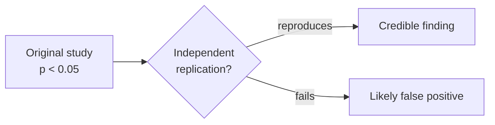

# Uncertainty, Error, and Reproducibility

No measurement is exact and no single study is decisive. Mature science does not pretend otherwise:
it *quantifies* how much it doesn't know, distinguishes kinds of error, and treats a result as real
only once others can reproduce it. Handling uncertainty honestly is what separates science from the
appearance of science.

## Two kinds of error

- **Random error** — unpredictable scatter that pushes measurements above and below the true value
  with no consistent direction. It limits [precision](observation-and-measurement.md) and is reduced
  by **averaging repeated measurements**: noise partly cancels, and uncertainty shrinks roughly with
  the square root of the sample size.
- **Systematic error (bias)** — a consistent offset in one direction, from a miscalibrated
  instrument, a flawed procedure, or a skewed sample. It limits **accuracy** and is *not* fixed by
  taking more measurements — averaging a biased instrument just gives a precise wrong answer. It must
  be hunted down by [calibration and controls](experiments-and-controls.md).

Reporting a result means stating its uncertainty — an error bar, a confidence interval, a ± range —
so readers know how much weight it bears. A result with no stated uncertainty is incomplete.

## Statistical significance and its abuse

To judge whether an effect is more than random error, science uses statistical tests, most commonly
the **p-value**: the probability of seeing data at least this extreme *if there were no real effect*
(the [null hypothesis](hypothesis-theory-and-law.md)). A conventional threshold (p < 0.05) marks
"statistically significant." But this tool is widely misused:

- **A p-value is not the probability the hypothesis is true**, nor the size or importance of an
  effect. A tiny, trivial effect can be "significant" with a big enough sample.
- **p-hacking / data dredging** — trying many analyses and reporting only those that cross 0.05
  manufactures false positives. Test 20 things and one will "significantly" pass by chance.
- **Publication bias** — journals prefer positive results, so the literature over-represents flukes
  and under-represents the null findings that would balance them ("the file-drawer problem").

## The replication crisis

Reproducibility — independent researchers getting the same result with the same methods — is the
ultimate check. In the 2010s, large replication projects (notably in
[psychology](../psychology/index.md), also medicine and other fields) found that a substantial
fraction of published, "significant" findings **failed to replicate**. The causes trace directly to
the abuses above — p-hacking, publication bias, small underpowered samples, and undisclosed analytic
flexibility — rather than to fraud.

The response is the **open-science** movement: pre-registration of hypotheses and analysis plans
before data collection, sharing data and code, larger samples, reporting effect sizes with
confidence intervals, and rewarding replication (see [the scientific community and peer
review](scientific-community-and-peer-review.md)).

## Why it matters

Science's authority rests on being self-correcting — but self-correction only works if uncertainty
is stated, errors are the right kind of catchable, and findings are actually reproduced. Knowing why
a single significant study is weak evidence, and why replication and quantified uncertainty are
non-negotiable, is what lets you read scientific news without being whipsawed by every preliminary
result.

## References

- [The Logic of Scientific Discovery](popper-logic-of-scientific-discovery.md) — on why a claim that
  cannot fail a test, or be independently checked, is not yet science.
