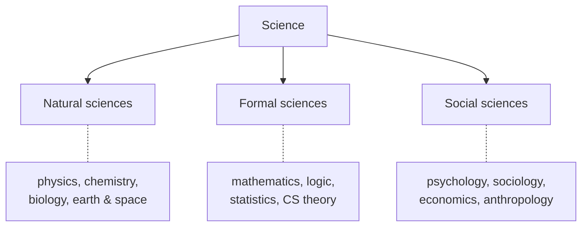

# What Is Science

Science is a systematic enterprise for building and organizing knowledge about the world in the
form of testable explanations and predictions. Two features distinguish it from other ways of
knowing. First, it is **empirical**: its claims must ultimately answer to observation and evidence,
not to authority, tradition, revelation, or intuition alone. Second, it is **self-correcting**:
its claims are held provisionally and revised when better evidence arrives. Science is therefore
less a fixed body of facts than a *method* — and a community that practises it — for turning
observations into reliable, general knowledge.

## The aims of science

Scientific work pursues four intertwined goals, usually in this order of ambition:

- **Describe** — characterize a phenomenon accurately (what happens, how often, under what
  conditions).
- **Explain** — identify the mechanism or cause that produces it.
- **Predict** — say what will happen in situations not yet observed.
- **Control / apply** — intervene on the phenomenon, the bridge to
  [engineering](../engineering/index.md) and technology.

Prediction is the sharpest of these because a theory that predicts novel, checkable outcomes
exposes itself to failure — the heart of [falsifiability](falsifiability-and-demarcation.md).

## The kinds of science

- **Natural sciences** study the physical and living world through observation and experiment:
  [physics](../physics/index.md), [chemistry](../chemistry/index.md),
  [biology](../biology/index.md), earth and space science. They are the paradigm case of empirical
  science.
- **Formal sciences** — [mathematics](../math/index.md), [logic](../logic/index.md),
  [statistics](../statistics/index.md), theoretical computer science — study abstract structures
  and are validated by *proof* rather than experiment. They supply the language the natural
  sciences reason in, but are not themselves empirical.
- **Social sciences** study human behavior and societies ([psychology](../psychology/index.md),
  [sociology](../sociology/index.md), [economics](../economics/index.md),
  [anthropology](../anthropology/index.md)). They use the empirical method on subjects that are
  harder to isolate, control, and measure, so they lean heavily on
  [statistics](../statistics/index.md) and [careful experimental design](experiments-and-controls.md).

The [branches of science](the-branches-of-science.md) note develops this map further, including the
tension between **reductionism** (explain wholes by their parts) and **emergence** (wholes with
properties their parts lack).

## Science versus non-science

Not every claim about the world is scientific. What separates science from
[pseudoscience](falsifiability-and-demarcation.md), dogma, or mere opinion is not the subject
matter but the *method and attitude*: exposing claims to evidence that could refute them, quantifying
[uncertainty](uncertainty-error-and-reproducibility.md), and submitting results to
[the community's scrutiny](scientific-community-and-peer-review.md). This boundary question — the
**demarcation problem** — is one of the field's central puzzles, and no single criterion draws the
line cleanly.

## Why it matters

Science is the most reliable engine humans have built for correcting their own errors about the
natural world. Its power comes not from the infallibility of any scientist but from a *system* —
[method](the-scientific-method.md), [measurement](observation-and-measurement.md),
[peer review](scientific-community-and-peer-review.md), replication — designed so that mistakes get
caught and knowledge accumulates. The rest of this folder is that system, taken apart piece by
piece.

## References

- [The Structure of Scientific Revolutions](kuhn-structure-of-scientific-revolutions.md) — Kuhn on
  what a mature science is and how it changes.
- [The Demon-Haunted World](sagan-demon-haunted-world.md) — Sagan on science as a way of thinking,
  not just a body of knowledge.
