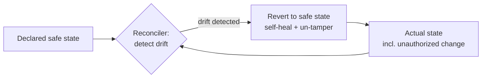

# Building Secure and Reliable Systems

Google's 2020 book by Heather Adkins, Betsy Beyer, Paul Blankinship, Ana Oprea, Piotr Lewandowski, and Adam Stubblefield argues a single thesis: **security and reliability are the same discipline**, not adjacent concerns. A system that isn't secure can't be considered reliable, and vice versa — both are about a system continuing to do the right thing under adversarial or degraded conditions. It is kept here for two ideas that anchor HAL's stance on running AI-generated code safely: **least privilege** and **the reconciler pattern used as a safety mechanism**.

## Least privilege

Every component, credential, and human should hold the **minimum authority needed to do its job, and no more** — so that a compromise or a mistake is contained rather than catastrophic. The book develops this into concrete practice: fine-grained access instead of broad admin, short-lived credentials over standing ones, breaking large privileges into auditable pieces, and requiring multi-party authorization for the most dangerous actions. Least privilege is the design principle that turns "an attacker got in" or "the agent did something wrong" from a total breach into a bounded incident.

## Defense in depth and blast-radius control

Reliability and security both come from **layered controls** — no single point whose failure defeats the whole system — and from deliberately **limiting blast radius**: compartmentalizing so that a failure in one zone cannot cascade. The book pairs this with designing for **recovery and resilience**: assume things will break or be attacked, and make the system able to detect, contain, and return to a known-good state.

## The reconciler as a safety mechanism

The book's most transferable engineering idea for HAL is that a **continuous reconciliation loop is itself a security-and-reliability control**. If the intended state of a system is declared and a reconciler constantly drives actual state back toward it, then unauthorized or accidental drift — a config someone changed by hand, a resource an attacker spun up, a permission that shouldn't exist — gets *automatically detected and reverted*. The same [Kubernetes reconciler](../distributed-systems/kubernetes-up-and-running.md) that provides self-healing availability doubles as an enforcement mechanism: the loop that heals is the loop that also un-does tampering. Declared desired state plus a reconciler equals both resilience and a tripwire.

## Why it matters here

For AI-generated and AI-executed change, these two ideas are the safety spine. Least privilege is why an agent should run with scoped, revocable, minimal permissions — the containment principle behind [execution sandboxing](../ai-platform/execution-sandboxing.md) and the [LLM safeguards](../ai-platform/llm-safeguards.md) notes. The reconciler-as-safety-mechanism is why a harness that continuously reasserts desired state is not just an availability tool but a security control: it bounds what a misbehaving generator can leave behind. It complements HAL's [web security](web-security.md) and [six layers of AI governance](../ai-governance/six-layers-ai-governance.md) notes with the deeper principle that security and reliability are engineered by the same loop.

## References

- [Building Secure and Reliable Systems — Adkins, Beyer, Blankinship, Oprea, Lewandowski, Stubblefield (Google / O'Reilly, 2020)](https://sre.google/books/building-secure-reliable-systems/)
