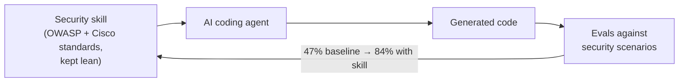

# Cisco CodeGuard: Security Skills for AI Coding Agents

A Cisco principal engineer on the AI Native Dev podcast describes **CodeGuard**:
**security skills for your AI coding agent.** Cisco wants developers across its orgs
to use AI coding because it accelerates delivery — so the fix is not to slow the
agent down but to **inject security guidance into the agent's context** so it writes
safer code in the first place. This is the "security guidance injected into the
agent" half of [AI code security](ai-code-security.md), made concrete.

## What it is

CodeGuard packages OWASP best practices and Cisco's internal software-security
standards into **skills** the agent loads. A design constraint runs through the
whole thing: **too much context is a problem** — skills are kept lean and actionable
rather than dumping a verbose security manual into the prompt (agent-authored skills
tend to be overly verbose, and that hurts).

## Measured, not asserted: the eval loop

The distinguishing feature is that skills are **backed by evals** and continuously
re-evaluated. Each skill is tested against realistic scenarios; if an eval isn't
accurate, it's changeable, so the skill stays honest.

Reported result on their scenarios:

- **Baseline (plain Claude Code, no skill): 47%** success against the security
  criteria.
- **With the CodeGuard skill: 84%** agent success.

That is the same **47% → 84% (1.79×)** figure cited in
[AI code security](ai-code-security.md) for Cisco's CodeGuard layer — read as
self-reported by the tool's builders, best treated as directional. The mechanism is
what matters: security skills + evals turn "write secure code" from a hope into a
measured, regression-tested capability.

## Related

- [AI code security](ai-code-security.md) — the CodeGuard figure and the inject-guidance strategy.
- [Does AI generate secure code?](does-ai-generate-secure-code.md) — why steering the model works.
- [The hidden vulnerabilities behind AI code](hidden-vulnerabilities-ai-code.md) — the gap CodeGuard aims to close.
- [Evals & LLM-as-a-judge](../ai-platform/evals-llm-as-a-judge.md) — the measurement discipline behind the skills.

## References
- [Cisco Principal Engineer's Fix for AI Code Security (AI Native Dev)](https://www.youtube.com/watch?v=aI5-oKjfgo4)
