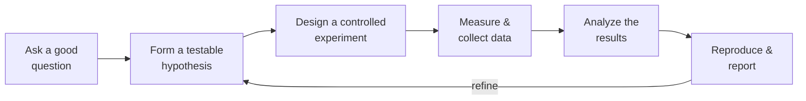

# Essential Cybersecurity Science

Josiah Dykstra's argument is that security work too often runs on intuition, vendor
claims, and folklore — and that the cure is the same scientific method used in the
physical sciences, applied deliberately to security systems. Instead of asserting that a
tool, defense, or product "works," you form a hypothesis, design a controlled experiment
to test it, measure the outcome, analyze the data, and — crucially — make the whole thing
reproducible so someone else can check you. The book's thesis is that this discipline is
learnable and applies across every corner of the field.

## The experimental loop

The core is a repeatable cycle. It is the same loop whether you are fuzzing a parser or
tuning an intrusion detector.

- **Good question.** Specific, answerable, and worth answering — "does turning on ASLR
  reduce successful exploitation of *this* class of bug?" beats "is ASLR good?"
- **Testable hypothesis.** A falsifiable claim with a predicted outcome, not a hope.
- **Controlled experiment.** Change one variable, hold the rest fixed. This is what
  separates a real result from a coincidence: without controls you cannot attribute the
  effect to the thing you changed.
- **Measurement.** Decide the metrics before you run, so you are not fishing for a
  flattering number afterward.
- **Analysis.** Interpret honestly, account for variance, and don't over-claim from a
  single run.
- **Reproducibility.** Document the environment, inputs, tooling, and steps well enough
  that the experiment can be rerun and confirmed — the difference between a finding and an
  anecdote.

## Why rigor matters in security

Security is adversarial and consequential, which makes unverified claims expensive.
Dykstra spends real energy on **pseudoscience** and on how buyers get misled: vendor
marketing, cherry-picked benchmarks, and "provably secure" language that hides its
assumptions. The book includes a set of clarifying questions to put to salespeople and
researchers to probe the methodology behind a claim. It also treats **human factors**
seriously — the roles people play in experiments and the **cognitive biases**
(confirmation bias, anchoring, and friends) that quietly corrupt both the design and the
interpretation of security tests. Rigor is the defense against fooling yourself. This is
the same instinct behind treating [LLM-as-a-judge evaluations](../ai-platform/evals-llm-as-a-judge.md)
as measurements that need calibration and controls rather than trusted verdicts.

## Prerequisites and test environments

Before running anything, the book covers the setup that makes results trustworthy:
sourcing **open datasets** so experiments are comparable and repeatable, and choosing a
test environment — desktop, cloud, or a dedicated **cybersecurity testbed** — with a
checklist for picking one. The environment is part of the experiment: an uncontrolled or
undocumented one is why "works on my machine" is not evidence.

## Experimentation across security domains

The back half of the book is a tour showing the same loop applied domain by domain. Each
chapter opens with a worked example experiment, then a case study and a fresh experiment
to try.

- **Software assurance** — testing that software behaves securely, with **fuzzing** as the
  worked technique: generate malformed inputs and measure what crashes or leaks. This is
  the security-testing sibling of the review-and-verify discipline in
  [securing AI-generated code](ai-code-security.md), and the experimental complement to
  the attack/defense catalog in [Web Security: A WhiteHat Perspective](web-security.md).
- **Malware analysis** — experiments to characterize and classify malicious code rather
  than eyeballing it.
- **Cryptography** — experimentally evaluating designs and implementations, and being
  precise about what "provably secure" does and does not guarantee once assumptions,
  composition, and constrained environments (e.g. IoT) enter the picture.
- **Digital forensics** — treating investigative conclusions as claims that must hold up,
  supported by evidence and repeatable procedure.
- **Intrusion detection** — the recurring tradeoff between detection accuracy and
  performance, measured instead of guessed.
- **Situational awareness** — experiments in making the state of a system and its threats
  legible.
- **Human-computer interaction / usability** — measuring **effectiveness, efficiency, and
  satisfaction**, with usability tested during both design and validation (the case study
  is a user-friendly encrypted-email interface). Insecure-because-unusable is a real
  failure mode.
- **Visualization** — evaluating security visualizations experimentally rather than by
  which one looks best.

## Building reproducible experiments

The through-line is reproducibility as a first-class deliverable. A security result you
cannot rerun — same dataset, same environment, same procedure — is not yet evidence. The
book's checklists (for constructing an experiment and for selecting a test environment)
exist to force that discipline early, so the eventual claim rests on a documented,
repeatable procedure rather than a one-time observation. Appendix A closes the loop on the
consumer side: how to evaluate the scientific claims of others and spot real versus bogus
science.

## References

- [Essential Cybersecurity Science — O'Reilly](https://www.oreilly.com/library/view/essential-cybersecurity-science/9781491921050/)
