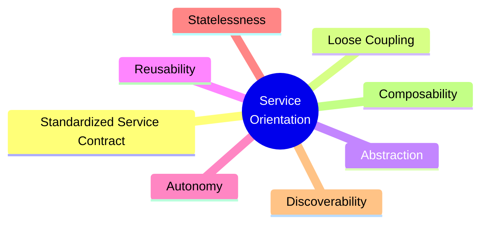

# SOA: Principles of Service Design

Thomas Erl's *SOA: Principles of Service Design* (2007) is the canonical text defining
**Service-Oriented Architecture** as a disciplined design paradigm rather than a vendor
product or protocol. Where earlier SOA writing was long on hype and short on rigor, Erl's
contribution was to name a concrete, teachable set of **service-orientation design
principles** and tie each one back to the strategic goals SOA is supposed to deliver.
This note treats his work as the definitive SOA entry.

## What SOA is

SOA is an architectural style in which an enterprise's capabilities are exposed as a set
of **services** — self-contained units of logic with a published contract — that are
**reusable** and **composable** into larger business processes. The unit of design is the
service; the unit of value is the *composition* of services into workflows that solve
business problems. Rather than building each application as an isolated silo, SOA aims for
an enterprise-wide inventory of services that many consumers can reuse, so new capabilities
are assembled from existing parts instead of rebuilt each time.

The style grew out of the web-services era (WSDL, XML Schema, SOAP, WS-* policy), and Erl's
treatment leans on those standards for the concrete mechanics of contracts and coupling —
but the principles themselves are technology-neutral and outlast any one protocol.

## The eight service-orientation design principles

Erl's core contribution is eight principles, each the subject of its own chapter. They are
mutually reinforcing: pursuing one (e.g. reusability) is what makes another (e.g.
composability) achievable.

1. **Standardized Service Contract** — services express their purpose and capabilities
   through a formal, consistent contract (in the web-services era: WSDL + XML Schema +
   WS-Policy). Standardizing contracts across the inventory is what lets services
   interoperate without custom glue.
2. **Loose Coupling** — minimize dependencies between a service, its consumers, and its
   own implementation. The contract is the only thing consumers depend on; the underlying
   technology, data model, and logic can change behind it. Erl catalogs positive and
   negative coupling types and the trade-offs of each.
3. **Abstraction** — a service hides its internals and publishes only what a consumer needs
   to use it. Information hiding at the service boundary; consumers see the contract, not
   the implementation.
4. **Reusability** — services are designed as agnostic, general-purpose enterprise
   resources, not one-off solutions. This borrows explicitly from commercial software design
   (build once, use many times) and is the economic heart of SOA.
5. **Autonomy** — a service controls its own runtime environment and underlying resources as
   much as possible, so its behavior is predictable and reliable regardless of what else is
   happening in the enterprise. Higher autonomy improves reliability, scalability, and
   performance.
6. **Statelessness** — services defer state management wherever possible and stay stateless
   between invocations, freeing resources and improving scalability. State is externalized
   rather than held in the service.
7. **Discoverability** — services are designed to be found and interpreted, with metadata
   rich enough that they can be located in a registry and understood well enough to be
   reused, rather than duplicated.
8. **Composability** — services are designed to participate as members of larger
   compositions, potentially deep and complex ones. This is the payoff principle: an
   inventory of composable services is what lets the enterprise assemble new processes from
   existing parts.

The book also contrasts service-orientation with **object-orientation** (a whole chapter),
clarifying what actually qualifies as "service-oriented" logic versus merely wrapping an
object model in a web-service interface.

## Services, the ESB, and orchestration

Classic SOA composes services through infrastructure rather than direct point-to-point
calls:

- The **Enterprise Service Bus (ESB)** is the messaging backbone — routing, transformation,
  and protocol mediation between services, so consumers and providers stay loosely coupled
  and need not share a wire format.
- **Orchestration** (e.g. BPEL-era process engines) composes services into executable
  business processes with a central coordinator that owns the workflow. This is the
  composability principle made operational at the enterprise scale.

The ESB is the feature most associated — and most criticized — in later years: centralizing
intelligence in the bus tends to grow it into a bottleneck and a coupling point of its own,
which is one of the tensions the microservices movement reacted against.

## Relationship to microservices

SOA is the **enterprise-wide ancestor**; microservices are the **fine-grained,
independently-deployable descendant.** They share the same lineage — services with
contracts, loose coupling, composition — but differ sharply in emphasis:

- **Granularity & scope.** SOA targets enterprise-wide reuse through a shared service
  inventory and a shared bus. [Microservices](microservice-architecture.md) favor small
  services owned by autonomous teams, each independently deployable.
- **Smart pipes vs. dumb pipes.** SOA concentrates routing and orchestration logic in the
  ESB ("smart pipes"). Microservices push logic into the endpoints and keep the transport
  dumb — favoring lightweight messaging and choreography over a central bus.
- **Data ownership.** SOA often shared canonical enterprise data; microservices insist on a
  database-per-service to preserve autonomy.
- **Governance.** SOA leans on centralized, top-down governance; microservices lean on
  decentralized team ownership.

Erl's eight principles largely carry forward — loose coupling, autonomy, statelessness,
composability, contracts are all still load-bearing in microservices. What changed is the
deployment and organizational model, not the underlying design ideals. See
[Building Microservices](building-microservices.md) for the modern treatment and
[Monolith to Microservices](monolith-to-microservices.md) for the migration path — both of
which build on the service-design ideas Erl formalized.

## Related notes

- [Microservice architecture](microservice-architecture.md) — the fine-grained descendant.
- [Building Microservices](building-microservices.md) — Newman's canonical microservices text.
- [Monolith to Microservices](monolith-to-microservices.md) — decomposition patterns.
- [Patterns of Enterprise Application Architecture](patterns-of-enterprise-application-architecture.md)
  — the enterprise application patterns SOA services are often built from.
- [Enterprise Integration Patterns](enterprise-integration-patterns.md) — the messaging
  patterns underpinning the ESB and service-to-service integration.
- [Domain-Driven Design](domain-driven-design.md) — bounded contexts, which inform how both
  SOA and microservices carve up the enterprise into service boundaries.

## References

- [SOA: Principles of Service Design — Thomas Erl (Pearson/Prentice Hall, 2007)](https://www.informit.com/store/soa-principles-of-service-design-9780132344821)
