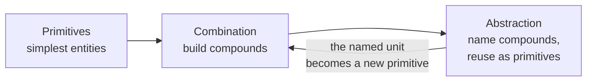

# Structure and Interpretation of Computer Programs (SICP)

By Harold Abelson and Gerald Jay Sussman with Julie Sussman (MIT Press, 2nd ed.
1996). The "Wizard Book" — the foundational MIT text that treats programming not
as a matter of syntax or a particular language, but as the discipline of
**controlling the complexity of large systems**. Its examples are in Scheme (a
small Lisp), but the language is incidental; the book is about ideas that outlive
any language.

## The thesis: programs are written for people

The book's most-quoted line frames everything else:

> "Programs must be written for people to read, and only incidentally for
> machines to execute."

A program is a description an author gives to other humans — future maintainers,
collaborators, and their own later self. Machine execution is a side effect. This
reorders priorities: clarity, structure, and the honest naming of ideas come
first; making the machine go is the easy part once the ideas are clean. This is
the same conviction that runs through [A Philosophy of Software
Design](a-philosophy-of-software-design.md) (fight complexity as the central
enemy), [Clean Code](clean-code.md) (code is read far more than it is written),
and [Code Simplicity](code-simplicity.md).

## Three mechanisms for managing complexity

Every powerful language, SICP argues, gives you the same three tools. When you
evaluate a language — or design an abstraction — ask what it offers on each axis:

1. **Primitive expressions** — the simplest entities the language provides
   (numbers, built-in procedures like `+`).
2. **Means of combination** — ways to build compound elements from simpler ones
   (nesting expressions, applying procedures to arguments).
3. **Means of abstraction** — ways to name compound elements and manipulate them
   as units (`define`, so a combination can be used as a primitive elsewhere).

The loop is the point: abstraction feeds back into combination. A named
procedure becomes a black box you combine again, and complexity stays bounded no
matter how large the system grows. This is the mechanical answer to the "easy vs.
simple" distinction in [Simple Made Easy](simple-made-easy.md) — abstraction lets
you *unbraid* concerns so each piece stays simple.

## Building abstractions with procedures

A procedure is a pattern for a computation. SICP separates **what** a procedure
does (its contract) from **how** it does it (its implementation) — a black-box
abstraction. Reasoning about programs starts with a model of evaluation:

- **The substitution model** — the beginner's mental model of applicative-order
  evaluation: to apply a procedure, substitute arguments for parameters in its
  body and reduce. It is a *model*, not the truth, and it deliberately breaks
  down once assignment enters the picture (see below), which is exactly why the
  book introduces it and then retires it.

**Higher-order procedures** take the same idea one level up: procedures that
accept or return other procedures. Patterns like `sum`, `map`, `filter`, and
`accumulate` capture a *shape* of computation once, so the varying part is passed
in. This is the origin of the functional-programming vocabulary now standard
everywhere, and it is abstraction applied to control flow itself.

## Data abstraction

The same wall between interface and implementation applies to data. You define
data by its **selectors and constructors** and the contract they satisfy (e.g. a
rational number is whatever `make-rat`, `numer`, `denom` agree on), not by its
representation. Programs written to the interface are immune to representation
changes — the classic decoupling. SICP pushes this to closure (structures built
from structures, like lists and trees) and to symbolic data.

## State, environments, and the substitution model's limits

Introducing **assignment and local state** (`set!`) is a turning point. Once
objects have mutable identity, the substitution model no longer works — two calls
with the same arguments can return different results. The book replaces it with
the **environment model**: evaluation happens relative to an environment (a chain
of frames binding names to values), and a procedure is code plus the environment
it was defined in (a closure). This machinery explains local state, message-passing
objects, and why identity and equality diverge once mutation exists — the cost
that assignment buys you.

## Streams

**Streams** are lists whose tails are computed on demand (delayed evaluation).
They let you model time-varying quantities as sequences without mutable state —
recovering much of the clarity of the substitution model while still expressing
signals, iteration, and even infinite sequences. Streams are the book's
demonstration that state is a modeling choice, not a necessity.

## Metalinguistic abstraction

The final and highest move: when a problem is hard, **invent a language** in which
it is easy to express, then implement that language. Programs that manipulate
programs.

- **The metacircular evaluator** — a Scheme interpreter written in Scheme. Making
  `eval` and `apply` explicit demystifies what "running a program" means: `eval`
  reduces an expression in an environment; `apply` binds arguments and evaluates
  a body. Because it is written in the language it interprets, the evaluator lays
  bare the whole evaluation model in a page of code.
- **Variations and compilers** — from there the book builds lazy evaluators,
  nondeterministic (`amb`) evaluators, a logic-programming language, a
  register-machine simulator, and a **compiler** that translates to
  register-machine instructions. The recurring lesson: interpreters and compilers
  are two strategies for the same job, and the boundary between "language,"
  "interpreter," and "program" is one you draw, not one that is given.

## Why it belongs in this wiki

SICP is the deep bedrock under the newer books here. It is the *mechanism* behind
their advice: complexity is the enemy, abstraction is the weapon, and every
abstraction is a contract you draw between what and how. Where
[Introduction to Algorithms](introduction-to-algorithms.md) asks how to make a
computation *fast*, SICP asks how to make a system *comprehensible* — the prior
question, and the harder one.

## References

- [Structure and Interpretation of Computer Programs — MIT Press](https://mitpress.mit.edu/9780262510875/structure-and-interpretation-of-computer-programs/)
