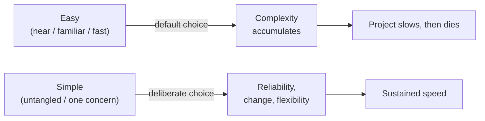

# Simple Made Easy

Rich Hickey's 2011 Strange Loop talk (the author of Clojure) argues that the software
industry systematically confuses two different things — **simple** and **easy** — and that
this confusion is the root of most of the complexity that eventually kills projects. The
talk is a case for choosing simplicity deliberately, even when it feels slower up front.

## Simple ≠ easy — they are different axes

The two words are not synonyms; they measure different things.

- **Simple** is the opposite of **complex**. The word's root is *sim-plex* — "one fold /
  one braid." Its opposite, *com-plex*, means "braided together, intertwined." Simplicity
  is about how many things are twisted together, and it is a largely **objective** property:
  you can look at a construct and see whether it interleaves multiple concerns.
- **Easy** comes from a root meaning "to lie near" — "at hand," "approachable," "familiar."
  Easiness is **relative** to the observer: near to my skills, near to my tools, near to
  what I already know. Something can be easy (a one-line ORM call, an available library) and
  still be deeply complex under the hood.

The core insult of the talk: we make decisions by reaching for what is *easy* (near, familiar,
fast to type) rather than what is *simple* (untangled), and then we pay for the tangle forever.

## Complecting — the sin

Hickey coins the verb **complect**: to interleave, braid, or tie things together. Every time
you complect two concerns, complexity rises **combinatorially**, not additively — because now
you can no longer reason about either one in isolation. Humans can only hold a few things in
mind at once, and intertwining destroys the ability to consider a piece by itself.

Simplicity, then, is achieved by **not** complecting — by keeping each thing about *one* thing.

## Why it matters: simplicity is a prerequisite for reliability

What actually matters in software is: does it do what it should, is it of high quality, can
we rely on it, can we fix problems as they arise, can requirements change over time? None of
that is about how the code *felt* to write.

The benefits of simplicity are concrete:

- **Ease of understanding** — you can reason about a part without the whole.
- **Ease of change** — to change software safely you must first understand it.
- **Ease of debugging** — untangled code isolates faults.
- **Flexibility** — decoupled pieces recombine freely.

A memorable jab at over-reliance on tooling: every bug in production *passed the type checker
and passed all the tests*. Guardrails don't grant understanding; they let you drive without
looking. Simplicity is what lets you look.

## The speed illusion

Choosing "easy" feels fast at the start — like a sprinter off the blocks. But ignored
complexity accumulates and slows you down over time; eventually it kills the project. Choosing
simplicity starts slower (you have to think things through) but stays fast. Firing the starting
gun every 100 yards and calling each stretch a "new sprint" doesn't make the marathon shorter.

## Complex vs. simple constructs

Hickey pairs common constructs by which fold in incidental complexity and which stay untangled:

| Complex (braids concerns) | Simple (one concern) |
|---|---|
| State, objects | Values |
| Methods | Functions, namespaces |
| Inheritance, switch/matching | Polymorphism (à la carte) |
| Vars, mutable state | Managed refs |
| Imperative loops, fold | Set functions |
| Actors | Queues |
| ORM | Declarative data manipulation |
| Conditionals | Rules |
| Inconsistency | Consistency |

The point is not "never use the left column" but to recognize what each construct entangles.

## How to build simple systems

1. **Abstraction as design** — design by asking *what, who, when, where, why, how*, and
   answer each independently.
   - **What**: define small abstractions (interfaces, protocols) that are *specifications,
     not implementations*. Name them. Keep them small; use polymorphism to keep them small.
   - **Who**: define the data/entities the abstractions use; pass subcomponents as arguments
     rather than hard-wiring them.
   - **How**: flesh out implementations last, isolated, leaning on the polymorphism defined
     earlier — so implementation detail never leaks into the specification.
   - **When / where**: don't tie things together in time or place; decouple with **queues**
     instead of direct connections.
2. **Choose constructs that generate simple artifacts** — judge a construct by the tangle of
   what it *produces*, not by how easy it is to type.
3. **Simplify by encapsulation** — "I don't know and I don't want to know" what's behind an
   abstraction is a feature, not a gap.

## Takeaways

- Aim for **simplicity because it is a prerequisite for reliability** — not because it's
  elegant.
- Watch your language: "simple" and "easy" are different. Decisions made for easiness are
  often complexity in disguise.
- The enemy is **complecting**. Keep each thing about one thing; decouple with values,
  functions, and queues.
- Tests and types catch some errors but do not substitute for the *understanding* that only
  simplicity affords.

Related notes in HAL: [Code Simplicity](code-simplicity.md), [Clean Code](clean-code.md),
[Clean Architecture](clean-architecture.md), [The Law of Leaky Abstractions](law-of-leaky-abstractions.md),
[Refactoring: Improving the Design of Existing Code](refactoring-improving-the-design-of-existing-code.md),
[Hexagonal Architecture (Ports and Adapters)](hexagonal-architecture-ports-and-adapters.md).

## References

- [Simple Made Easy — Rich Hickey, Strange Loop 2011 (InfoQ)](https://www.infoq.com/presentations/Simple-Made-Easy/)
