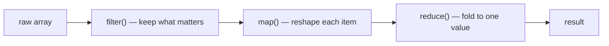

# Simplifying JavaScript

Joe Morgan's *Simplifying JavaScript* (Pragmatic Bookshelf, 2018) is a
tips-based field guide to modern JavaScript. Its argument is that ES5, ES6, and
beyond didn't just add features — they gave you a vocabulary for saying what you
mean. The book is organized as 51 small, self-contained tips, each one a
before/after refactor: take a tired idiom and replace it with a clearer, more
declarative modern one. Nothing here is a rewrite-the-world proposal; every tip
is a change you can make in one sitting, and the cumulative effect is code that
reads like intent instead of mechanism.

This maps directly onto the idea that the best code communicates its purpose,
echoing the taste-and-craft view of [JavaScript: The Good Parts](javascript-the-good-parts.md)
and the reduce-what-you-must-hold-in-your-head thesis of [Code Simplicity](code-simplicity.md).

## The through-line: signal intent

The unifying theme is *signaling*. Old JavaScript forced you to write code whose
shape hid its purpose — a `var` says nothing about whether a value changes, a
`for` loop buries the fact that you're really just transforming a list. Modern
syntax lets the shape of the code carry the meaning, so a reader (or a future
you) can tell at a glance what's going on.

## Variables: say whether a value changes

- Default to `const`. Reach for `let` only when you genuinely reassign. Reserve
  `var` for legacy. The keyword itself becomes a signal: `const` tells the reader
  "this binding is stable," which removes a whole class of "wait, does this
  change later?" questions.
- Block scoping (`let`/`const`) confines a variable to the block it lives in,
  killing the leaky, hoisted, function-wide scope of `var` and the bugs that came
  with it.
- **Template literals** (backtick strings) replace fragile `+` concatenation with
  readable interpolation and multi-line strings.

## Collections: build them without mutating

- Prefer arrays for ordered collections; use `includes()` for a clean membership
  check instead of `indexOf() !== -1`.
- The **spread operator** (`...`) is the workhorse for *immutable* updates: copy
  and extend an array without `push` mutating the original, and sort a copy
  instead of sorting in place. The same move applies to objects via
  `Object.assign()` and object spread — produce a new object rather than mutating
  the input.
- Use **`Map`** for key-value data that changes over time or has non-string keys,
  and **`Set`** to keep a collection unique. These special collections say
  something a plain object can't: "this is a lookup," "these are distinct."

## Conditionals: shorten without obscuring

- Lean on **falsy values** so a guard reads plainly instead of comparing against
  `undefined`, `null`, `''`, `0` one at a time.
- The **ternary** expresses a small either/or inline.
- **Short-circuiting** (`||`, `&&`) supplies defaults and gates side effects
  concisely — used with restraint so it stays readable.

## Loops: prefer array methods over hand-rolled iteration

This is the book's biggest lever. A hand-written `for` loop mixes *what* you want
with *how* to walk the collection. Array methods separate the two:

- **`map()`** — transform every element into a new array of the same size.
- **`filter()`** / **`find()`** — pull out the subset (or first match) you care
  about.
- **`forEach()`** — apply a consistent side effect across a list.
- **`reduce()`** — fold a collection down to a single value (a sum, an object, a
  grouped structure).
- **Chaining** these composes a pipeline that reads top-to-bottom as a sequence of
  transformations.

The point isn't cleverness — it's that the method name announces the intent, so
`filter` reads as "keep these" without the reader decoding loop bookkeeping.

## Parameters and returns: declare shape at the boundary

- **Default parameters** move fallback logic into the signature, so the function's
  contract is visible where you call it.
- **Destructuring** pulls named fields out of objects and arrays right in the
  parameter list or assignment, so a function states exactly which properties it
  consumes.
- The **rest operator** (`...args`) collects a variable number of arguments into a
  real array — the modern replacement for the awkward `arguments` object.

## Functions: small, testable, context-safe

- Write functions for **testability**: pure, single-responsibility, dependencies
  passed in.
- **Arrow functions** cut ceremony for short callbacks, and — critically — they
  bind `this` **lexically**. That solves the classic "lost `this`" bug where a
  callback's `this` silently changed; the arrow keeps the surrounding context, so
  you rarely need `bind()`, `that = this`, or `self`.
- **Partial application and currying** let you fix some arguments up front and
  compose specialized functions, pairing naturally with array methods.

## Classes: clearer object interfaces

ES6 `class` syntax is sugar over prototypes, but it makes intent legible:
readable class bodies, `extends` for inheritance, `get`/`set` for computed
interfaces, and generators for iterable properties. When context is genuinely
tricky, `bind()` pins `this` explicitly.

## Async and external data

- **Promises** replace nested callbacks ("callback hell") with a flat, chainable
  model for values that arrive later.
- **`async`/`await`** goes further: asynchronous code that *reads* like
  synchronous code, with ordinary `try`/`catch` for errors.
- **`fetch`** gives a clean, promise-based API for HTTP; **`localStorage`**
  persists state across sessions.

This is exactly the terrain covered in depth by [Async JavaScript](async-javascript.md).

## Modules and component architecture

The closing tips assemble the pieces into applications: `import`/`export` to
isolate functionality into modules, **npm** to reuse the community's work,
**component architecture** to gather related files by feature, **build tools** to
combine components for delivery, and CSS for animation. The organizing principle
scales up from the line to the file: keep each unit focused and let its
boundaries state what it owns.

## The mental model

Every tip is the same move at a different scale — replace a mechanism-revealing
idiom with an intent-revealing one:

- `var` → `const`/`let` (does this change?)
- string `+` → template literal (what's the shape?)
- `for` loop → `map`/`filter`/`reduce` (what transformation?)
- mutation → spread/`Object.assign` (new value, not a side effect)
- callbacks → promises → `async`/`await` (when does this happen?)
- nested access → destructuring (what do I actually use?)

Simpler modern JavaScript isn't shorter for its own sake; it's code where the
syntax and the intent finally line up.

## References

- [Simplifying JavaScript — Pragmatic Bookshelf](https://pragprog.com/titles/es6tips/simplifying-javascript/)
