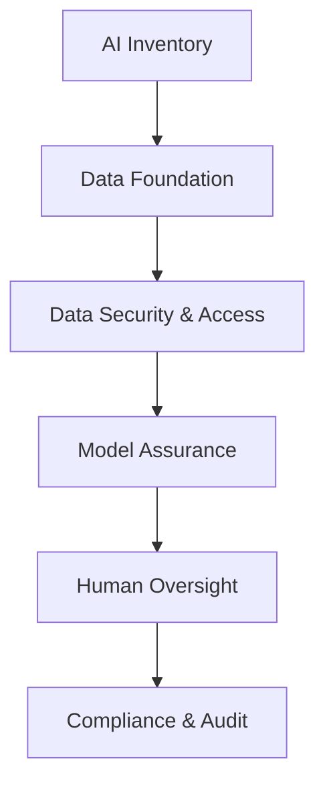

# Six Layers for AI Governance

A stacked model of AI governance, foundation (top of the stack as drawn: inventory)
down to compliance.

| Layer | Covers |
|---|---|
| AI Inventory | Shadow-AI detection, system classification, risk tiering, ownership assignment, model registry |
| Data Foundation | Source tracking, lineage mapping, quality validation, freshness monitoring, data-bias screening |
| Data Security & Access | Encryption, anonymization, role-based access, least privilege, key management |
| Model Assurance | Model cards, performance benchmarks, fairness testing, red-teaming, drift detection |
| Human Oversight | Decision review, escalation paths, override authority, output validation, accountability mapping |
| Compliance & Audit | EU AI Act mapping, GDPR alignment, policy enforcement, incident reporting, audit trails |

## The stack

## Cross-links

The governance/operations concerns that the production layers of
[Agent Harness Engineering](agent-harness-engineering.md) and the context/observability
layers of [Agentic Engineering Stack](agentic-engineering-stack.md) must satisfy.
