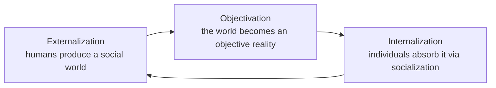

# The Social Construction of Reality

*The Social Construction of Reality: A Treatise in the Sociology of Knowledge* (1966), by Peter L.
Berger and Thomas Luckmann, is the book that gave the phrase "social construction" to the modern
vocabulary. Drawing on the phenomenology of Alfred Schütz and the classical sociology of knowledge,
it asks how the taken-for-granted world of everyday life — the reality we treat as simply "there" —
is in fact continuously produced, maintained, and transmitted by human beings acting together.

## Reality as a human product

Berger and Luckmann start from everyday life as the paramount reality: the intersubjective,
commonsense world we share with others and treat as objective and self-evident. Their thesis is that
this reality is *socially* constructed. Knowledge — everything from scientific theories to the rules
for greeting a neighbor — is a social product, and once produced it acts back on the people who made
it as if it were an external, objective fact. The book's task is to trace how something humans create
comes to confront them as an independent reality. This makes it the systematic statement behind
[culture and socialization](culture-and-socialization.md).

## The dialectic: externalization, objectivation, internalization

The heart of the book is a three-moment dialectic describing the ongoing relationship between
individuals and their social world — a precise account of the [structure and agency](social-structure-and-agency.md)
problem:

- **Externalization** — humans, unlike other animals, must build their own world; through activity
  they pour meaning and habitual action out into the social environment.
- **Objectivation** — those products (institutions, roles, language) take on a solid, objective
  existence that seems to stand over and against their creators, an external "reality out there."
- **Internalization** — new members (children, newcomers) absorb this objectivated world through
  socialization, taking it into consciousness as their own subjective reality.

The famous summary of the dialectic: "Society is a human product. Society is an objective reality.
Man is a social product."

## Institutionalization and legitimation

Institutions arise, the authors argue, through **habitualization** and **typification**: when repeated
actions become habitual and are then classified into reciprocal, shared **roles** ("this is how *a
teacher* acts"), they become available for others to enact and thus become
[social institutions](social-institutions.md). To later generations who did not build them,
institutions appear as an objective, given order. Sustaining that order requires **legitimation** —
the explanations and justifications (from proverbs up to entire "symbolic universes" like religion,
science, or ideology) that make the institutional world plausible and morally right. This is the
crucial link to [organizations and bureaucracy](organizations-and-bureaucracy.md), which are
formalized institutional orders held together by such legitimations.

## Significance

The book relaunched the **sociology of knowledge**, shifting it from the study of ideas and ideology
(its Marxian and Mannheimian roots) to the study of *commonsense* knowledge — how ordinary reality is
built. It founded modern **social constructionism** and shaped subsequent thinking across the social
sciences about how facts, categories, and identities are made rather than merely found. The
International Sociological Association ranked it among the most important sociological books of the
twentieth century. It occupies a central place in contemporary [sociological theory](sociological-theory.md)
as the great synthesis of phenomenology and institutional analysis.

## References

- [The Social Construction of Reality — Peter L. Berger and Thomas Luckmann (Penguin Random House)](https://www.penguinrandomhouse.com/books/159443/the-social-construction-of-reality-by-peter-l-berger-and-thomas-luckmann/)
