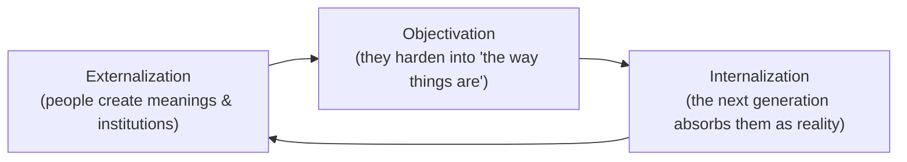

# Culture and Socialization

**Culture** is the shared, learned, symbolic way of life of a group — everything from a
people's beliefs and values down to how they greet each other and what they eat.
**Socialization** is the lifelong process by which a raw human being absorbs that culture
and becomes a competent, recognizable member of society. The two concepts are a pair:
culture is *what* gets passed on; socialization is *how*. Together they answer a founding
sociological puzzle — why members of the same society, though never centrally coordinated,
behave in such patterned, mutually intelligible ways.

## The components of culture

Sociologists usually break culture into a few elements:

- **Values** — abstract standards of what is good, desirable, and worthy (e.g. equality,
  achievement, family loyalty).
- **Norms** — concrete rules for behavior that put values into practice. **Folkways** are
  everyday conventions (which fork to use); **mores** are morally charged norms whose
  violation brings strong reaction; **laws** are norms formally codified and enforced.
  Norms are the everyday material of [deviance-and-social-control](deviance-and-social-control.md).
- **Beliefs** — accepted convictions about what is true.
- **Symbols** — anything that carries shared meaning: flags, gestures, brands, money.
- **Language** — the master symbolic system. The **Sapir–Whorf hypothesis** proposes that
  the language we speak shapes how we perceive and think, making language not just a
  container for culture but partly its architect. Language as a social phenomenon is the
  subject of [../linguistics/sociolinguistics.md](../linguistics/sociolinguistics.md).

A useful distinction is **material culture** (physical artifacts — tools, buildings,
clothing) versus **non-material culture** (ideas, norms, values). The two can drift out of
sync: William Ogburn's **cultural lag** describes how non-material culture (laws, ethics)
often struggles to catch up with fast-moving material culture (technology) — a tension now
central to [technology-and-society](technology-and-society.md).

## Socialization: becoming social

Nobody is born knowing their culture. Through socialization, external social rules become
internal, felt dispositions — so that conformity comes to feel like simply "being
yourself." This is the interpersonal mechanism behind the
[social-construction-of-reality](berger-luckmann-social-construction-of-reality.md):
Berger and Luckmann describe how humans **externalize** shared meanings into institutions,
those meanings become an **objective**-seeming reality that stands over us, and each new
generation **internalizes** that reality until it feels natural rather than made.

Key ideas about the process:

- **Agents of socialization** — the family (primary and most formative), schools, peer
  groups, media, religion, and the workplace, each teaching different competencies and
  sometimes conflicting messages.
- **Primary vs. secondary socialization** — primary is early, in the family, and lays the
  emotional and linguistic foundation; secondary is later, in wider institutions.
- **The looking-glass self** (Charles Cooley) and **role-taking** (George Herbert Mead) —
  we build a sense of self by imagining how others see us and by learning to take the role
  of the "generalized other." Selfhood is thus a *social product*, not a prerequisite of
  society — the interactionist thread that runs into
  [goffman-presentation-of-self](goffman-presentation-of-self.md).
- **Resocialization** — the sometimes-jarring relearning demanded by new environments, from
  boot camp to immigration to a new job.

## Cultural capital, subcultures, and relativism

- **Cultural capital** (Pierre Bourdieu) — the non-financial assets, such as tastes,
  vocabulary, credentials, and manners, that signal status and smooth one's passage through
  elite institutions. Because it is acquired through socialization in advantaged
  households, it quietly reproduces inequality: schools reward the cultural style the
  already-privileged arrive with. This links culture directly to
  [social-structure-and-agency](social-structure-and-agency.md),
  [social-networks-and-capital](social-networks-and-capital.md), and
  [social-stratification-and-inequality](social-stratification-and-inequality.md).
- **Subcultures and countercultures** — groups within a society that share the mainstream
  culture but add distinctive norms and symbols (subcultures) or actively oppose dominant
  values (countercultures). They show that "a culture" is rarely monolithic.
- **Ethnocentrism vs. cultural relativism** — ethnocentrism judges other cultures by one's
  own standards; **cultural relativism** insists on understanding a practice within its own
  cultural logic before judging it. Relativism is a methodological discipline for seeing
  clearly, not necessarily a claim that all practices are equally defensible.

## Why it matters

Culture and socialization explain the extraordinary fact that societies persist across
generations without central control: order is carried inside people, not just imposed from
outside. They also reveal how inequality can travel invisibly, dressed as personal taste
and merit. And because culture is *learned*, it is also changeable — which is why
socialization is a site of both stubborn reproduction and genuine social change.

## References

- [The Social Construction of Reality](berger-luckmann-social-construction-of-reality.md) —
  Berger and Luckmann on how shared meaning becomes taken-for-granted reality.
