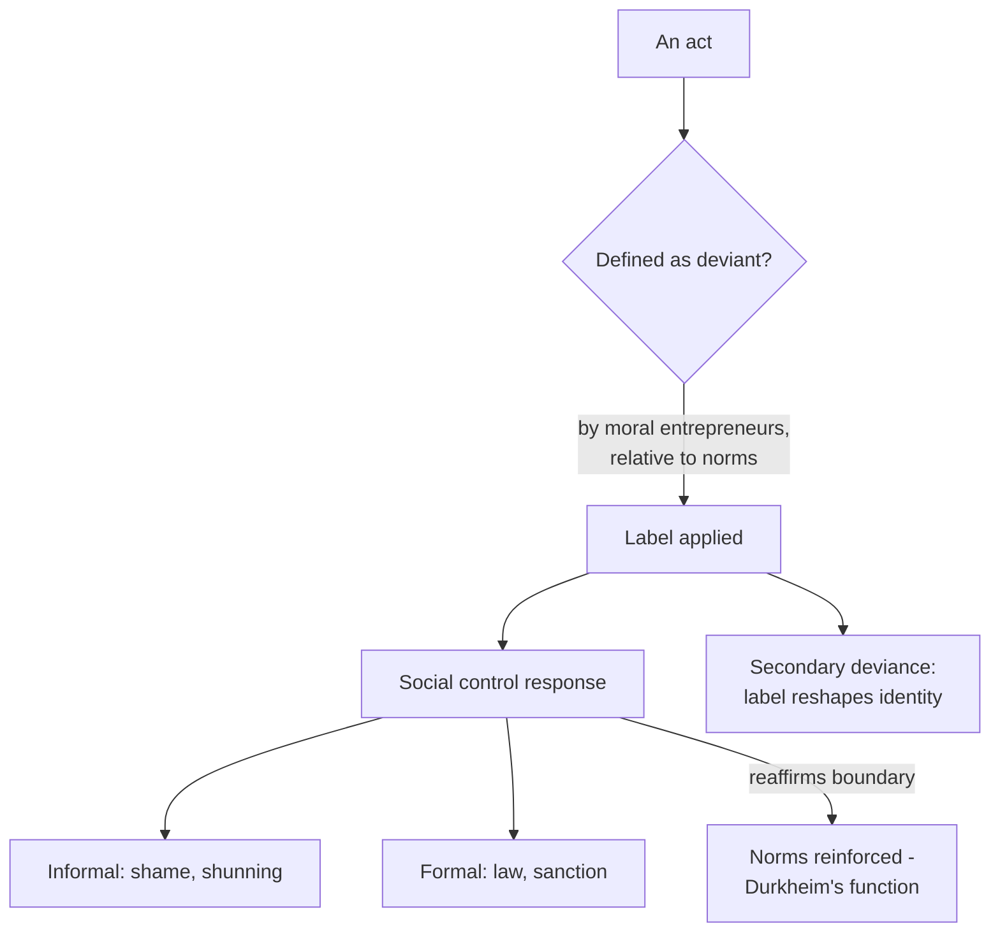

# Deviance and Social Control

**Deviance** is behavior, belief, or condition that violates the norms of a group
and provokes a negative reaction. The foundational sociological move — often
counterintuitive to newcomers — is that **deviance is not a property of the act
itself but of how the act is defined and responded to**. "No act is inherently
deviant." The same behavior (killing, drug use, nudity, dissent) is celebrated,
tolerated, or punished depending on context, era, and who is doing it. Deviance is
therefore *relative*, *contested*, and *produced by social definition*.

**Social control** is the set of mechanisms a society uses to encourage conformity
and respond to deviance. It comes in two forms:

| Type | Agents | Sanctions |
|------|--------|-----------|
| **Informal** | Family, peers, coworkers, everyday interaction | Approval/disapproval, gossip, praise, shunning |
| **Formal** | Law, police, courts, schools, regulators | Codified rules, fines, licensing, incarceration |

Most conformity is achieved *informally* and invisibly, through internalized norms
learned in [culture-and-socialization.md](culture-and-socialization.md); formal
control is the exception layered on top and channeled through
[social-institutions.md](social-institutions.md).

## Durkheim: deviance is normal — and functional

Durkheim argued deviance is a **normal, inevitable** feature of all societies and
even *functional*: publicly reacting to deviance clarifies and reaffirms the shared
moral boundary ("this is who we are, that is what we don't do"), promotes solidarity,
and can drive social change when today's deviant becomes tomorrow's reformer. A
society with *no* rule-breaking would be one with rules so total that any minor
difference registers as deviance. He also named **anomie** — a state of normlessness
when norms break down or fail to regulate desires.

## Strain theory

Merton reworked anomie into **strain theory**: deviance arises from a *gap* between
culturally prescribed **goals** (e.g. wealth, success) and the legitimate **means**
available to reach them. When society tells everyone to succeed but denies many the
tools, strain results. Merton's typology of adaptations:

- **Conformity** — accept goals + means.
- **Innovation** — accept goals, reject/bypass means (e.g. crime for gain).
- **Ritualism** — abandon goals, cling to means (going through the motions).
- **Retreatism** — reject both (dropout, addiction).
- **Rebellion** — replace both with new goals and means (radical politics).

Strain theory locates deviance in **social structure**, not individual pathology,
and links directly to [social-stratification-and-inequality.md](social-stratification-and-inequality.md):
blocked opportunity is unequally distributed.

## Labeling theory

Where strain asks *why people break rules*, **labeling theory** (Becker, Lemert)
asks *how acts and people come to be defined as deviant in the first place*.
Becker: deviance is not the quality of the act but the consequence of others
**applying the label** "deviant." Key ideas:

- **Moral entrepreneurs** create and enforce the rules whose violation *becomes*
  deviance — so deviance is manufactured by rule-making, not just rule-breaking.
- **Primary deviance** (an initial act) vs. **secondary deviance** (behavior that
  flows from *having been labeled* — the label reorganizes identity and life
  chances, a self-fulfilling prophecy).
- Labeling is unequally applied: who gets labeled depends on power, race, class, and
  gender.

## Stigma (Goffman)

Goffman's **stigma** is a "deeply discrediting" attribute that spoils a person's
social identity, reducing them "from a whole and usual person to a tainted,
discounted one." He distinguished the **discredited** (stigma already visible) from
the **discreditable** (stigma concealable), whose central challenge is *information
management* — passing, covering, controlling disclosure. This is the same
dramaturgical machinery of impression management laid out in
[goffman-presentation-of-self.md](goffman-presentation-of-self.md): social control
operates through the constant work individuals do to manage how they are perceived.

## Surveillance and the disciplinary shift

Foucault reframed social control as **discipline**: modern power works less through
spectacular punishment and more through *surveillance* that induces self-regulation.
His emblem is Bentham's **panopticon** — an architecture where inmates, unable to
tell when they are watched, discipline *themselves*. The insight generalizes far
beyond prisons to schools, workplaces, and clinics, and it is the direct ancestor of
debates over digital surveillance, data collection, and algorithmic monitoring, where
the watching is ambient, continuous, and internalized.

## Why it matters

Studying deviance is really studying **norms and power** from the other side: to see
what a society punishes is to see what it values and who gets to decide. It exposes
how "crime," "madness," "addiction," and "dissent" are categories built and enforced —
often unequally — rather than natural kinds, connecting the analysis of order to
inequality, institutions, and identity throughout sociology.

## References

Concept note synthesized from the field; no single source. Anchored by
[goffman-presentation-of-self.md](goffman-presentation-of-self.md); cross-links
[culture-and-socialization.md](culture-and-socialization.md),
[social-institutions.md](social-institutions.md).
