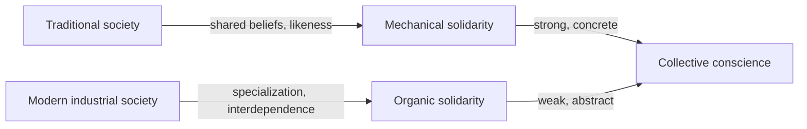

# The Division of Labor in Society

Émile Durkheim's 1893 doctoral dissertation (*De la division du travail social*) is a
founding text of sociology as a discipline. Its central question is deceptively simple:
what holds a society together? Durkheim's answer is that the *form* of social cohesion
changes as societies grow more complex, and that the division of labor is not merely an
economic fact but the modern basis of moral and social order.

## Two forms of solidarity

Durkheim distinguishes two ideal types of **social solidarity**, each corresponding to a
different kind of society:

- **Mechanical solidarity** characterizes small, "primitive," or traditional societies.
  People are alike — they share beliefs, sentiments, and ways of life — and cohesion comes
  from this likeness. A strong **collective conscience** (the shared body of beliefs and
  moral sentiments) binds individuals directly to the group, with little room for
  individual difference.
- **Organic solidarity** characterizes large, modern, industrial societies. Here cohesion
  comes not from likeness but from *interdependence*: an advanced division of labor makes
  each person a specialist who depends on countless others. Like organs in a body,
  differentiated parts need one another to function. The collective conscience weakens and
  becomes more abstract, leaving more space for individual autonomy.

## Law as an index of solidarity

Because solidarity itself is not directly observable, Durkheim proposes to measure it
through law, its visible expression. **Repressive law** (punitive, criminal) dominates
where mechanical solidarity prevails — an offense wounds the shared conscience and must be
avenged. **Restitutive law** (contract, commercial, administrative) dominates under organic
solidarity — its aim is to restore relations and coordinate cooperation rather than punish.
This methodological move — using external, measurable social facts to study internal moral
states — is a hallmark of Durkheim's approach to [sociological methods](sociological-methods.md).

## Anomie and abnormal forms

Durkheim insists the division of labor normally *produces* solidarity, but he devotes the
final part of the book to its **abnormal forms**. The most important is **anomie** — a state
of normlessness in which the rules coordinating specialized functions are absent, unclear,
or unjust, as during rapid industrialization or economic crisis. Anomic division of labor
generates conflict and dysfunction rather than cohesion. This concept became central to his
later work on suicide and to sociology's understanding of [deviance and social control](deviance-and-social-control.md).

## Society sui generis

Underlying the whole argument is Durkheim's foundational claim that society is *sui generis*
— a reality of its own kind, not reducible to the individuals who compose it. Social facts
(collective ways of thinking and acting) exert external constraint on individuals and must be
explained by other social facts, not by psychology or individual intent. This positions
Durkheim as the architect of **functionalism** and a pillar of classical
[sociological theory](sociological-theory.md), and frames the division of labor itself as a
[social institution](social-institutions.md) that binds people into a moral community.

## References

- [The Division of Labor in Society — Émile Durkheim](https://www.simonandschuster.com/books/The-Division-of-Labor-in-Society/Emile-Durkheim/9781476749733)
