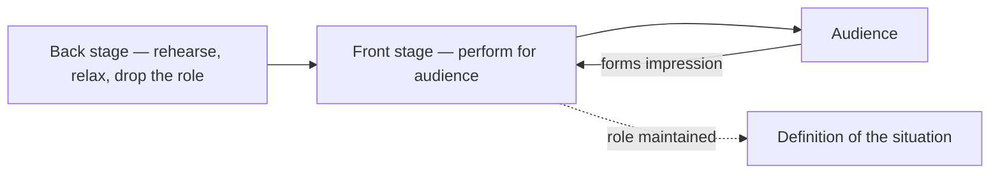

# The Presentation of Self in Everyday Life

Erving Goffman's book — published in Scotland in 1956 and in the United States in 1959 — was the
first work to treat ordinary **face-to-face interaction** as a serious object of sociological
study. Where the classical theorists worked at the scale of whole societies and institutions,
Goffman zooms all the way in to the micro-level: the handshake, the dinner party, the office, the
sickroom. His governing metaphor is the theater, and the framework he builds from it —
**dramaturgy** — became one of the most influential contributions to symbolic interactionism.

## Dramaturgy: life as performance

Goffman's premise is that when people are in the presence of others, they are giving a
**performance**. Each of us works, consciously and unconsciously, to control the impression others
form of us — through our setting, appearance, and manner. Social interaction is thus a continuous
process of **impression management**. Crucially, all participants collaborate to sustain a shared
definition of the situation and to avoid embarrassment, so performances are cooperative as much as
manipulative. This is a theory of the self as something *produced* in interaction rather than
possessed in advance, a core insight of [culture and socialization](culture-and-socialization.md).

## Front stage and back stage

The dramaturgical vocabulary organizes social space into regions:

- **Front stage** — where the performance is given for an audience. Here the actor maintains the
  expected role, adhering to the setting and to a "front" (the standardized expressive equipment:
  uniform, décor, demeanor).
- **Back stage** — where the performance is prepared, dropped, or contradicted, and where the actor
  can relax out of character (the kitchen behind the restaurant dining room, the staff room behind
  the classroom).

Goffman adds concepts such as the **performance team** (people who cooperate to stage a single
routine), **audience segregation** (keeping incompatible audiences apart so contradictory roles
don't collide), and **face-work** — the small rituals by which people protect their own and
others' social standing.

## Deviance, control, and the fragile order

Because a performance can fail, be discredited, or reveal a discrepancy between the projected self
and the "real" self behind it, Goffman is deeply concerned with how interactional order is
maintained and repaired. Actors police their own conduct and one another's; embarrassment,
tact, and corrective rituals function as an informal system of [deviance and social control](deviance-and-social-control.md)
operating at the level of the encounter. The moral order of society, in this view, is enacted and
sustained in millions of small performances.

## Significance

*The Presentation of Self* established **microsociology** as a legitimate and rich field and gave
symbolic interactionism a powerful analytic vocabulary. Its concepts — impression management,
front and back stage, face-work — have escaped sociology into everyday and organizational language.
The book earned the American Sociological Association's MacIver Award and is routinely ranked among
the most important sociological works of the twentieth century.

## References

- [The Presentation of Self in Everyday Life — Erving Goffman (Penguin Random House)](https://www.penguinrandomhouse.com/books/56059/the-presentation-of-self-in-everyday-life-by-erving-goffman/)
