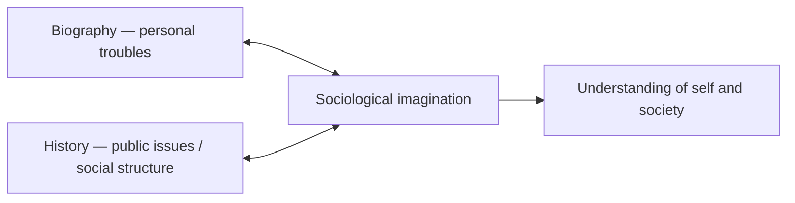

# The Sociological Imagination

C. Wright Mills's 1959 book gave the discipline its charter — a compact statement of what
sociological thinking *is* and why it matters. Written as both a manifesto and a polemic, it
argues that the promise of social science is to help people grasp their own lives in relation to
the larger historical and structural forces that shape them, and it sharply criticizes the
sociology of its day for betraying that promise.

## Troubles and issues

The book's central and most-quoted idea is the distinction between **personal troubles** and
**public issues**. A trouble is a private matter, occurring within an individual's immediate
milieu and within the range of what a person can personally do something about — losing one's
job, an unhappy marriage. An issue is a public matter that transcends the individual and belongs
to the structure of institutions — mass unemployment, the institution of marriage in a whole
society. The **sociological imagination** is precisely the capacity to move between these levels:
to see how private experience is bound up with public structure and historical moment.

> The sociological imagination lets us grasp *history* and *biography* and the relations between
> the two within *society*.

Mills's classic illustration: if one person is unemployed, that is a trouble to be understood in
terms of the person's character and skills; but if millions are unemployed, it is an issue whose
explanation lies in the economic and political structure, not in individual failings. Learning to
make this shift is, for Mills, the discipline's core promise — connecting the private and the
public is the work described in [sociological methods](sociological-methods.md).

## The critique of contemporary sociology

Much of the book is a critical attack on two dominant tendencies of mid-century American
sociology:

- **Grand theory** — abstract, jargon-laden conceptual systems (Mills's target was Talcott
  Parsons) so removed from concrete social life that they explain nothing.
- **Abstracted empiricism** — a fetish for method and quantification (survey research divorced
  from substance) that piles up data without asking meaningful questions.

Both, Mills argues, evade the real task: studying the structural and historical problems of the
age. He also warns against **bureaucratic uses** of social science, where research is put in the
service of administration and control rather than public enlightenment.

## Reason, freedom, and public sociology

Mills situates his argument in what he calls the **Fourth Epoch**, a post-liberal, post-socialist
moment in which older frameworks for understanding society have failed and increased rationality
has, paradoxically, moved society *away* from freedom rather than toward it. He calls on social
scientists to serve reason and freedom by clarifying public issues for ordinary citizens — an
early charter for what later became **public sociology**. The book also contains a famous appendix,
"On Intellectual Craftsmanship," a practical guide to doing sociology as a disciplined, reflective
craft.

## Significance

*The Sociological Imagination* is less a substantive theory than a statement of the discipline's
purpose and stance. As a critical intervention it sits within the tradition of
[sociological theory](sociological-theory.md), championing an engaged, structurally aware, and
historically grounded social science over both empty abstraction and mindless data-gathering.

## References

- [The Sociological Imagination — C. Wright Mills (Oxford University Press)](https://global.oup.com/academic/product/the-sociological-imagination-9780195133738)
