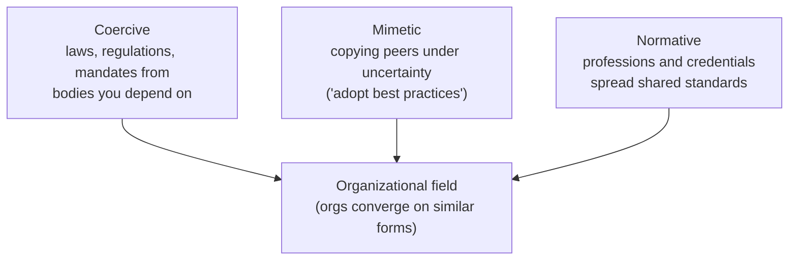

# Organizations and Bureaucracy

Formal organizations — firms, agencies, universities, armies — are the dominant vehicles
through which modern societies coordinate large-scale action. The sociology of
organizations asks how they are structured, why they take the forms they do, how their
official rules relate to what actually happens inside them, and how they shape (and are
shaped by) the people in them. This is the disciplinary bedrock under contemporary team
and organization design, including the questions raised in the
[AI-and-organizations hub](../ai-org/index.md).

## Weber's ideal-type bureaucracy

Max Weber gave the field its founding model. He argued that modern life is defined by
**rationalization** — the steady replacement of tradition and personal loyalty with
calculable, rule-governed, means-ends efficiency. Bureaucracy is rationalization applied
to administration. Weber's **ideal type** (an analytic abstraction, not a compliment)
lists its features:

- **Division of labor** into fixed, specialized offices with clear jurisdictions
- **Hierarchy** — a clear chain of command and supervision
- **Written rules** governing decisions, applied uniformly
- **Impersonality** — cases handled by rule, "without regard for persons," not favoritism
- **Merit-based careers** — appointment by qualification, salaried, promotable
- **Files** — decisions recorded, so authority resides in the office, not the person

Bureaucracy is technically superior for large-scale coordination precisely because it is
predictable and impersonal. But Weber saw the cost: the same rationalization that liberates
us from arbitrary personal rule builds an **iron cage** (*stahlhartes Gehäuse*) — an order
so efficient and pervasive that it constrains human freedom and drains meaning, leaving
"specialists without spirit." This dark ambivalence connects directly to his account of
how a religiously motivated work discipline hardened into secular compulsion, developed in
[Weber's Protestant Ethic](weber-protestant-ethic.md).

## Formal vs. informal structure

Weber's model describes the **formal** organization — the org chart, the rulebook. But
every organization also has an **informal** structure: the real networks of friendship,
influence, and workaround that grow up alongside the official one. The Hawthorne studies
and later research showed that informal norms often govern actual behavior more than
formal rules do — work groups set their own output norms, information routes around the
hierarchy, and the "way things really get done" diverges from policy. Effective
organizations depend on this informal layer; dysfunctional ones are where formal and
informal structures fight. The informal layer is itself a
[social network](social-networks-and-capital.md), and organizational advantage often flows
to those who broker across its structural holes.

## Organizational culture

**Organizational culture** is the shared set of values, assumptions, symbols, and taken-for-
granted practices that members absorb — "how things are done here." Edgar Schein's model
distinguishes visible **artifacts** (office layout, rituals, dress), **espoused values**
(stated mission and principles), and deep **underlying assumptions** (unconscious,
taken-for-granted beliefs) that are the real drivers. Culture does the coordinating work
that rules can't specify; it is also sticky and hard to change deliberately, which is why
mergers and transformations so often founder on cultural mismatch.

## Institutional isomorphism

Why do organizations in the same field come to look alike — same departments, same job
titles, same strategies — even when it isn't obviously efficient? Paul DiMaggio and Walter
Powell's answer is **institutional isomorphism**: organizations converge because they seek
**legitimacy**, not just efficiency. They identify three mechanisms:

- **Coercive** — pressure from the state or powerful partners you depend on (regulation,
  contract terms).
- **Mimetic** — under uncertainty, organizations imitate peers they see as successful;
  this drives the spread of management fads and "best practices."
- **Normative** — professionalization: universities and professional associations
  standardize how members think, so trained professionals bring the same templates
  everywhere they go.

The insight is that organizational forms diffuse for reasons of legitimacy and
imitation, not only performance — a sociological caution against reading every common
practice as optimal. It also frames current debates over
[AI adoption at organizational scale](../ai-org/index.md): expect firms to imitate visible
adopters and chase legitimacy, not just measured returns.

## Why it matters

Organizations are where most economic and political power is actually exercised.
Understanding them as [social institutions](social-institutions.md) with formal rules,
informal life, culture, and field-level pressures explains why reorganizations fail, why
efficient-looking structures persist despite dysfunction, and why "just changing the org
chart" rarely changes behavior. Any attempt to redesign how teams work — including
integrating new technology — is really an intervention into this whole sociological system.

## References

- Anchored in Max Weber's theory of bureaucracy and rationalization — see
  [Weber's Protestant Ethic](weber-protestant-ethic.md). Draws also on DiMaggio & Powell's
  new institutionalism and Schein on organizational culture. Related HAL notes:
  [social institutions](social-institutions.md),
  [social networks and capital](social-networks-and-capital.md), and the
  [AI-and-organizations hub](../ai-org/index.md).
