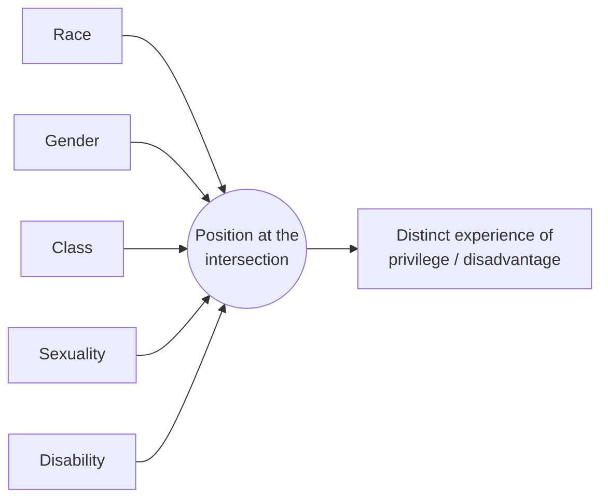

# Race, Gender, and Identity

A central insight of sociology is that categories that feel *natural* and *given* —
race, gender, ethnicity — are largely **social constructions**: real in their
consequences, but produced and maintained by human classification rather than
dictated by biology. Saying a category is "constructed" does **not** mean it is
fake or optional. It means its boundaries, meanings, and hierarchy are made by
societies and could be otherwise — as shown by how they vary across time and place.

## The social construction of race

There is more genetic variation *within* conventional racial groups than *between*
them; the racial categories used by any society are historically specific
inventions, not readings of nature. The proof is in the variation:

- Categories differ by place — someone classified one way in Brazil, another in the
  United States, another in South Africa.
- Categories change over time — groups once excluded from "whiteness" were later
  absorbed into it.
- The **one-drop rule** (any African ancestry = Black) was a legal-social
  construction serving a slavery-and-segregation order, not a biological fact.

**Racialization** is the process by which groups come to be *treated* as races and
assigned meaning and rank. **Racism** operates at multiple levels: interpersonal
(prejudice, discrete acts), **institutional/structural** (patterns baked into
housing, lending, schooling, policing that produce unequal outcomes with or without
individual bias), and cultural (whose norms are treated as the neutral default).
Structural racism explains how disadvantage persists even as overt prejudice
declines.

## The social construction of gender

Sociology distinguishes:

- **Sex** — biological/physiological attributes (themselves less binary than
  assumed).
- **Gender** — the social meanings, roles, and expectations attached to sex.

Gender is not simply *possessed* but **"done"** — West and Zimmerman's *doing
gender* frames it as an ongoing accomplishment performed in interaction and held to
account by others (a close cousin of Goffman's dramaturgy; see
[deviance-and-social-control.md](deviance-and-social-control.md) and
[goffman-presentation-of-self.md](goffman-presentation-of-self.md)). Gender is
enforced by **socialization** ([culture-and-socialization.md](culture-and-socialization.md)) —
family, schools, media, peers teaching the "rules" from birth — and by sanction
when the rules are broken.

## Identity

**Identity** is the sense of who one is, built at the intersection of the personal
and the social. Sociology stresses its **relational and situational** character:
identity is negotiated in interaction, partly *ascribed* by others' categorization
and partly *achieved* through one's own claims. Groups sustain collective identities
that can become the basis for solidarity and, sometimes, mobilization
([social-movements-and-collective-behavior.md](social-movements-and-collective-behavior.md)).

## Intersectionality

Coined by Kimberlé Crenshaw, **intersectionality** holds that systems of
categorization do not stack additively but **interlock**. A Black woman's
experience is not "race problems + gender problems"; it is a distinct position that
neither an analysis of race alone (centered on Black men) nor of gender alone
(centered on white women) captures. Discrimination and privilege must be read at the
*intersection* of race, gender, class, sexuality, disability, and other axes.

## Discrimination and structural inequality

Categories become **stratifying** when they map onto unequal life chances — the
link to [social-stratification-and-inequality.md](social-stratification-and-inequality.md).
Discrimination need not be intentional: neutral-seeming rules and historical legacies
(redlining, occupational segregation, wealth gaps) reproduce inequality automatically.
This is why sociologists distinguish *disparate treatment* (intentional) from
*disparate impact* (unequal effect of a facially neutral practice).

The concern now extends to **algorithmic systems**: models trained on historically
biased data can encode and scale discrimination — automating and laundering it as
"objective" — while obscuring accountability. This is a live governance problem; see
[../ai-governance/index.md](../ai-governance/index.md).

## Why it matters

How a society draws and ranks its categories determines who gets counted, protected,
hired, lent to, policed, and believed. Because the categories are made rather than
found, they can also be *remade* — which is exactly the terrain of politics, law, and
social movements. Neutral sociological analysis does not prescribe a remedy; it makes
visible the machinery by which categories become consequences.

## References

Concept note synthesized from the field; no single source. Cross-links:
[social-stratification-and-inequality.md](social-stratification-and-inequality.md),
[culture-and-socialization.md](culture-and-socialization.md),
[../ai-governance/index.md](../ai-governance/index.md).
