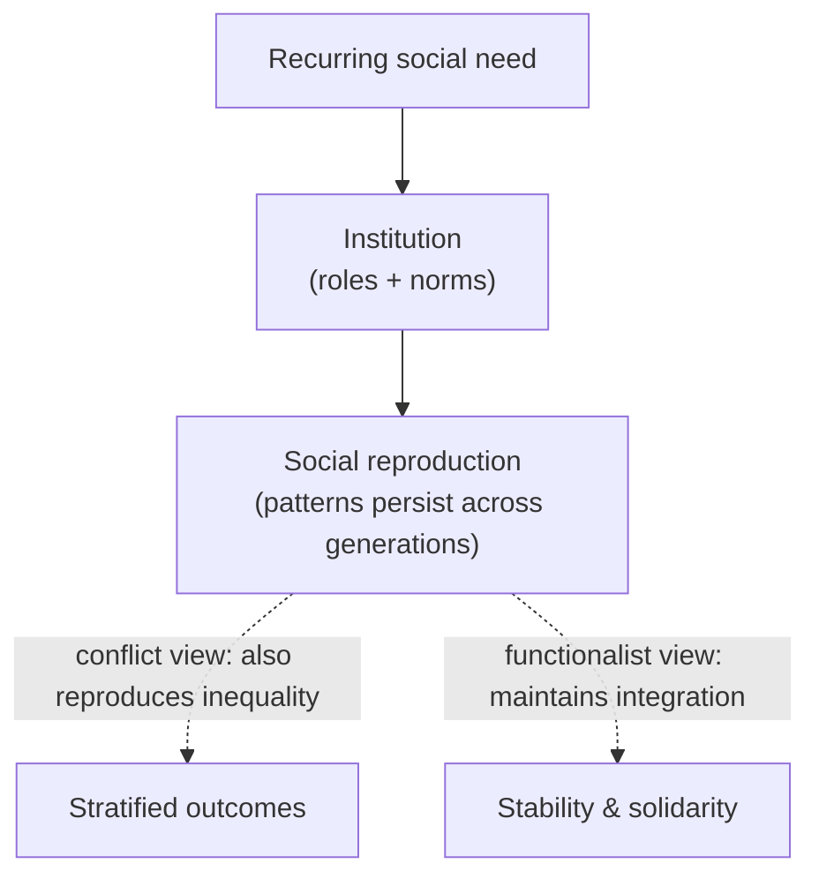

# Social Institutions

A **social institution** is a durable, patterned arrangement of roles, norms, and
relationships organized around meeting a basic and recurring need of society. Institutions
are not buildings or organizations — they are the deep *rules of the game* that structure a
whole domain of life. "The family," "education," "religion," "the economy," "the state,"
and "the media" are the major ones. They are what make social life predictable: whoever
plays a role, the role persists, so society reproduces itself across generations even as
individuals come and go.

## What counts as an institution

Institutions share several features:

- They are organized around a **persistent social need** — reproduction and care, transmission
  of knowledge, meaning and moral order, production and distribution, coordination and
  order, information.
- They consist of **interlocking roles and norms** (parent/child, teacher/student,
  citizen/official) that exist independently of the particular people filling them.
- They are **relatively stable and slow to change**, and they are **taken for granted** —
  people experience them as simply "the way things are," a point developed in
  [culture-and-socialization](culture-and-socialization.md) and
  [berger-luckmann-social-construction-of-reality](berger-luckmann-social-construction-of-reality.md).

Note the distinction from an **organization**: the state is an institution, a particular
ministry is an organization; marriage is an institution, a given couple's household is not.
Organizations are the concrete vehicles through which institutions operate — see
[organizations-and-bureaucracy](organizations-and-bureaucracy.md).

## The major institutions

| Institution | Core need addressed | Illustrative functions |
|---|---|---|
| Family | Reproduction, care, early socialization | Raising children, emotional support, inheritance |
| Education | Transmitting knowledge and skills | Teaching, credentialing, sorting people into roles |
| Religion | Meaning, morality, solidarity | Shared beliefs, ritual, moral community |
| Economy | Production and distribution | Making and allocating goods, organizing work |
| The state / polity | Order and collective decision | Law, enforcement, defense, public goods |
| Media | Information and communication | Spreading information, framing reality, shaping opinion |

These are analytically separate but tightly interwoven — the family feeds children into
education, which sorts them into the economy, which is governed by the state, and all of it
is narrated by the media.

## How they reproduce society

The **functionalist** reading (tracing to Durkheim) sees institutions as the organs of a
social body, each performing functions that keep the whole integrated and stable —
including the moral solidarity Durkheim analyzed in
[durkheim-division-of-labor](durkheim-division-of-labor.md). Robert Merton added that
institutions have **manifest** functions (education *teaches*) and **latent** ones
(education also provides childcare, delays entry to the labor market, and forges networks),
plus occasional **dysfunctions**.

The **conflict** reading (tracing to Marx) stresses that institutions also reproduce
*inequality*. Schools, in this view, don't merely teach — they sort children in ways that
track existing class advantage, transmitting cultural capital to those who already have it
(see [social-stratification-and-inequality](social-stratification-and-inequality.md) and
[social-structure-and-agency](social-structure-and-agency.md)). Louis Althusser called
institutions like schools, churches, and media the **ideological state apparatuses** that
secure consent to the existing order.

Both readings agree on the central fact — institutions are engines of **social
reproduction** — and disagree about whether that reproduction mainly serves the whole or
mainly serves the advantaged.

## Institutions and their neighbors

The **economy** is the institution studied in most depth by another discipline entirely;
sociology and economics meet here on questions of markets, work, and value — see
[../economics/index.md](../economics/index.md). Institutions are also not fixed forever:
they emerge, transform, and sometimes collapse, often under pressure from
[social-movements-and-collective-behavior](social-movements-and-collective-behavior.md) or
from new technology reshaping how needs are met
([technology-and-society](technology-and-society.md)).

## Why it matters

Institutions are the answer to Hobbes's old question — how is social order possible at all?
— without invoking either constant coercion or perfect goodwill. They let strangers
cooperate, let knowledge accumulate across lifetimes, and let a society survive the death of
every one of its members. Understanding them shows why change is *hard* (institutions are
sticky and self-reinforcing) and why it is nonetheless *possible* (they are made and
remade by human action, not laws of nature).

## References

- [The Division of Labor in Society](durkheim-division-of-labor.md) — Durkheim on how the
  interdependence of institutions generates social solidarity and order.
