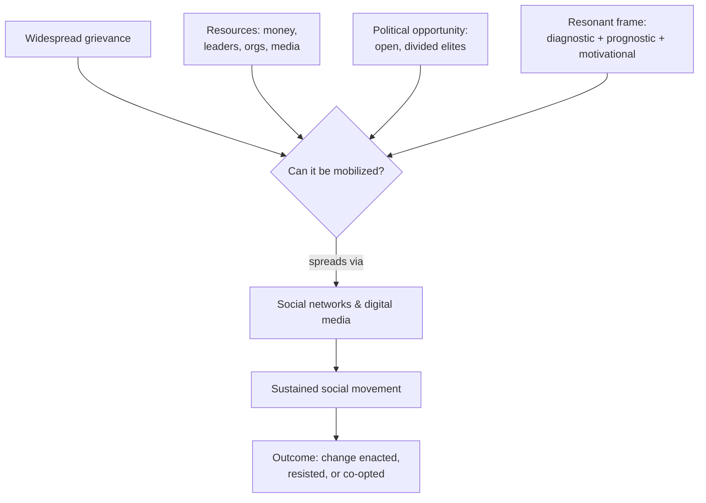

# Social Movements and Collective Behavior

**Collective behavior** is relatively spontaneous, loosely structured action by
groups outside routine institutions — crowds, panics, fads, rumors, riots. A
**social movement** is its organized, sustained cousin: a *purposive, collective
attempt to promote or resist change* through non-institutional means, carried by
identifiable actors over time. The move from a crowd to a movement is a move from
transient reaction to durable organization, strategy, and identity.

## From "irrational crowd" to organized action

Early theory (Le Bon, later "collective behavior" and *mass society* approaches)
treated crowds as irrational: individuals swept into contagion, losing judgment in
the mass, movements as symptoms of strain or breakdown. Modern sociology largely
**rejected** this. It found that participants act *rationally and strategically*,
that movements are *organized* rather than spontaneous eruptions, and that grievance
alone is a poor predictor — grievances are near-universal, but movements are not.
The question shifted from "why are people angry?" to "**how does anger become
organized action?**"

## Resource mobilization theory

The dominant answer: **resource mobilization theory** (McCarthy & Zald). Movements
succeed or fail based on their ability to marshal **resources** — money, labor,
time, leadership, organization, media access, and legitimacy — not merely on the
depth of grievance. It foregrounds **Social Movement Organizations (SMOs)** as the
carriers of mobilization and treats movements as a form of organized, resourceful
politics (see [organizations-and-bureaucracy.md](organizations-and-bureaucracy.md)).
This also confronts the **free-rider problem** (Olson): if a movement wins a *public
good*, why contribute rather than let others bear the cost? Selective incentives,
identity, and social pressure are part of the answer.

## Political opportunity and framing

Two refinements dominate contemporary work:

- **Political opportunity structure** — movements emerge and succeed when the
  external political environment opens: divided elites, new allies, shifting
  repression, expanding rights. Timing and context, not just internal resources,
  gate success.
- **Framing** (Snow & Benford) — movements must actively construct meaning. A
  **collective action frame** does three jobs: *diagnostic* (name the problem and
  who's to blame), *prognostic* (propose a solution), and *motivational* (give
  people a reason to act now). **Frame resonance** — fit with participants'
  experience and culture — determines whether the frame mobilizes. Framing links
  movements to [culture-and-socialization.md](culture-and-socialization.md) and to
  the identity work of [race-gender-and-identity.md](race-gender-and-identity.md).

## Networks and diffusion

Recruitment runs along **social networks**: people join movements far more through
personal ties to existing participants than through abstract agreement with the
cause. Pre-existing dense networks lower the cost and risk of joining and transmit
trust. Tactics, frames, and the movements themselves then **diffuse** across
network ties from group to group and place to place — a process well described by
[social-networks-and-capital.md](social-networks-and-capital.md) and by the
structural dynamics of [../systems-thinking/network-science.md](../systems-thinking/network-science.md)
(thresholds, contagion, hubs, weak ties bridging clusters). Granovetter's
*threshold models* explain why apparently sudden uprisings are actually chains of
individuals each acting once enough others have.

## The role of digital media

Digital platforms have reshaped mobilization by drastically lowering the cost of
coordination:

- **Faster, cheaper diffusion** of frames and calls to action across weak ties at
  scale.
- **"Organizing without organizations"** — movements can coordinate large actions
  with little formal SMO infrastructure.
- **Trade-offs** — the same low cost can yield shallow "slacktivism," fragile
  organization that struggles to sustain or negotiate, exposure to surveillance and
  repression, and vulnerability to platform control and algorithmic amplification.

This ties directly to [technology-and-society.md](technology-and-society.md): the
medium is not neutral — it shapes which movements form, how they act, and how they
are countered.

## Why it matters

Social movements are a primary engine of social change and a check on entrenched
power — abolition, suffrage, labor, civil rights, and environmental movements
reshaped institutions and law. Understanding *when* collective grievance turns into
effective action, and when it fizzles, illuminates the relationship between
structure and agency ([social-structure-and-agency.md](social-structure-and-agency.md))
and how societies contest their own stratification
([social-stratification-and-inequality.md](social-stratification-and-inequality.md)).

## References

Concept note synthesized from the field; no single source. Cross-links:
[social-networks-and-capital.md](social-networks-and-capital.md),
[technology-and-society.md](technology-and-society.md),
[../systems-thinking/network-science.md](../systems-thinking/network-science.md).
