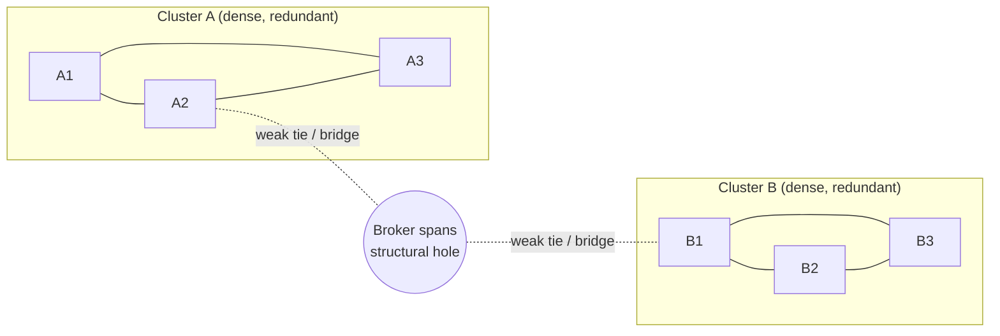

# Social Networks and Capital

Network sociology treats society not as a collection of isolated individuals with
attributes, but as a **web of relations**. What matters is less *who you are* (your
category memberships) than *how you are connected* — the pattern of ties around you. A
person's opportunities, information, and constraints flow through their position in the
network. This relational lens is the sociological foundation under the more mathematical
[network science](../systems-thinking/network-science.md), and it feeds directly into how
[social movements](social-movements-and-collective-behavior.md) mobilize and how ideas
spread through a population.

## The strength of weak ties

Mark Granovetter's 1973 paper "The Strength of Weak Ties" is the field's most cited
result. Intuition says your *strong* ties — close friends, family — help you most. But
Granovetter found the opposite for information like job leads. Strong ties cluster: your
close friends tend to know each other and know the same things you already know. **Weak
ties** — acquaintances — bridge to *other* clusters, carrying novel information you
couldn't get otherwise. Empirically, people found jobs more often through contacts they
saw rarely than through close friends. The general principle: bridges between densely
knit groups are almost always weak ties, and those bridges are where new information
enters.

## Structural holes

Ronald Burt extended this into the theory of **structural holes**. A structural hole is a
gap between two groups that don't otherwise communicate. The actor who sits *across* that
gap — a **broker** — controls the flow of information and resources between the two sides
and captures the value of arbitraging them. Networks rich in structural holes give their
brokers an advantage: earlier access to information, more control over its packaging, and
credit for combining ideas from disconnected worlds. This is a structural, not personal,
theory of advantage — the same person moved to a redundant position loses the edge.

## Social capital

**Social capital** is the value that accrues to actors from their network position — the
resources embedded in and mobilized through relationships. Three influential accounts
differ on where the value sits:

| Theorist | Locus of social capital | Emphasis |
|---|---|---|
| James Coleman | Closed, dense networks | Trust, norms, sanctions — closure enforces obligations |
| Ronald Burt | Open networks with holes | Brokerage — bridging disconnected groups yields information and control |
| Robert Putnam | Community-level stocks | Civic association; the decline of participation ("Bowling Alone") |

Putnam's key distinction is between **bonding** capital (inward-looking ties within a
homogeneous group — reinforces solidarity) and **bridging** capital (outward-looking ties
across diverse groups — generates broader reach and reciprocity). Coleman prizes closure
because it lets a group enforce norms; Burt prizes openness because holes are where
information and control live. The tension is real: the same closure that builds trust also
traps a group in redundant information. Which form pays off depends on the goal.

## Homophily and diffusion

**Homophily** — "birds of a feather flock together" — is the strong empirical tendency for
ties to form between similar people (by race, class, education, interests). Homophily
shapes networks into segregated clusters, which is precisely why weak ties and structural
holes are scarce and valuable: crossing similarity boundaries is rare. Homophily also
limits the diversity of information any one person receives.

**Diffusion** is how things — innovations, behaviors, diseases, rumors — spread through a
network. Adoption often follows social contagion: people adopt after enough of their
contacts have. Because network structure governs who is exposed to what and when, the same
innovation can spread explosively or stall depending purely on topology. This connects the
sociology directly to the formal treatment in
[network science](../systems-thinking/network-science.md) and to the economics of
[network effects](../economics/information-economics-and-network-effects.md), where a
product's value rises with the size of its connected user base.

## Why it matters

Network thinking reframes classic sociological questions — inequality, mobility,
influence, [social capital](social-networks-and-capital.md) itself — as questions about
structure rather than individual traits. It explains why identical people fare differently
(position), why information is unequally distributed (homophily and holes), and why
diffusion is path-dependent. It is also the intellectual bridge between sociology and the
quantitative study of graphs, underpinning everything from epidemiology to platform design.

## References

- Draws on the network-sociology tradition (Granovetter, Burt, Coleman, Putnam,
  McPherson). See the related [network science](../systems-thinking/network-science.md)
  concept for the formal graph treatment, and
  [information economics and network effects](../economics/information-economics-and-network-effects.md)
  for the economic parallel.
