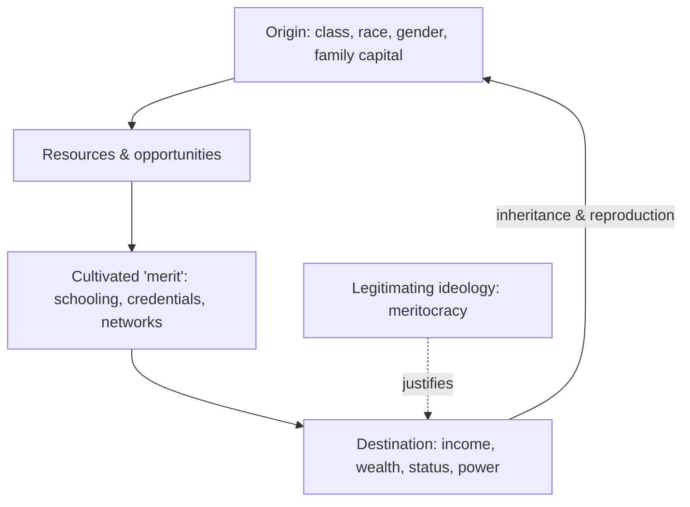

# Social Stratification and Inequality

**Stratification** is the arrangement of a society into a durable hierarchy of
layers ("strata") that receive unequal shares of valued resources — income,
wealth, prestige, and power. What distinguishes stratification from mere
individual difference is that it is **structured, patterned, and reproduced
across generations**: a person's position is heavily shaped by the position they
are born into, not only by their own effort. Every large society stratifies; the
sociological questions are *along what lines*, *how steeply*, *how rigidly*, and
*how it is justified*.

## Systems of stratification

- **Caste** — closed, ascribed at birth, endogamous, near-zero mobility (classical
  India, apartheid South Africa).
- **Estate** — legally defined orders with fixed rights and duties (feudal Europe:
  nobility, clergy, commoners).
- **Class** — the modern, more open form: position is tied to economic resources
  and, in principle, permits movement. "Open" is relative — class societies still
  reproduce advantage powerfully.

## Two classic accounts of class: Marx vs. Weber

**Marx** sees class as defined by one thing: the **relationship to the means of
production**. There are owners (the *bourgeoisie*) and those who must sell their
labor (the *proletariat*). Their interests are inherently opposed — profit comes
from the surplus value extracted from labor — so class is a structural antagonism,
not a gradient. Class consciousness, when it forms, turns a "class in itself" into
a "class for itself" capable of collective action (see
[marx-communist-manifesto.md](marx-communist-manifesto.md)).

**Weber** argues this is too one-dimensional. He splits stratification into three
analytically separate dimensions:

| Dimension | Basis | Question it answers |
|-----------|-------|---------------------|
| **Class** | Economic "life chances" in the market | What can you buy / earn? |
| **Status** (*Stände*) | Social honor, prestige, lifestyle | How are you regarded? |
| **Party** | Organized power, political influence | What can you make happen? |

The dimensions often diverge — a wealthy but socially disdained group has high
class but low status; a revered clergy may have status without wealth. Weber's
scheme lets us describe stratification that pure economic class misses (see
[weber-protestant-ethic.md](weber-protestant-ethic.md), which also traces how a
*status ethic* reshaped economic behavior). Weber's three-dimensional view
underlies most modern empirical work on inequality.

## Income vs. wealth

A crucial distinction:

- **Income** is a *flow* — earnings over a period (wages, returns, transfers).
- **Wealth** is a *stock* — net accumulated assets minus debts.

Wealth is far more unequally distributed than income and far more inheritable, so
it is the sharper lens on entrenched advantage. Because returns on capital can
outpace wage growth, wealth tends to concentrate over time absent
countervailing forces (progressive taxation, war, mass education). The **Gini
coefficient** (0 = perfect equality, 1 = one person holds everything) is the
standard summary measure.

## Social mobility

**Mobility** is movement between strata.

- *Intragenerational* — within one person's lifetime.
- *Intergenerational* — between parents and children (the key test of openness).
- *Absolute* mobility (did living standards rise for a cohort, often via
  economic growth) vs. *relative* mobility (did the odds of moving up become more
  equal across origins — the tougher, "positional" question).

High absolute mobility can coexist with low relative mobility: everyone rises, but
the rank order barely changes.

## Meritocracy and its critiques

The dominant modern *legitimating ideology* is **meritocracy** — the claim that
positions are earned through talent and effort, so inequality is fair. Sociologists
press three critiques:

1. **Unequal starting lines.** "Merit" is cultivated by the resources of one's
   origin (education, networks, [social-networks-and-capital.md](social-networks-and-capital.md)),
   so measured merit partly *encodes* prior advantage.
2. **Ascription persists.** Race and gender still shape outcomes independent of
   merit (see [race-gender-and-identity.md](race-gender-and-identity.md)).
3. **Moral cover.** Even where merit operates, meritocracy tells the winners they
   deserve everything and the losers they deserve nothing, corroding solidarity —
   the "tyranny of merit."

## Power

Stratification is ultimately about **power** — the capacity to secure outcomes over
resistance. Power operates not only through coercion but through *legitimation*:
the ability to shape the ideas by which an unequal order is accepted as normal or
just (Marx's "ideology"; Gramsci's *hegemony*; Weber's types of legitimate
authority). Analyzing who controls the rules — markets, law, culture — is
inseparable from analyzing who ends up on top. Economic mechanisms behind
concentration and distribution are treated in [../economics/index.md](../economics/index.md);
when markets systematically misallocate, see
[../economics/market-failure-and-externalities.md](../economics/market-failure-and-externalities.md).

## Why it matters

Stratification structures nearly every life outcome — health, longevity,
education, exposure to the justice system, political voice. Understanding whether
inequality is *earned*, *inherited*, or *imposed* is the pivot on which policy,
politics, and moral argument turn (see [../philosophy/political-philosophy.md](../philosophy/political-philosophy.md)
for the justice theories behind those arguments). It connects to how societies
justify their hierarchies ([sociological-theory.md](sociological-theory.md)) and
how those on the bottom sometimes mobilize against them
([social-movements-and-collective-behavior.md](social-movements-and-collective-behavior.md)).

## References

Concept note synthesized from the field; no single source. Anchored by
[marx-communist-manifesto.md](marx-communist-manifesto.md) and
[weber-protestant-ethic.md](weber-protestant-ethic.md).
