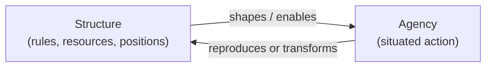

# Social Structure and Agency

The structure–agency problem is the deepest and most enduring debate in sociology: **do
social structures shape us, or do we make them?** Put concretely — when a person acts, are
they freely choosing, or are they enacting patterns (class, culture, institutions) that
were in place long before they arrived and that they had no hand in building? The
strongest answers refuse the either/or and try to show how both are true at once.

## The two poles

- **Structure** refers to the durable, patterned arrangements that stand over individuals
  and constrain them: institutions, class positions, norms, language, the distribution of
  resources. In the structuralist reading (with roots in
  [durkheim-division-of-labor](durkheim-division-of-labor.md)'s social facts), structure
  is prior and causal — people are, to a large degree, the carriers of positions they
  occupy.
- **Agency** refers to the capacity of individuals to act independently, to choose, to
  improvise, and to do otherwise. In the agency-first reading (with roots in Weber's
  interpretive sociology and in symbolic interactionism — see
  [goffman-presentation-of-self](goffman-presentation-of-self.md)), structure is nothing
  but the ongoing accomplishment of acting people.

Taken alone, each pole is unsatisfying. Pure structure makes people into puppets and
can't explain change or resistance. Pure agency can't explain why "free" choices fall into
such stable, predictable patterns across whole populations.

## Bridging the gap

The major twentieth-century theorists built frameworks to dissolve the dichotomy.

- **Anthony Giddens — structuration.** Structure and agency are not two things but two
  aspects of the same social process: the **duality of structure**. Structure is both the
  *medium* of action (the rules and resources people draw on) and its *outcome* (patterns
  are reproduced or altered precisely by being used). A language exists only because people
  speak it, yet no one can speak without it — and every act of speech subtly maintains or
  shifts it. Structure is real but has no existence apart from the practices that enact it.
- **Pierre Bourdieu — habitus.** Bourdieu's answer is the **habitus**: a set of durable
  dispositions — tastes, bodily habits, gut senses of what is "for people like us" —
  internalized from one's position in social space, especially in childhood. The habitus
  is *structure made flesh*. It generates action that feels spontaneous and free but
  reliably reproduces the existing order, because people "choose" what their conditioning
  has already made thinkable and comfortable. Combined with **capital** (economic, social,
  cultural) and **field** (a structured arena of competition), it explains how inequality
  reproduces itself without anyone deciding it should — a theme carried into
  [culture-and-socialization](culture-and-socialization.md),
  [social-networks-and-capital](social-networks-and-capital.md), and
  [social-stratification-and-inequality](social-stratification-and-inequality.md).

The loop is the point: neither arrow can be removed. Action is always *structured*, and
structure is always *enacted*.

## Emergence and the reality of the social

Why can't we just reduce society to individuals? Because social patterns are **emergent** —
they arise from countless interactions but have properties none of the participants
possess or intend. A traffic jam is not "in" any driver; a market crash is not "in" any
trader; a norm is not "in" any conformist. This is the same logic studied formally in
[../systems-thinking/emergence.md](../systems-thinking/emergence.md) and
[../systems-thinking/complex-systems.md](../systems-thinking/complex-systems.md):
higher-level order that is genuinely real, causally potent, and yet not locatable in any
single part. Emergence is what gives *structure* its independent bite while still grounding
it in *agency* — the macro arises from the micro without being reducible to it, which is
exactly the **micro–macro link** that sociological theory keeps circling back to (see
[sociological-theory](sociological-theory.md)).

## Why it matters

How you resolve structure vs. agency drives everything downstream — how you assign
responsibility (is poverty a personal failing or a structural outcome?), how you imagine
change (reform individuals or transform institutions?), and how you read your own life.
The mature position, shared by Giddens and Bourdieu in different vocabularies, is that
these are false opposites: we are made by a world we are simultaneously, continuously
making. Understanding this keeps analysis honest — neither blaming individuals for
patterns they inherited nor treating structures as forces that leave people no room to act.

## References

- [The Division of Labor in Society](durkheim-division-of-labor.md) — Durkheim's case for
  structure as an independent social reality.
- [The Protestant Ethic and the Spirit of Capitalism](weber-protestant-ethic.md) — Weber's
  interpretive, agency-attentive counterweight.
- [The Presentation of Self in Everyday Life](goffman-presentation-of-self.md) — Goffman on
  agency at the scale of the encounter.
