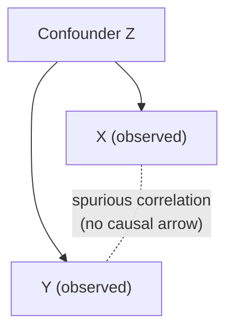

# Sociological Methods

Sociology is an empirical discipline: its claims are meant to be checked against evidence
about the social world, not asserted. Its methods are the disciplined procedures for
turning fuzzy questions about society into answerable, defensible research. The
methodological imagination that animates good research is what C. Wright Mills called the
[sociological imagination](mills-sociological-imagination.md) — the capacity to connect
private troubles to public structure, personal biography to history. Method is how that
imagination is made rigorous, and how a piece of [sociological theory](sociological-theory.md)
earns or loses empirical support.

## Quantitative vs. qualitative

The field's central methodological divide is between two complementary traditions:

| | Quantitative | Qualitative |
|---|---|---|
| Data | Numbers: surveys, censuses, administrative records | Text, talk, observation: field notes, transcripts |
| Logic | Measure variables across many cases; generalize | Understand meaning in depth within few cases |
| Typical methods | Surveys, experiments, statistical modeling | Ethnography, participant observation, in-depth interviews |
| Strength | Breadth, generalizability, precise comparison | Depth, context, discovery, capturing meaning |
| Root question | *How much / how many / how related?* | *How and why, from the inside?* |

Neither is superior; they answer different questions. Surveys tell you the *distribution*
of a phenomenon; ethnography tells you *what it means* to those living it. **Mixed-methods**
research deliberately combines them. Quantitative work leans on statistical tooling — see
the [statistics hub](../statistics/index.md).

## Operationalization

Concepts like "social class," "trust," or "religiosity" are abstract. **Operationalization**
is the step of defining, precisely, how an abstract concept will be *measured* — turning a
construct into observable indicators (e.g., measuring class by income, occupation, and
education). The gap between the concept and its operational proxy is where much
methodological argument lives: a measure is only as good as the fit between what you *mean*
and what you actually *count*.

## Sampling

Because we usually can't study everyone, we study a **sample** and infer to a
**population**. The gold standard is **probability (random) sampling**, where every member
has a known, nonzero chance of selection — this is what licenses statistical
generalization. **Non-probability** samples (convenience, snowball, purposive) are common
and useful — essential in qualitative work — but can't support the same generalizing
claims. Bad sampling is the most common source of misleading social statistics: a large
but biased sample is worse than a small random one.

## Reliability and validity

Two distinct quality criteria for any measure:

- **Reliability** — consistency. Would the measure give the same result on repeat under
  the same conditions? A reliable measure is repeatable.
- **Validity** — accuracy. Does the measure actually capture the concept it claims to?

A bathroom scale that reads five pounds heavy every time is *reliable but invalid*. You
can be consistently wrong. Good measurement requires both.

## Correlation vs. causation

Two variables moving together (**correlation**) does not establish that one *causes* the
other. Alternatives must be ruled out: **reverse causation** (Y causes X), and — most
insidiously — a **confounder** (a third variable Z driving both). Establishing causation
requires more: a plausible mechanism, correct time order, and ideally an intervention that
holds confounders constant. Randomized experiments are the strongest design because random
assignment balances confounders in expectation — the logic developed for the social and
digital world in
[experimental design and A/B testing](../statistics/experimental-design-and-ab-testing.md).
Where experiments are impossible (much of sociology), researchers use quasi-experimental
and statistical controls, always more fragile than randomization.

## Reflexivity

Sociologists study a world they are part of. **Reflexivity** is the disciplined awareness
of how the researcher's own position — class, race, gender, assumptions, and presence in
the field — shapes what data is collected and how it is interpreted. Rather than pretending
to a view from nowhere, reflexive research makes the observer's standpoint explicit and
examines its effects. This matters especially in ethnography, where the researcher *is* the
instrument, but it bears on all social measurement (even survey questions carry the
designer's assumptions). It connects to how meaning is negotiated in interaction, a theme
shared with [sociolinguistics](../linguistics/sociolinguistics.md).

## Why it matters

Method is what separates sociology from opinion. It disciplines the
[sociological imagination](mills-sociological-imagination.md) into checkable claims, guards
against the seductive misreading of correlation as cause, and forces researchers to
confront their own influence on their findings. Understanding these tools is also basic
data literacy for reading any social statistic — including the flood of numbers produced
by digital platforms and algorithmic systems.

## References

- Anchored in C. Wright Mills's [sociological imagination](mills-sociological-imagination.md).
  Draws on the standard methods canon (survey methodology, ethnographic tradition,
  causal-inference literature). Related HAL notes: the
  [statistics hub](../statistics/index.md),
  [experimental design and A/B testing](../statistics/experimental-design-and-ab-testing.md),
  and [sociological theory](sociological-theory.md).
