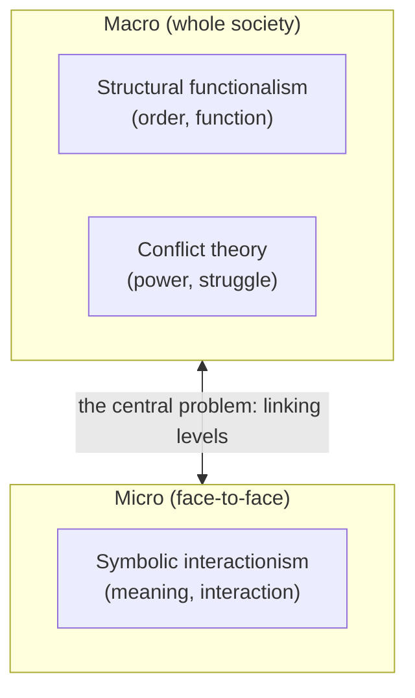

# Sociological Theory

Sociological theory is the set of organized frameworks sociologists use to explain how
society holds together, how it changes, and why people behave the way they do in groups.
A theory is not just a hunch — it is a coherent way of *seeing* the social world that
tells you which questions to ask, which facts count as evidence, and how to connect them.
The discipline crystallized in the nineteenth and early twentieth centuries around three
founders whose contrasting visions still structure the field: Émile Durkheim, Karl Marx,
and Max Weber.

## The three founders

- **Émile Durkheim** treated society as a reality *sui generis* — greater than the sum of
  its members and studiable through **social facts** (patterns of behavior and belief that
  exist outside any one individual and constrain them). His study of suicide showed that
  even the most private-seeming act follows social regularities, varying with a group's
  degree of integration and regulation. See
  [durkheim-division-of-labor](durkheim-division-of-labor.md).
- **Karl Marx** saw history as driven by **class conflict** over the means of production.
  The economic base shapes the legal, political, and ideological superstructure; those who
  own capital extract surplus from those who sell their labor, and this antagonism is the
  engine of social change. See [marx-communist-manifesto](marx-communist-manifesto.md).
- **Max Weber** insisted that explaining society requires **verstehen** — interpreting the
  subjective meanings actors attach to their actions. He traced how ideas (notably
  religious ones) shape economic life, and analyzed authority, rationalization, and the
  spread of [organizations-and-bureaucracy](organizations-and-bureaucracy.md). See
  [weber-protestant-ethic](weber-protestant-ethic.md).

## The three classical paradigms

From these roots grew the three paradigms that a first course in sociology still teaches.
They differ in *scale* (macro vs. micro) and in whether they emphasize consensus or
conflict.

| Paradigm | Level | Society is… | Key figure(s) | Guiding question |
|---|---|---|---|---|
| Structural functionalism | Macro | An integrated system of interdependent parts | Durkheim, Parsons, Merton | What function does this pattern serve for the whole? |
| Conflict theory | Macro | An arena of struggle over scarce resources and power | Marx, and later feminist and racial-conflict theorists | Who benefits, and at whose expense? |
| Symbolic interactionism | Micro | Continuously produced in face-to-face meaning-making | Mead, Blumer, Goffman | How do people construct meaning in interaction? |

**Structural functionalism** models society like an organism: institutions
(family, religion, economy, education) are organs, each performing functions that keep the
whole stable. Robert Merton refined it by distinguishing **manifest functions**
(intended, recognized) from **latent functions** (unintended, unrecognized) and by naming
**dysfunctions**. Its weakness is a bias toward order — it can make inequality look
necessary.

**Conflict theory** flips the lens: what functionalists call "shared values" are often the
values of the powerful, and stability may just be domination that isn't being resisted
yet. Conflict analysis generalizes beyond Marx's economic classes to any axis of
advantage — see [social-stratification-and-inequality](social-stratification-and-inequality.md)
and [race-gender-and-identity](race-gender-and-identity.md). Its risk is over-reading
harmony as mere suppression.

**Symbolic interactionism** zooms all the way in. Following George Herbert Mead and
Herbert Blumer, it holds that we act toward things based on the **meanings** they have for
us, that meanings arise in social interaction, and that we constantly reinterpret them.
Erving Goffman's dramaturgical analysis — social life as a theater of performances — is
its most famous development; see [goffman-presentation-of-self](goffman-presentation-of-self.md).
Its blind spot is the reverse: focused on the encounter, it can lose sight of the large
structures that set the stage.

## Macro and micro — the recurring axis

The gap between macro paradigms (which start from structures) and the micro paradigm
(which starts from interactions) is not a flaw to be resolved so much as the discipline's
permanent working tension — the subject of
[social-structure-and-agency](social-structure-and-agency.md). Later theorists refused to
choose: Bourdieu, Giddens, and others built frameworks meant to hold structure and action
together.

## Why it matters

Theory is what turns a pile of observations into an explanation. The *same* fact — say,
that children of professionals tend to become professionals — reads as a functional
matching of talent to roles, a reproduction of class advantage, or a set of internalized
self-understandings, depending on the lens. Knowing the paradigms lets you see which
assumptions a claim smuggles in, and lets you triangulate: mature sociology tends to use
all three rather than crowning one. The founders' concerns also echo across fields —
Marx's political economy into [../economics/index.md](../economics/index.md), Weber's and
Durkheim's questions about order and legitimacy into
[../philosophy/index.md](../philosophy/index.md) and
[../philosophy/political-philosophy.md](../philosophy/political-philosophy.md).

## References

- [The Division of Labor in Society](durkheim-division-of-labor.md) — Durkheim's founding
  argument for society as a reality with its own laws.
- [The Communist Manifesto](marx-communist-manifesto.md) — Marx and Engels on class
  conflict as the motor of history.
- [The Protestant Ethic and the Spirit of Capitalism](weber-protestant-ethic.md) — Weber
  on meaning, ideas, and the rise of rational capitalism.
