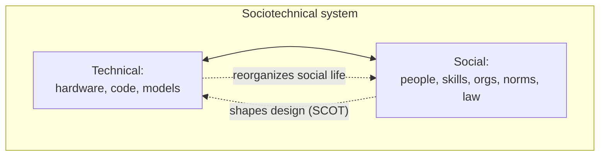

# Technology and Society

Technology and society do not stand apart, one acting on the other. They **co-shape** each
other: social choices, values, and power relations get built into artifacts, and artifacts
in turn reorganize social life. Rejecting both *technological determinism* (technology
autonomously drives society) and its naive opposite (technology is a neutral tool), the
sociology of technology insists that the two are woven together. This lens is essential for
thinking clearly about the current wave of AI — see the [AI hub](../ai/index.md) and
[AI governance hub](../ai-governance/index.md).

## Social construction of technology (SCOT)

**SCOT**, associated with Wiebe Bijker and Trevor Pinch, argues that a technology's design
is not dictated by nature or pure efficiency but is *socially negotiated*. Different
**relevant social groups** interpret an artifact differently and want different things from
it — this is **interpretive flexibility**. Design proceeds through struggle among these
groups until the artifact reaches **closure** (a dominant interpretation stabilizes) and
becomes taken for granted. The classic example is the early bicycle: the high-wheel
"penny-farthing" and the low safety bicycle competed as solutions to different problems
(sport vs. transport) for different groups before the safety design won. The moral:
today's obvious design is a frozen accident of past social conflict, not an inevitability.

## Sociotechnical systems

A **sociotechnical system** is the recognition that no significant technology works as a
lone machine — it functions only as a bundle of hardware, software, people, skills,
organizations, laws, and norms. A power grid, an airliner, or a machine-learning model is
inseparable from the operators, maintenance practices, regulations, and institutions around
it. Failures are usually *sociotechnical* failures (organization and technology together),
not purely technical ones. This is why deploying AI is never just an engineering task: it
is a reconfiguration of an entire sociotechnical arrangement, the theme of
[AI adoption at organizational scale](../ai-org/ai-adoption-at-org-scale.md).

## The digital society

Digital technologies have restructured social life at scale. Communication, work,
intimacy, politics, and identity are increasingly mediated by platforms. This produces new
forms of sociability, new [social networks](social-networks-and-capital.md) that span
distance, and new ways language and identity are performed online — connecting to
[sociolinguistics](../linguistics/sociolinguistics.md). It also produces new inequalities:
the **digital divide** (unequal access and skills) maps onto and deepens existing
stratification. And it reshapes the public sphere, where algorithmic curation, virality,
and misinformation change how collective attention and opinion form.

## Surveillance capitalism and platform power

Shoshana Zuboff's **surveillance capitalism** names an economic logic in which human
experience is claimed as free raw material, rendered into **behavioral data**, and traded
in markets that predict and increasingly *modify* behavior. Under this logic, the platform's
product is prediction, and the user is the source of the data, not the customer. Combined
with **network effects** — where a platform grows more valuable and harder to leave as more
people join (see [network effects](../economics/information-economics-and-network-effects.md))
— this concentrates enormous **platform power** in a few firms that set the terms of
markets, communication, and even public discourse. The concern is not merely privacy but
the asymmetry of knowledge and power between platforms and populations.

## The sociology of AI

AI is the current frontier where all of these threads converge. Sociologically, four
issues stand out:

- **Bias.** Models learn from data produced by an unequal society, so they reproduce and
  can amplify existing patterns of [race, gender, and other inequality](race-gender-and-identity.md).
  "Neutral" systems can systematize discrimination. A central concern of the
  [AI governance hub](../ai-governance/index.md).
- **Labor.** AI reorganizes work — automating some tasks, creating precarious "ghost work"
  (data labeling, content moderation) behind the scenes, and shifting the balance of skill
  and autonomy. Weber's [rationalization](organizations-and-bureaucracy.md) reappears as
  algorithmic management.
- **Adoption.** How AI actually enters organizations is a sociotechnical and institutional
  process, prone to imitation and legitimacy-seeking, not simple efficiency calculation —
  see [AI adoption at organizational scale](../ai-org/ai-adoption-at-org-scale.md).
- **Platform power.** Control of the compute, data, and models underlying AI further
  concentrates the platform power described above.

## Why it matters

Treating technology as socially shaped, rather than as fate, restores human agency: if
designs are negotiated, they can be renegotiated, regulated, and redesigned more justly.
The framework equips you to see AI not as an autonomous force to accommodate but as a
sociotechnical system whose values, winners, and harms are the product of choices — choices
open to governance, contestation, and better design.

## References

- Draws on the sociology-of-technology tradition: Bijker & Pinch (SCOT), the
  sociotechnical-systems school, and Shoshana Zuboff (surveillance capitalism). Related HAL
  notes: [AI hub](../ai/index.md), [AI governance hub](../ai-governance/index.md),
  [AI adoption at organizational scale](../ai-org/ai-adoption-at-org-scale.md),
  [sociolinguistics](../linguistics/sociolinguistics.md), and
  [social networks and capital](social-networks-and-capital.md).
