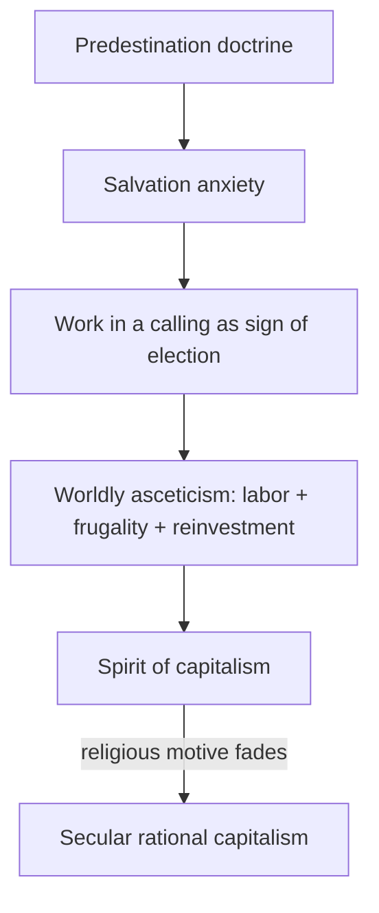

# The Protestant Ethic and the Spirit of Capitalism

Max Weber's essay, published in two parts in 1904–05, is one of sociology's most famous and
most contested arguments. Against a crude materialism that treats economic structure as the
sole engine of history, Weber argues that *ideas* — specifically religious ideas — helped
shape the economic order. His claim is not that Protestantism caused capitalism, but that a
particular religious ethos supplied the cultural disposition, the "spirit," that made modern
rational capitalism possible.

## The puzzle and the "spirit"

Weber begins with an observed correlation: in early modern Europe, business leaders and
skilled workers were disproportionately Protestant. What needed explaining was not the pursuit
of wealth (greed is universal) but a peculiar new *attitude* toward it — the treatment of
disciplined, methodical, profit-seeking work as a moral duty and an end in itself, coupled with
ascetic restraint on enjoying the proceeds. This ethos is the **spirit of capitalism**,
captured for Weber in Benjamin Franklin's maxims: time is money, industry and frugality are
virtues.

## Calvinism, the calling, and worldly asceticism

Weber traces this spirit to Reformation theology, above all **Calvinism** and its doctrine of
**predestination**. If salvation is fixed in advance and unknowable, believers face unbearable
anxiety about their eternal fate. The psychological resolution: relentless, successful,
methodical labor in one's worldly **calling** (*Beruf*) becomes a way to demonstrate — to
oneself — that one is among the elect. Wealth is not to be squandered but reinvested; leisure
and indulgence are sinful. This **worldly asceticism** channeled religious energy into
economic rationality. Over time the religious scaffolding fell away, but the disciplined,
accumulating conduct it produced remained and became secular capitalist behavior.

## Rationalization and the iron cage

The essay is one entry in Weber's larger thesis about **rationalization** — the long-run
Western tendency to organize life by calculable, impersonal, efficiency-maximizing rules. What
began as an ethically charged vocation hardens into an external, self-perpetuating economic
system. Weber's most quoted image is the **iron cage** (*stahlhartes Gehäuse*): modern
individuals are locked into a bureaucratic, market-driven order they did not choose and cannot
easily escape, "specialists without spirit, sensualists without heart." Rationalization brings
formal, procedural rationality (*Zweckrationalität*) that can diverge sharply from
substantive value (*Wertrationalität*), a tension Weber saw as the defining ambivalence of
modernity. This links directly to his theory of [organizations and bureaucracy](organizations-and-bureaucracy.md).

## Method and significance

Methodologically the work exemplifies Weber's **interpretive (verstehende) sociology** and his
use of **ideal types**: he seeks to understand action by reconstructing its subjective meaning
for actors, then builds stylized concepts ("spirit of capitalism," "Protestant ethic") as
analytical instruments. As a pillar of classical [sociological theory](sociological-theory.md),
it stands as the great counterweight to purely economic explanations of history, insisting that
culture and belief have causal force in economic life. See also [../economics/index.md](../economics/index.md)
for the economic side of capitalism it seeks to explain.

## References

- [Max Weber — Stanford Encyclopedia of Philosophy](https://plato.stanford.edu/entries/weber/)
