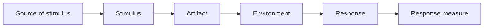

# Software Architecture in Practice

Len Bass, Paul Clements, and Rick Kazman — all associated with the Software Engineering
Institute (SEI) at Carnegie Mellon — wrote the foundational academic-yet-practical text
on architecture as a discipline. Across its editions (3rd, 4th) it establishes the
vocabulary the field still uses: quality attributes, tactics, evaluation methods, and
views. Where the Thoughtworks books
([The Hard Parts](software-architecture-the-hard-parts.md),
[Evolutionary Architectures](building-evolutionary-architectures.md)) are lightweight and
pragmatic, this is the rigorous source those pragmatic methods descend from.

## Quality attributes and scenarios

The book's core claim is that **architecture exists to satisfy quality attributes** — the
non-functional requirements (availability, performance, security, modifiability,
testability, usability, deployability, ...) that shape structure far more than functional
requirements do. Functionality can be delivered by almost any structure; *qualities*
cannot.

The trouble is that "the system should be secure" is untestable. The book's fix is the
**quality attribute scenario**, a six-part template that turns a vague goal into something
concrete and measurable:

For example: *(source)* an authenticated user *(stimulus)* submits a request *(artifact)*
to the search service *(environment)* under peak load *(response)* returns results
*(measure)* within 500 ms for the 99th percentile. Now it can be designed for and tested.

## Architectural tactics

A **tactic** is a design decision that influences the response of a *single* quality
attribute — a finer-grained building block than a full pattern. The book organizes
tactics by attribute: availability tactics (heartbeat, ping/echo, redundancy, failover),
performance tactics (manage resources, control demand), security tactics (detect, resist,
react, recover), modifiability tactics (reduce coupling, increase cohesion, defer
binding), and so on. Patterns are then understood as bundles of tactics that trade several
attributes against each other.

## The ATAM evaluation method

The **Architecture Tradeoff Analysis Method (ATAM)** is the SEI's structured process for
evaluating whether an architecture will meet its quality goals *before* it is built out.
Stakeholders gather, extract quality attributes from business drivers, and analyze
architectural approaches against scenarios to surface:

- **Sensitivity points** — decisions that strongly affect one quality attribute.
- **Trade-off points** — decisions that affect *multiple* attributes in opposing
  directions (a sensitivity point for two or more attributes at once).
- **Risks and non-risks** — decisions that endanger, or safely satisfy, the goals.

The nine steps run in two phases (architect-and-evaluators first, then the broader
stakeholder group), moving from general to specific across cycles:

1. Present ATAM to stakeholders.
2. Present the business drivers.
3. Present the architecture.
4. Identify architectural approaches.
5. Generate a **quality attribute utility tree** (map business/technical requirements to
   architectural properties, with a scenario per requirement).
6. Analyze architectural approaches against the prioritized scenarios.
7. Brainstorm and prioritize scenarios with the larger stakeholder group.
8. Re-analyze approaches with that added input.
9. Present results.

This is the heavyweight ancestor of the lightweight, ad-hoc trade-off analysis Ford and
Richards advocate in [The Hard Parts](software-architecture-the-hard-parts.md) — same
core idea (reason explicitly about trade-offs), far more ceremony.

## Views and documentation

The book treats **architecture documentation** as capturing a set of **views**, each
showing a coherent slice of the system to a particular set of stakeholders (module views,
component-and-connector views, allocation/deployment views). No single diagram captures an
architecture; you document the views that answer the questions your stakeholders actually
have. This lineage runs directly into later notations like the
[C4 model](c4-model.md) and the practice of recording decisions as
[architecture decision records](documenting-architecture-decisions.md).

## Where it sits

This is the theoretical bedrock beneath most modern architecture practice. Its quality
attributes and scenarios explain *what* fitness functions in
[Building Evolutionary Architectures](building-evolutionary-architectures.md) are
protecting; its ATAM is the formal parent of the trade-off habit in
[The Hard Parts](software-architecture-the-hard-parts.md); and its structural concerns
connect to [clean architecture](clean-architecture.md) and
[domain-driven design](domain-driven-design.md).

## References

- [Software Architecture in Practice — O'Reilly](https://www.oreilly.com/library/view/software-architecture-in/9780136885979/)
- [Architecture Tradeoff Analysis Method (ATAM) — Wikipedia](https://en.wikipedia.org/wiki/Architecture_tradeoff_analysis_method)
