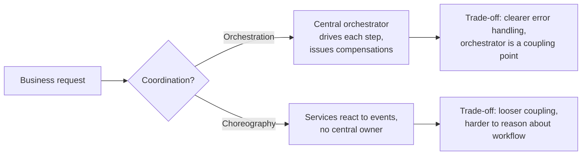

# Software Architecture: The Hard Parts

Neal Ford, Mark Richards, Pramod Sadalage, and Zhamak Dehghani wrote this 2021
O'Reilly book as a deep sequel to *Fundamentals of Software Architecture*. Where the
first book surveyed the discipline, this one drills into the genuinely hard decisions of
**distributed architectures** — the ones that have no clean answer, only consequences.

## The central thesis: there are no best practices, only trade-offs

The organizing law is blunt: **everything in software architecture is a trade-off**, and
a corollary — *why* is more important than *how*. Because the industry's "best practices"
are context-dependent, the authors refuse to hand out prescriptions. Instead they teach a
repeatable habit of **trade-off analysis**: when facing a decision, find the parts that
are coupled, model the forces at play, and reason qualitatively about which option makes
each architectural characteristic (scalability, availability, data integrity,
performance, ...) better or worse.

They favor **qualitative** analysis because quantitative comparison across architectures
is rarely feasible — you cannot cheaply hold two whole systems side by side and measure.
The practical move is a scoped question: "If we switch from orchestration to
choreography *here*, does scalability improve or degrade, and at what cost to
consistency?" This is lighter-weight than the formal academic methods
([ATAM, CBAM](software-architecture-in-practice.md)) that preceded it, which the authors
found too bureaucratic and meeting-heavy to use in practice.

## Decomposition: pulling a monolith apart

The book gives concrete techniques for breaking a system into services:

- **Component-based decomposition** — identify logical components inside the monolith
  (via directory/namespace structure and afferent/efferent coupling), then refactor
  toward those seams before extracting anything.
- **Tactical forking** — when a codebase is too tangled to analyze cleanly, clone the
  whole thing per team and *delete* what each service doesn't need, rather than trying to
  extract a clean module outward. Sometimes subtraction is easier than extraction.
- **Component coupling metrics** and the idea of *architectural quanta* (independently
  deployable units with high functional cohesion) guide where the service boundaries
  should fall.

## Pulling data apart

Splitting services is the easy half; splitting the **data** is the hard part. The book
treats data decomposition as a first-class problem:

- Reasons to keep data together vs. split it apart (data disintegrators vs. integrators).
- **Data ownership** patterns — single owner, common ownership, joint ownership — and how
  to resolve the joint-ownership tangle (table split, data domain, delegate, service
  consolidation).
- **Distributed data access** — the pain of not being able to `JOIN` across service
  boundaries, and patterns to cope (column schema replication, replicated caching, data
  domain).

## Distributed transactions and sagas

Once each service owns its data, a single ACID transaction no longer spans the business
operation. The book catalogs **saga** patterns as coordinated sequences of local
transactions with compensating actions, organized along two axes — communication
(synchronous vs. asynchronous), consistency (atomic vs. eventual), and coordination
(orchestration vs. choreography):

Each saga flavor trades error-recovery clarity against coupling and complexity — the
recurring lesson that the "right" choice depends entirely on the forces in your context.

## Contracts and communication

Services must agree on **contracts**, and the book frames the spectrum from **strict**
(tightly specified, e.g. shared schemas / gRPC) to **loose** (name-value pairs, consumer
flexibility). Strict contracts catch errors early but couple deploys; loose contracts
decouple at the cost of runtime surprises. **Consumer-driven contracts** and stamp
coupling are covered as ways to manage the middle ground. Communication style
(synchronous request-reply vs. asynchronous event-driven) is another trade-off axis with
consequences for responsiveness, error handling, and coupling.

## Where it sits

This is the distributed-architecture companion to
[microservice architecture](microservice-architecture.md) and
[building microservices](production-ready-microservices.md) thinking, and it pairs with
[domain-driven design](domain-driven-design.md) for finding service boundaries and with
[clean architecture](clean-architecture.md) for the internal structure of each service.
The trade-off-analysis discipline is the practical, lightweight descendant of the formal
evaluation methods in [Software Architecture in Practice](software-architecture-in-practice.md),
and it complements the change-safety guardrails of
[Building Evolutionary Architectures](building-evolutionary-architectures.md).

## References

- [Software Architecture: The Hard Parts — O'Reilly](https://www.oreilly.com/library/view/software-architecture-the/9781492086888/)
