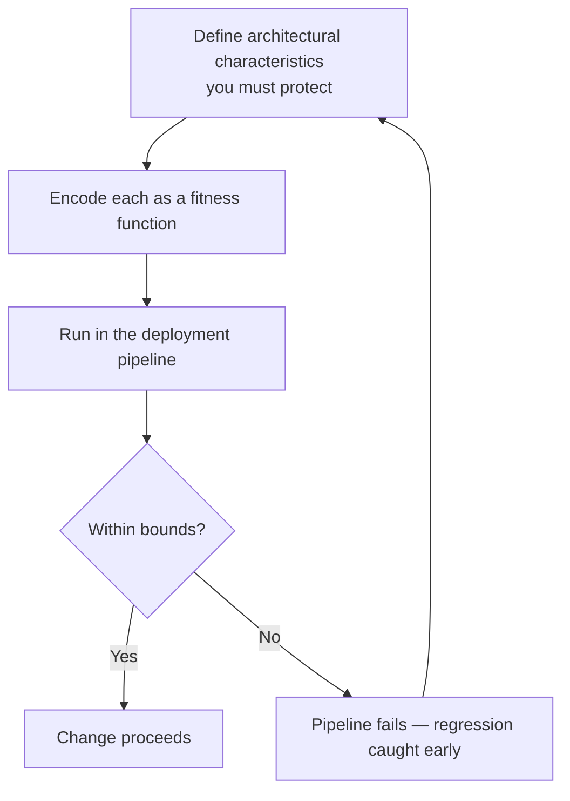

# Building Evolutionary Architectures

Neal Ford, Rebecca Parsons, and Patrick Kua argue that the software ecosystem changes
constantly — new tools, frameworks, platforms, business demands — so an architecture that
merely *resists* change is already failing. The alternative is to design an architecture
that **evolves** on purpose. Their one-line definition:

> An evolutionary architecture supports **guided, incremental change** as a first
> principle, across multiple dimensions.

The 2nd edition (O'Reilly) expands the fitness-function catalog and sharpens the
practices around continuous, safe evolution.

## The three ideas in the definition

- **Guided** — evolution has a direction. You decide which architectural characteristics
  matter (scalability, security, latency, modularity, ...) and steer toward preserving
  them. Guidance is what separates evolution from drift.
- **Incremental** — change lands in small, reversible steps rather than big-bang
  rewrites. This depends heavily on the engineering practices from
  [Continuous Delivery](../devops-sre/continuous-delivery.md): a strong deployment pipeline is the
  substrate that makes safe increments possible.
- **Multiple dimensions** — an architecture is not just code structure. It spans
  technical, data, security, and operational concerns, and an evolvable system must
  protect characteristics across all of them at once, not one at a time.

## Fitness functions: automated architectural guardrails

The book's signature contribution. A **fitness function** is an objective, executable
check that measures how close the architecture is to a desired characteristic — an
automated test for an *architectural* property rather than a functional one.

Fitness functions come in several shapes:

- **Atomic vs. holistic** — a single characteristic in isolation vs. the interaction of
  several together.
- **Triggered vs. continual** — run on a build/deploy event vs. monitored constantly in
  production.
- **Static vs. dynamic** — a fixed threshold vs. one that shifts with context.
- **Automated vs. manual** — most should be automated; some (e.g. a legally-mandated
  review) legitimately stay manual.

Examples: cyclic-dependency checks, layer-access rules (like
[ArchUnit](clean-architecture.md)-style tests enforcing that the UI never imports the
persistence layer), latency budgets, and security scans — all wired into CI so an
architectural regression fails the build the same way a broken unit test does. This turns
architecture from a document that rots into a set of continuously-verified constraints,
which is the same reflex as [test-driven development](../software-engineering/tdd-five-practices.md) applied at
the architectural level.

## Why it matters

Without guardrails, architecture erodes silently as hundreds of small changes accrete.
Fitness functions make the important characteristics *legible and enforced*, so teams can
change quickly without quietly destroying the qualities the system depends on. It is the
architectural complement to the trade-off reasoning in
[Software Architecture: The Hard Parts](software-architecture-the-hard-parts.md) and to
the evaluation-then-protect cycle of
[Software Architecture in Practice](software-architecture-in-practice.md): decide what
matters, then encode it so it cannot silently regress. The delivery-throughput evidence
in [Accelerate](../devops-sre/accelerate.md) is the payoff — teams that can change safely ship faster.

## References

- [Building Evolutionary Architectures — O'Reilly](https://www.oreilly.com/library/view/building-evolutionary-architectures/9781492097532/)
