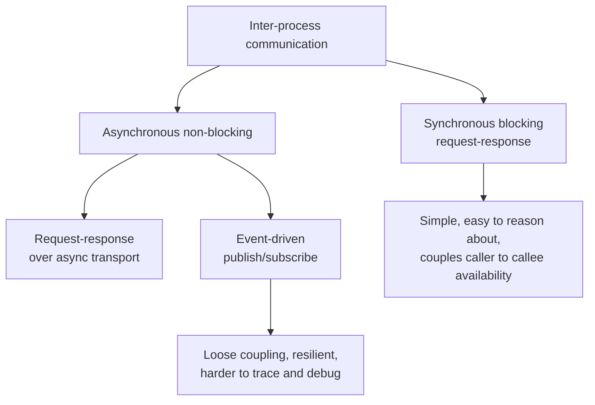

# Building Microservices (2nd ed.)

Sam Newman's practical field guide to designing, building, and operating
microservice systems. The second edition is a near-complete rewrite of the
best-selling first, reflecting how the practice shifted over five years:
containers, Kubernetes, and serverless get first-class treatment, and
inter-process communication grew large enough to span three chapters. The book
is opinionated but honest that most decisions have more than one defensible
answer — its value is teaching you how to reason about the trade-offs rather
than handing you a template.

## What a microservice is

A microservice is an independently deployable service modeled around a
**business domain**. The word "independently" is load-bearing: if you cannot
deploy one service without lock-stepping the release of others, you have a
distributed monolith and all the pain of microservices with none of the
benefit. Services own their own data — no shared database — and communicate
only over the network through well-defined interfaces. This gives you
information hiding at the service boundary: internal implementation can change
freely as long as the contract holds.

## Decomposing around business domains

Newman leans on [Domain-Driven Design](domain-driven-design.md) to draw service
boundaries. The **bounded context** is the primary unit: a self-contained slice
of the domain with its own model and language, exposing an explicit interface
and hiding the rest. Boundaries drawn along business capabilities tend to be
stable because business capabilities change more slowly than technology; a
service seam that follows a bounded context localizes most change to a single
service. Boundaries drawn along technical layers (a "database team," a "UI
team") do the opposite — every feature crosses every seam.

The goal is **high cohesion within a service and loose coupling between
services**. Related behavior that changes together lives together; unrelated
things are kept apart so they can evolve and deploy on their own cadence. This
echoes the modularity arguments in
[A Philosophy of Software Design](../software-engineering/a-philosophy-of-software-design.md), applied
at the granularity of deployable units.

## Communication styles

Newman frames integration along two axes — synchronous vs. asynchronous, and
request-response vs. event-driven — rather than reaching reflexively for REST.

Key guidance: prefer explicit, technology-agnostic contracts; avoid leaking
internal representations; be wary of shared client libraries that recreate
coupling. Event-driven collaboration buys loose coupling and resilience at the
cost of harder reasoning, tracing, and eventual-consistency handling — a
trade-off, not a free upgrade.

## Deployment and independence

Independent deployability is the operational payoff and the thing most teams
get wrong. Newman argues for one service per deployable unit, aggressive
automation, and treating each service's pipeline as its own. The second edition
maps this onto modern substrate: containers as the packaging format, Kubernetes
as the orchestration layer when you genuinely need it (and a caution against
adopting it before you do), and serverless where it fits. Contract testing
(consumer-driven contracts) lets services release on independent schedules
without end-to-end test suites becoming a synchronization bottleneck.

## Migration patterns

You should almost never start with microservices. Newman's strong
recommendation is to begin with a monolith and extract services incrementally,
guided by real pain and real seams rather than speculation. The **strangler fig**
pattern wraps the legacy system and peels functionality out to new services one
capability at a time. **Branch by abstraction** and **parallel run** let you
migrate risky pieces with a fallback. Database decomposition is treated as the
genuinely hard part — splitting shared tables, handling foreign keys across
service boundaries, and moving from distributed transactions to **sagas** for
managing consistency across services.

## The cost microservices add

The book is refreshingly candid that microservices are not free. They convert
in-process method calls into network calls, so you inherit the fallacies of
distributed computing: latency, partial failure, unreliable networks. You need
serious investment in **observability** (logs, metrics, distributed tracing),
resilience patterns (timeouts, bulkheads, circuit breakers — see
[Release It!](release-it.md)), automated deployment, and a monitoring culture
before the architecture pays off. Newman's advice: adopt microservices to solve
a specific problem (independent scaling, independent deployment, team autonomy,
technology heterogeneity), and only when your organization can absorb the
operational tax. Otherwise a well-structured monolith is the better default.

## Related notes

- [Microservice architecture](microservice-architecture.md) — the pattern language this book operationalizes
- [Production-Ready Microservices](production-ready-microservices.md) — operational standards for services once they exist
- [Domain-Driven Design](domain-driven-design.md) and [Implementing Domain-Driven Design](implementing-domain-driven-design.md) — bounded contexts and strategic design
- [Release It!](release-it.md) — stability and resilience patterns for distributed systems
- [Fundamentals of Software Architecture](fundamentals-of-software-architecture.md) — microservices as one style among many

## References

- Sam Newman, *Building Microservices*, 2nd Edition — <https://samnewman.io/books/building_microservices_2nd_edition/>
