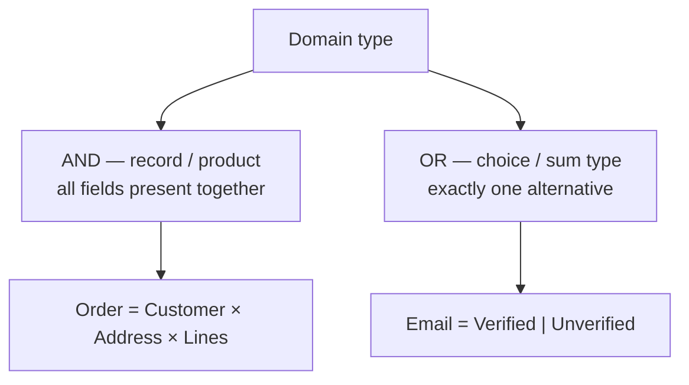
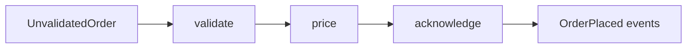

# Domain Modeling Made Functional

Scott Wlaschin's argument is that [domain-driven design](domain-driven-design.md) and
statically-typed functional programming are natural partners. DDD gives you a way to
understand and carve up a business problem; functional programming — specifically a rich
type system — gives you a way to capture that understanding directly in code, so the model
and the implementation never drift apart. The examples are written in F#, but the ideas are
language-agnostic: any language with sum types and function composition (Rust, Haskell,
Scala, TypeScript, Kotlin) can apply them.

## Understand the domain first

Before any code, you build a shared mental model with the people who actually know the
business. Two practices carry this:

- **Ubiquitous language** — one vocabulary, used by domain experts and developers alike,
  that shows up verbatim in the code. If the business says "unvalidated order," there is a
  type called `UnvalidatedOrder`. This is the same discipline as in
  [domain-driven design](domain-driven-design.md) and its tactical patterns in
  [Implementing Domain-Driven Design](implementing-domain-driven-design.md).
- **Event storming** — a collaborative workshop where everyone maps the domain as a timeline
  of *domain events* ("order placed," "invoice sent"), the commands that trigger them, and
  the workflows in between. It surfaces the real boundaries and the vocabulary quickly,
  without upfront modeling ceremony.

## Model with algebraic data types

The core modeling move is to describe the domain as **algebraic data types (ADTs)**, built
from two combinators:

- **AND — records / product types.** A thing composed of several parts, all present at once.
  An `Order` has a customer *and* a shipping address *and* line items.
- **OR — choices / sum types.** A thing that is exactly one of several alternatives. An
  `Email` is `Verified` *or* `Unverified`; a `PaymentMethod` is `Cash` *or* `Card` *or*
  `PayPal`.



Sum types are the piece most object-oriented languages lack, and they are what unlock the
book's signature goal: **make illegal states unrepresentable**. Rather than validating at
runtime that an email has been verified before you send to it, you model verified and
unverified emails as *distinct types*. A function that requires a verified address simply
won't accept an unverified one — the compiler rejects the mistake before the program runs.
Constraints that would otherwise live in scattered `if` checks and comments become part of
the type, giving you "compile-time unit tests." This is the same
[make-the-easy-change-easy](../software-engineering/code-simplicity.md) instinct — push complexity out of the code
and into the shape of the data.

## Workflows as functions; the signature is the design

Each business workflow is modeled as a **function**: it takes an input type and produces an
output type. The *type signature* is the design artifact. Before writing any body, you write
the signatures — this is **type-driven development**: sketch the types, let the compiler and
the signatures tell you whether the design hangs together, then fill in implementations.

```fsharp
type PlaceOrder =
    UnvalidatedOrder -> Result<OrderPlaced, PlaceOrderError>
```

That one line encodes a real design decision: placing an order takes an unvalidated order and
either succeeds with an event or fails with a known error.

## Errors and effects live in the types too

Nothing hides in exceptions or ambient state. Outcomes that can fail return a `Result`
(success or a typed error), so every caller must confront the failure path. Effects —
missing values, async I/O, dependencies on the outside world — are similarly lifted into the
types (`Option`, async result types) rather than left implicit. The signature tells the whole
truth about what a function can do.

## Compose a pipeline of transformations

A complete use case is assembled from small, pure, individually testable functions chained
end to end — validate, then price, then acknowledge, then emit events. Each stage transforms
one type into the next; the workflow is the composition of the stages. Impure boundaries
(I/O, persistence) are pushed to the edges, keeping the core transformations pure. This is the
same separation enforced structurally by
[hexagonal architecture / ports and adapters](hexagonal-architecture-ports-and-adapters.md)
and by [clean architecture](clean-architecture.md): the domain logic sits at the center,
independent of infrastructure, which lives on the outside.



The payoff: code that reads as documentation of the domain, business rules enforced by the
compiler, and a design that stays honest because the types can't lie.

## References

- [Domain Modeling Made Functional — Pragmatic Bookshelf](https://pragprog.com/titles/swdddf/domain-modeling-made-functional/)
