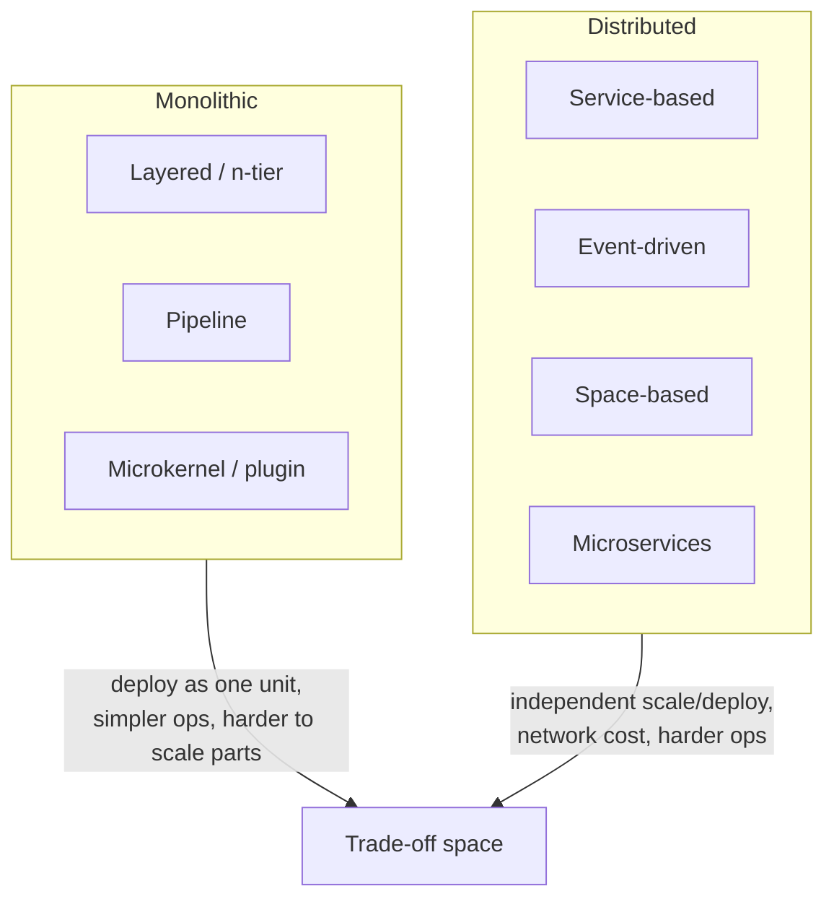

# Fundamentals of Software Architecture

Mark Richards and Neal Ford's attempt to give software architecture the
comprehensive, stack-agnostic overview it never had. Both authors teach
architecture professionally, and the book reads like a distilled course: it
covers the technical foundations (characteristics, styles, components), the
engineering discipline (metrics, repeatable results, honest valuation of
options), and the soft skills that actually determine whether an architect
succeeds. Its animating slogan is that **everything in architecture is a
trade-off** — and that anyone who tells you otherwise is selling something.

## Architecture characteristics (the "-ilities")

Architecture is less about *what the system does* (requirements) and more about
*how well it does it* under constraints — the **architecture characteristics**:
availability, scalability, performance, security, deployability,
testability, elasticity, fault tolerance, and dozens more. The authors stress
that you cannot maximize all of them; improving one usually degrades another
(more security often costs performance and usability). The architect's job is
to identify the *driving* characteristics for this system — ideally the fewest
that matter — and design explicitly around them. Characteristics should be
made measurable ("fitness functions") so the design can be governed and
evolved objectively rather than by opinion.

## Architecture styles

A large part of the book is a comparative catalog of architecture styles, each
scored against the characteristics it supports well or poorly, so you can pick
by trade-off rather than fashion.

- **Layered (n-tier)** — the default; simple, low cost, but poor at
  deployability and elasticity. Prone to the "architecture sinkhole"
  anti-pattern.
- **Pipeline** — sequence of filters over a pipe; great for transformation
  workflows.
- **Microkernel (plugin)** — a minimal core plus plugins; excellent for
  product/extensibility-driven systems.
- **Service-based** — coarse-grained distributed services sharing a database;
  a pragmatic middle ground.
- **Event-driven** — asynchronous, highly scalable and responsive, but hard to
  test and reason about.
- **Space-based** — removes the database bottleneck via in-memory data grids
  for extreme, unpredictable scale.
- **Microservices** — maximal independence and deployability at maximal
  operational complexity (see [Building Microservices](building-microservices.md)
  and [Microservice architecture](microservice-architecture.md)).

## Components and structure

The **component** — a deployable or logical building block of the system — is
the architect's primary unit of design. The book covers component
identification, and the properties that make structure sound: **coupling**
(afferent/inbound and efferent/outbound), **cohesion**, **partitioning**
(technical vs. domain — the authors favor domain partitioning), and
**granularity**. These are the same forces
[A Philosophy of Software Design](../software-engineering/a-philosophy-of-software-design.md) discusses
at the module level and [Clean Architecture](clean-architecture.md) formalizes
into dependency rules; here they operate at the top level of the system.

## Architecture as an engineering discipline

Richards and Ford push architecture toward rigor: repeatable results, concrete
metrics, and evolutionary architecture with **fitness functions** that guard
chosen characteristics as the system changes. They advise architects to keep
their hands dirty with code, and to record decisions explicitly (ADRs — see
[Documenting Architecture Decisions](documenting-architecture-decisions.md)) so
the reasoning behind a trade-off survives the person who made it.

## The soft skills of the architect

The final theme, and the one most often skipped in technical books: an
architect's effectiveness depends on communication, negotiation, leadership,
running effective meetings, presenting, and mentoring teams. Diagramming and
presenting architecture clearly is a first-class skill. An architect who cannot
sell a trade-off cannot get it built.

## Related notes

- [Clean Architecture](clean-architecture.md) — dependency direction and component boundaries
- [Patterns of Enterprise Application Architecture](patterns-of-enterprise-application-architecture.md) — the layered/enterprise pattern vocabulary
- [Building Microservices](building-microservices.md) — a deep dive on one of the catalog's styles
- [The Software Architect Elevator](software-architect-elevator.md) — the architect's organizational role, complementary to the technical craft here
- [Documenting Architecture Decisions](documenting-architecture-decisions.md) — recording trade-offs as ADRs

## References

- Mark Richards & Neal Ford, *Fundamentals of Software Architecture* — <https://fundamentalsofsoftwarearchitecture.com/>
