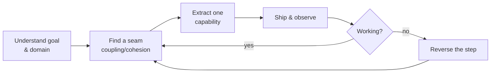

# Monolith to Microservices

Sam Newman's companion to [Building Microservices](building-microservices.md). Where that
book explains what a good [microservice architecture](microservice-architecture.md) looks
like, this one answers a narrower, harder question: how do you get an existing monolith
*there* without stopping the business? The whole argument is evolutionary — you migrate a
running system in small reversible steps, not by rewriting from scratch.

## When to migrate — and when not to

Microservices are a means, not a goal. Before splitting anything, name the outcome you
actually want: independent deployability, team autonomy, independent scaling, technology
flexibility, or fault isolation. If you can't state the goal, you can't tell whether the
migration is working, and you'll pay the distributed-systems tax for nothing.

Good reasons to migrate: teams stepping on each other in one deployment pipeline, a need
to scale one hot component independently, or wanting to adopt new technology in isolation.

Reasons it's a **bad** idea:
- **You don't understand your domain yet.** A greenfield product with unclear boundaries
  will get the service boundaries wrong, and boundaries are expensive to move once the
  network is between them. Grow the monolith first, split once the seams are visible.
- **Small teams / startups.** The operational overhead outweighs the benefit when there
  aren't multiple teams to decouple.
- **You just want "clean code."** A well-modularized monolith gets you most of the code
  benefits with none of the distributed-systems cost.

The monolith is not the enemy — it is a valid, often preferable, architecture. Coupling
and cohesion decide where seams belong; [domain-driven design](domain-driven-design.md)
and bounded contexts give you the vocabulary to find them.

## Incremental decomposition over the big-bang rewrite

The central principle: **migrate incrementally.** A big-bang rewrite freezes the monolith,
delays all value until the end, and gives you no feedback until it's too late to change
course. Instead, extract one small capability, ship it, learn, and repeat. Each step is
small enough to reason about and — critically — to reverse.

Reducing the **cost of change** is the whole game. Model the split with a paper exercise
(what would each service own, what calls cross the new boundary), start with the seam that
is easy to extract *and* delivers real benefit, and keep the monolith releasable
throughout. This mindset is [refactoring](../software-engineering/refactoring-improving-the-design-of-existing-code.md)
applied at architecture scale, and it leans on the same discipline as
[working effectively with legacy code](../software-engineering/working-effectively-with-legacy-code.md): get a
seam under control before you cut.

## Application patterns for splitting the monolith

**Strangler fig application.** The signature pattern, named for the fig that grows around
a tree until it replaces it. Put an interception layer (often an HTTP proxy) in front of
the monolith. Route calls for a capability to the monolith until the new service is ready,
then flip that route to the new service. The monolith is gradually "strangled" — hollowed
out one capability at a time — while it keeps serving everything not yet extracted. No
change to the monolith's own code is required to start.

**UI composition.** Sometimes the seam is at the presentation layer, not the backend.
Assemble the UI from pieces served by different systems (page-, widget-, or
micro-frontend-level composition) so new services own new screens while the monolith owns
the rest.

**Branch by abstraction.** When strangler-fig routing at the perimeter won't reach — the
code you want to replace is *inside* the monolith — introduce an abstraction (an interface)
over the functionality, build a new implementation behind it, switch callers over via the
abstraction, then delete the old implementation. Both implementations can coexist behind
the seam, so the change lands on mainline without a long-lived branch.

**Parallel run.** For risky replacements, run the old and new implementations side by side
on live traffic, compare their outputs, but keep serving the old (trusted) result. This
verifies the new service against real production behavior before you depend on it — a
concrete example of building confidence, in the spirit of
[production-ready microservices](production-ready-microservices.md).

**Decorating collaborator** and **change data capture** round out the set: trigger new
behavior by observing the monolith's calls or its data changes, respectively, without
modifying the monolith itself.

## Decomposing the database

Splitting the code is the easy half. The database is where the real coupling hides, and
Newman treats it as the hardest part of any migration.

**Shared database (the starting point / anti-pattern).** Two services reading and writing
the same tables are not actually independent — the schema is a hidden contract nobody
owns. Intermediate steps buy time without full separation: a **database view** to expose a
stable projection, a **wrapping service** or **database-as-a-service interface** to put
code in front of the shared schema.

**Splitting the tables.** Eventually each service must own its own data. This means
physically splitting tables along service boundaries — and confronting what that breaks:

- **Broken referential integrity.** A foreign key can't span a service boundary. You move
  the relationship into application code (**move foreign-key relationship to code**): one
  service holds an ID and asks the other service for the rest, accepting that the
  reference can now dangle.
- **Broken transactional integrity.** A single ACID transaction can no longer wrap a
  write that now spans two databases.

**Sagas** replace the lost distributed transaction. A saga is a sequence of local
transactions, one per service, coordinated so that if a later step fails, earlier steps
are undone by explicit **compensating** actions rather than a database rollback. You trade
atomicity for eventual consistency and design the failure/compensation path deliberately.
Data-migration helpers along the way include **synchronize data in application** and the
**tracer write** (gradually move the source of truth while writing to both).

## Reversibility is the safety net

Every pattern above is chosen partly because it can be undone cheaply. Strangler-fig routes
flip back, branch-by-abstraction keeps both implementations live, parallel run never
depends on the untrusted path until it's proven. Because the steps are small and reversible,
a mistake costs one step, not the whole migration — which is exactly what makes incremental
migration safer than the rewrite. Newman closes on the **growing pains** that show up as
service count climbs (breaking changes, reporting across split data, monitoring and
troubleshooting a distributed system, local developer experience) — the recurring reminder
that microservices move complexity around rather than removing it.

## References

- [Monolith to Microservices — Sam Newman (O'Reilly, 2019)](https://samnewman.io/books/monolith-to-microservices/)
