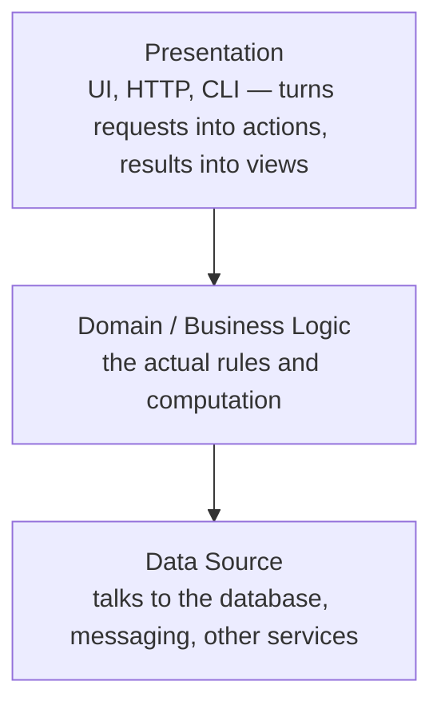
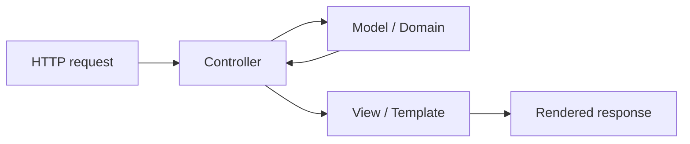

# Patterns of Enterprise Application Architecture

Martin Fowler's PoEAA is a pattern catalog for the recurring problems of
enterprise applications — systems dominated by messy business logic, lots of
persistent data, concurrent access, and integration with other systems. The book
pairs a set of narrative chapters (how the patterns relate) with a reference
catalog (each pattern written up with intent, sketch, and code). The value is the
vocabulary: naming these structures lets a team reason about tradeoffs instead of
reinventing them. It sits alongside [Domain-Driven Design](domain-driven-design.md)
(which goes deeper on modeling the domain), [Clean Architecture](clean-architecture.md)
(which generalizes the layering idea into dependency rules), and
[Refactoring](../software-engineering/refactoring-improving-the-design-of-existing-code.md) (the mechanics
for moving code toward these patterns safely).

## The three layers

The organizing idea is a layered architecture. Each layer depends downward, not
upward, so presentation can be swapped without touching the domain, and the domain
does not know how it is stored or displayed.

- **Presentation** — handles interaction with the user or another system: rendering
  HTML, serving an API, driving a command line.
- **Domain (business logic)** — the real work: validation, calculation, workflow.
- **Data source** — communication with the database, message queues, and external
  systems.

The rest of the book is largely "how do you build each layer, and how do you bridge
the domain and the data source cleanly."

## Domain logic patterns

Four ways to organize business logic, on a spectrum from simple/procedural to
rich/object-oriented:

- **Transaction Script** — one procedure per business transaction. Straightforward
  and easy to follow for simple logic; degrades into duplication as complexity grows.
- **Domain Model** — an interconnected web of objects that carry both data and
  behavior. Scales with complexity but has a steeper learning curve and needs real
  object-relational mapping. This is the entry point to [DDD](domain-driven-design.md).
- **Table Module** — one class per database table, holding the logic for all rows of
  that table (rather than one object per row). A middle ground that fits toolkits
  built around record-set structures.
- **Service Layer** — defines the application's boundary as a set of coarse-grained
  operations, coordinating the domain and orchestrating transactions. It gives clients
  a clear API and keeps use-case orchestration out of the domain objects themselves.

## Data source patterns

How domain code reaches the database:

- **Row Data Gateway** — an object that is a single row: one instance per record, with
  finders returning them. No domain logic, just data access.
- **Table Data Gateway** — one object per table that holds all the SQL for it and
  returns record sets. Pairs naturally with **Table Module**.
- **Active Record** — a domain object that also carries its own persistence: it wraps a
  row *and* holds business logic. Simple and popular (Rails), but couples the domain to
  the schema, which strains as the model diverges from the tables.
- **Data Mapper** — a separate layer that moves data between objects and the database,
  keeping the two independent of each other. More machinery, but it lets a rich
  **Domain Model** stay ignorant of persistence — the seam that
  [Clean Architecture](clean-architecture.md) formalizes.

## Object-relational mapping patterns

Bridging objects and tables raises its own recurring problems:

- **Unit of Work** — tracks every object touched during a business transaction and works
  out the minimal set of inserts/updates/deletes to commit together, in the right order.
- **Identity Map** — ensures each loaded record is represented by exactly one in-memory
  object, so you never get two conflicting copies of the same row (and you avoid
  redundant reads).
- **Lazy Load** — an object that doesn't hold all its data but knows how to fetch it on
  first access, so you don't pull the whole object graph up front.

The book also covers structural mapping (foreign-key and association-table mappings,
embedded value, inheritance mappings like single-table / class-table / concrete-table)
and metadata mapping to drive the ORM from configuration.

## Web presentation patterns

Patterns for the presentation layer of web apps:

- **Model View Controller (MVC)** — split input handling (controller), the domain
  data/logic (model), and rendering (view) so each varies independently.
- **Page Controller** — one controller object per page or action. Simple, direct.
- **Front Controller** — a single handler that receives all requests and dispatches
  them, centralizing common concerns (auth, routing, logging).
- **Template View** — render a page by embedding markers in HTML (the familiar
  templating approach).
- **Transform View** — render by transforming domain data element-by-element into output.
- **Two-Step View** — build a logical page representation first, then render it to the
  target format, so presentation styling is centralized.

## Concurrency and offline concurrency

Enterprise systems have concurrent users and business transactions that span multiple
requests (an "offline" transaction, longer than a single database transaction). The
patterns manage conflicting edits:

- **Optimistic Offline Lock** — let concurrent work proceed, and detect a conflict at
  commit time (typically via a version number that must match). Best when conflicts are
  rare; failures are handled after the fact.
- **Pessimistic Offline Lock** — prevent conflicts up front by acquiring a lock before
  editing, so only one business transaction can touch the data at a time. Avoids lost
  work but reduces concurrency and risks deadlock, so it's reserved for cases where a
  late-detected conflict would be too costly.
- Supporting patterns include **Coarse-Grained Lock** (lock a cluster of related objects
  as one) and **Implicit Lock** (have the framework acquire locks so developers can't
  forget).

## Base, distribution, and session patterns

Smaller supporting patterns round out the catalog: **Gateway**, **Mapper**, **Layer
Supertype**, **Separated Interface**, **Registry**, **Value Object**, **Money**,
**Special Case**, and **Plugin** (base patterns); **Remote Facade** and **Data Transfer
Object** (distribution — make remote calls coarse-grained to survive network latency);
and **Client / Server / Database Session State** (where to keep session state between
requests). The recurring lesson across distribution is "don't distribute objects if you
can avoid it — cross a process boundary rarely and coarsely."

## References

- [Patterns of Enterprise Application Architecture — Martin Fowler](https://martinfowler.com/books/eaa.html)
