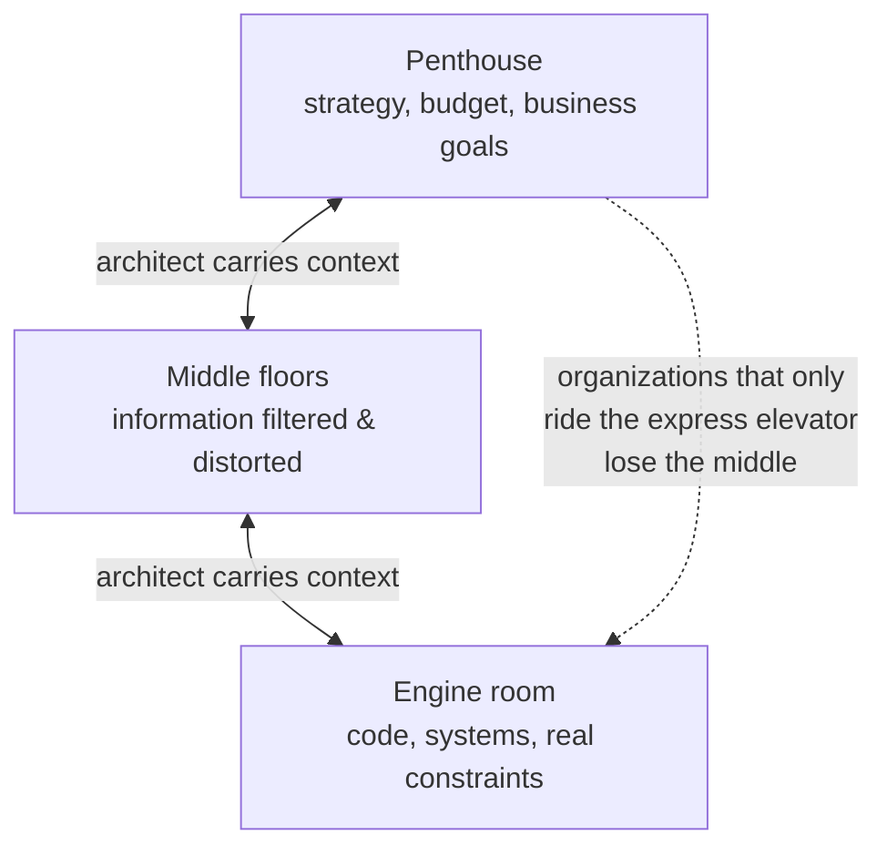

# The Software Architect Elevator

Gregor Hohpe's argument for what the modern architect actually does — which is
far more than draw boxes. The book (which grew out of his earlier *37 Things One
Architect Knows About IT Transformation*) reframes the architect as the person
who connects the technical **engine room** to the strategic **penthouse**, and
who makes the economics of technical decisions legible to the people who fund
them. It is aimed at architects, lead developers, and IT leaders in
organizations undergoing digital transformation, and it is heavy on real
anecdotes rather than abstract theory.

## Riding the elevator

The central metaphor: most enterprises have a top floor (the penthouse, where
executives set strategy and control budgets) and a basement (the engine room,
where engineers build the systems). In between sit floors that filter, dilute,
and distort information in both directions. The architect's distinctive value
is the willingness and ability to **ride the elevator end to end** — to sit in
strategy meetings and also read the code — carrying context up and down so that
strategy is grounded in technical reality and technical work is aligned to
business intent.

Architects who live only in the penthouse produce disconnected slide-ware;
those who never leave the engine room build locally-optimal systems no one
funds. The point is to move *between* floors, not to pick one.

## Architecture as selling options

Hohpe brings an explicitly economic lens. A good architectural decision is
often the purchase of an **option**: you pay a modest premium now (added
flexibility, decoupling, a seam) to preserve the right — but not the
obligation — to change direction later. This is real-options thinking borrowed
from finance. It gives architects a rigorous way to justify investments in
flexibility: not "good engineering hygiene," but a priced hedge against an
uncertain future. When uncertainty is high, options are worth more; when the
future is known, paying for flexibility is waste. This makes concrete the
trade-off framing in
[Fundamentals of Software Architecture](fundamentals-of-software-architecture.md)
— every "-ility" you buy has a price and a payoff you can reason about.

## Reversible vs. irreversible decisions

A recurring theme: distinguish decisions that are cheap to reverse from those
that are not, and spend your deliberation budget accordingly. One-way doors
deserve heavy analysis; two-way doors should be made quickly and revisited. The
architect's skill is telling them apart and designing systems so that more
decisions become reversible.

## Connecting IT to organizational transformation

The larger arc of the book is that technical architecture and organizational
architecture are inseparable — a restatement of Conway's Law with teeth. You
cannot deliver a modern, decoupled, fast-moving system inside a slow, siloed,
approval-gated organization; the org structure will imprint itself on the
software. So the transformational architect works on both at once: shipping
architecture that enables autonomy (which connects directly to the independent
deployability goal in [Building Microservices](building-microservices.md)) while
also changing how decisions are made, how teams are organized, and how IT talks
to the business. Hohpe treats the architect as a change agent whose real
deliverable is a faster, more adaptive organization, with better software as
the visible output.

## Related notes

- [Fundamentals of Software Architecture](fundamentals-of-software-architecture.md) — the technical craft that complements this book's organizational focus
- [Building Microservices](building-microservices.md) — architecture that enables the team autonomy Hohpe argues for
- [Documenting Architecture Decisions](documenting-architecture-decisions.md) — capturing reversible vs. irreversible calls
- [Accelerate](../devops-sre/accelerate.md) — the delivery-performance evidence behind autonomy and fast feedback

## References

- Gregor Hohpe, *The Software Architect Elevator* — <https://architectelevator.com/book/>
