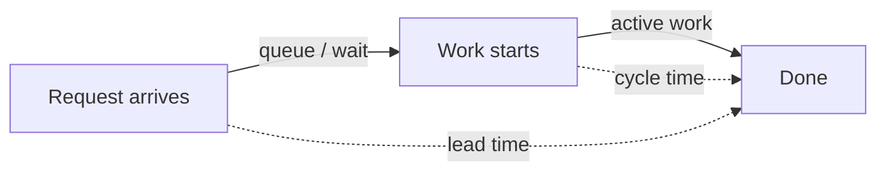

# Software Development Metrics

David Nicolette's *Software Development Metrics* (Manning, 2015) is a practical field
guide to picking a small set of metrics that actually help you steer delivery — and
throwing out the ones that only look like they do. Its core argument: a metric is
useful only in the context of *your* process and *your* delivery mode. Copying another
team's dashboard is how measurement goes wrong.

## Match the metric to your process, not the fashion

Nicolette frames every choice along two axes:

- **Process model** — *traditional/linear* (plan-driven, scope fixed up front, sequential
  phases) vs *adaptive* (iterative, scope discovered, empirical).
- **Delivery mode** — how work actually flows: time-boxed iterations vs continuous flow.

The same-named metric behaves differently across these quadrants. Velocity is
meaningful for a time-boxed adaptive team estimating in story points; it's noise for a
linear plan or a continuous-flow team. Percentage-of-scope-complete tells the truth on a
fixed-scope traditional project and lies on an adaptive one where scope is still moving.
The book is organized so you first ask *what kind of work am I doing*, then reach for the
metric that fits — never the reverse.

A recurring distinction: **forward-facing** metrics (help you predict and steer what's
ahead) vs **backward-facing** metrics (report what already happened). A "pragmatic"
metric is one that changes a decision you're about to make; if no decision hangs on the
number, collecting it is theater.

## Flow metrics: the honest core

For adaptive, flow-based work the book leans on a compact, mutually reinforcing set:

- **Throughput** — completed work items per unit of time. What you're actually shipping.
- **Cycle time** — elapsed time from when a work item *starts* being worked to when it's
  done. The customer-felt measure of responsiveness.
- **Lead time** — elapsed time from when a request *arrives* (enters the backlog/queue) to
  delivery. Cycle time plus the waiting-in-queue time.
- **Work in process (WIP)** — items started but not finished at a given moment.
- **Cumulative flow diagram (CFD)** — a stacked area chart of items in each workflow state
  over time. Band *widths* read as WIP; the horizontal gap between the arrival line and
  the departure line reads as lead time; a widening band signals a bottleneck upstream of
  it. One picture surfaces flow problems that point metrics hide.



### Little's Law ties them together

The relationship that makes flow metrics predictive rather than merely descriptive:

```
Average cycle time = Average WIP / Average throughput
```

The practical lever is WIP. If throughput is roughly steady, cutting WIP cuts cycle time
proportionally — you finish things faster by starting fewer things at once. The book uses
this to explain *why* limiting WIP works and to reason quantitatively about the effects of
high WIP: longer cycle times, worse **process cycle efficiency** (value-add time as a
fraction of total elapsed time — most of which is usually spent waiting in queues), and
even higher **defect density**, since work sitting half-done accumulates risk. See how
this connects to the delivery outcomes in
[Accelerate / DORA](developer-productivity-with-nicole-forsgren.md).

## Forecasting delivery

Nicolette draws a hard line between **estimation** (a guess at a single item's effort) and
**forecasting** (a probabilistic projection of when a *body* of work will be done, built
from observed throughput or cycle-time history). Forecasting from real historical flow —
ideally as a range with confidence, not a single date — is more honest and more accurate
than summing up-front estimates, especially when work items are kept consistently sized so
their count becomes a reliable proxy for effort. Consistent right-sizing is itself a lever:
it makes throughput a stable predictor and shrinks forecast variance.

## When velocity and burndown help — and when they mislead

- **Velocity** (story points completed per iteration) is a *capacity-planning* aid for a
  time-boxed adaptive team, useful only for that team's own forward planning. It breaks the
  moment it's used to compare teams, judge individuals, or as a target — points inflate and
  the number stops meaning anything.
- **Burn charts** (burndown/burnup) visualize progress against a scope line within an
  iteration or release. They help when scope is stable and the team reads the *slope*; they
  mislead when scope churns silently (a flat burndown can hide scope being added as fast as
  it's completed) — a case the book calls out explicitly, alongside "velocity looks good but
  little is delivered."

The book's anti-pattern catalog is the memorable part: *agile blindness*, the *easy rider*,
the *novice team*, and velocity/burndown misreadings each get a worked example of the wrong
conclusion the metric invites.

## Driving improvement without gaming it

The foreword (George Dinwiddie) sets the tone with **Goodhart's Law**: *a metric used as a
target ceases to be a good measurement.* Once a number becomes a goal or a performance lever,
people optimize the number, not the outcome. Nicolette's guardrails:

- Measure **results, not practices** — don't score whether a ritual happened, score whether
  value flowed.
- Never **treat humans as resources** or measure individuals for comparison; metrics are for
  the team to steer its own system.
- Watch for **motivational side effects** — any metric shown upward will be optimized toward,
  so choose ones whose optimization is genuinely good.
- Prize **effectiveness over efficiency**: squeezing out all slack to maximize an efficiency
  indicator eliminates the room to learn and often degrades the things you can't easily count.
- The point of a metric is to **illuminate reality so people make better decisions**, not to
  make the decision for them.

This is the same failure mode explored, in the AI-assisted era, in
[the software-engineering metrics AI broke](software-engineering-metrics-ai-broke.md) — where
proxy metrics like lines-of-code or commit counts detach from value even faster once a model
is generating the output. For a contrasting, team-level catalog of quantitative measures, see
[Codermetrics](codermetrics.md).

## References

- [Software Development Metrics — David Nicolette, Manning](https://www.manning.com/books/software-development-metrics)
