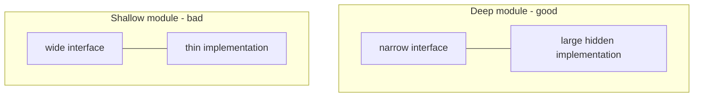

# A Philosophy of Software Design

John Ousterhout's book (2nd ed., 2021) argues that the single most important goal in
software design is **reducing complexity**, and it offers a set of concrete, sometimes
contrarian principles for doing so. It reads as a modern, opinionated companion to
[Parnas's information hiding](parnas-decomposing-systems-into-modules.md).

## Complexity is the enemy

Complexity is anything about a system's structure that makes it hard to understand and
modify. Ousterhout names three symptoms you can feel:

- **Change amplification** — a simple change requires edits in many places.
- **Cognitive load** — a developer must hold a lot in their head to make a change.
- **Unknown unknowns** — it is not even obvious what must change or what you must know
  to change it safely (the worst of the three).

Complexity is *incremental*: it accrues from many small, individually reasonable
decisions. So it must be fought continuously, not in a big cleanup later.

## Deep modules

The book's signature idea. A module has an **interface** (what you must know to use it)
and an **implementation** (everything behind it). The best modules are **deep**: a
*simple* interface hiding a *substantial*, complex implementation. That ratio is where
modularity pays off — a lot of functionality is made available at low cognitive cost.

**Shallow** modules are the opposite: their interface is nearly as complex as their
implementation, so they add cost without hiding much. A method that just forwards
arguments, or a class with more configuration surface than behavior, is shallow. This is
why Ousterhout is wary of the "many tiny classes/methods" style — decomposition that
multiplies shallow interfaces makes a system *harder*, not easier.

## Other load-bearing principles

- **Design it twice.** Consider at least two designs for any nontrivial decision; the
  comparison exposes what matters.
- **Pull complexity downward.** It is better for the module implementer to absorb
  complexity than to push it onto every caller. A configuration parameter is often just
  complexity shoved upward.
- **Define errors out of existence.** The best error handling is a design where the
  error case cannot arise.
- **Comments describe things the code cannot** — especially the *why* and the
  non-obvious invariants. Missing abstractions in the reader's head are the real cost;
  good comments and good names lower it.
- **Strategic vs. tactical programming.** Tactical programming optimizes for shipping
  the next feature and lets complexity accrue; strategic programming invests
  continuously in good design. The book advocates the strategic mindset.

## Related notes

- [Parnas — Decomposing Systems into Modules](parnas-decomposing-systems-into-modules.md)
  — deep modules are information hiding with a name for the interface/implementation
  ratio.
- [Simple Made Easy](simple-made-easy.md) — Hickey's "simple ≠ easy" is the same fight
  against incidental complexity.
- [Code Simplicity](code-simplicity.md) — complementary treatment of complexity cost.
- [Design Patterns (GoF)](../software-architecture/design-patterns-gof.md) — Ousterhout warns these can add
  shallow indirection if applied without a real change to absorb.
- [Clean Code](clean-code.md) — overlaps on naming and comments, but Ousterhout pushes
  back on the "many small methods" doctrine.

## References

- [A Philosophy of Software Design — John Ousterhout](https://web.stanford.edu/~ouster/cgi-bin/aposd.php)
